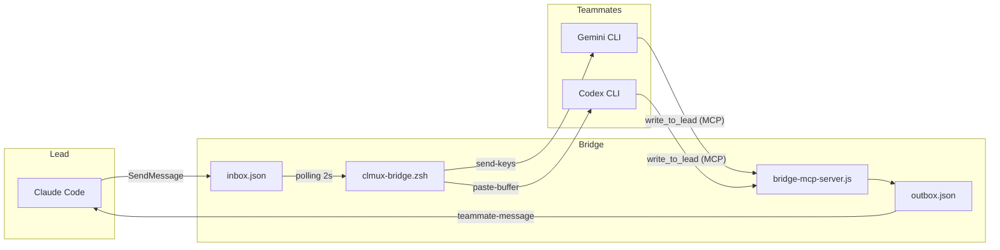

# clau-mux

Claude Code의 tmux 세션 관리와 Gemini/Codex AI teammate 통합을 지원하는 도구입니다.

> **macOS 전용** — macOS + iTerm2 + zsh 환경을 기준으로 개발 및 검증되었습니다.

## 문제와 해결

Claude Code는 동일 디렉토리에서 새 인스턴스를 실행하면 기존 인스턴스와 충돌합니다. `~/.claude.json` 등 공유 설정 파일에 대한 동시 쓰기 보호가 없어 파일 손상이 발생할 수 있습니다.

각 Claude Code 세션을 독립된 tmux 세션으로 격리하여 이를 방지합니다. 동일 이름의 세션이 이미 실행 중이면 새 접근을 차단합니다.

## 아키텍처



## 기능

- **세션 격리**: 각 Claude Code 인스턴스를 독립 tmux 세션으로 분리
- **충돌 방지**: 동일 세션 중복 실행 차단, orphaned 세션 자동 정리
- **Gemini Teammate**: Gemini CLI를 Claude Code teammate로 연결 (MCP bridge)
- **Codex Teammate**: OpenAI Codex CLI를 Claude Code teammate로 연결 (MCP bridge)
- **tmux 테마**: 커스텀 상태바, 마우스 토글, copy mode

## 설치

**1. 저장소 클론**

```bash
git clone https://github.com/DvwN-Lee/clau-mux.git ~/clau-mux
```

**2. 설치 스크립트 실행**

```bash
~/clau-mux/scripts/setup.sh
```

스크립트가 자동으로 처리하는 항목:

- `~/.zshrc`에 `clmux.zsh` source 라인 추가 (중복 방지)
- tmux 테마 적용 (선택, 대화형)
- Gemini CLI가 설치된 경우 MCP 브리지 자동 등록
- Codex CLI가 설치된 경우 MCP 브리지 자동 등록
- `GEMINI.md`, `AGENTS.md` 지시 파일 생성

**3. 셸 재로드**

```bash
source ~/.zshrc
```

## 사용법

### 세션 관리

```bash
# 세션 이름 없이 실행 — 현재 디렉토리 해시(6자)로 자동 지정
$ clmux

# 세션 이름 직접 지정
$ clmux -n PO

# Claude Code 옵션 전달
$ clmux -n BE --resume
$ clmux -n FE --continue

# Gemini teammate와 함께 세션 시작 (-g 플래그)
$ clmux -g

# Gemini teammate + 팀 이름 지정 (-T 플래그)
$ clmux -g -T my-team

# 세션 이름 + Gemini teammate + 팀 이름 조합
$ clmux -n PO -g -T po-team

# 세션 목록 확인
$ clmux-ls

# orphaned 세션 일괄 제거
$ clmux-cleanup
```

> **tmux 내부에서 실행하는 경우**: `$TMUX` 환경변수가 설정되어 있으면 세션 관리 없이
> `command claude [옵션]`을 직접 실행합니다. 별도 플래그가 필요하지 않습니다.

### Gemini Teammate

Gemini CLI를 Claude Code의 teammate로 연결합니다. `clmux-bridge.zsh`가 중계 역할을 하며, Gemini는 MCP 도구(`clau-mux-bridge`)를 통해 lead에 응답합니다.

```bash
# Gemini teammate 시작
clmux-gemini -t <team_name>

# Claude Code 내부에서 메시지 전송
SendMessage(to: "gemini-worker", message: "...")

# 종료
SendMessage(to: "gemini-worker", message: "/exit")
```

자세한 내용은 [Gemini Teammate 상세](docs/gemini-teammate.md)를 참고하세요.

### Codex Teammate

OpenAI Codex CLI를 Claude Code의 teammate로 연결합니다. Codex는 MCP 도구(`clau-mux-bridge`)를 통해 lead에 응답합니다.

> `-g` 플래그는 Gemini 전용입니다. Codex는 `clmux-codex -t <team>`으로 별도로 추가합니다.

```bash
# Codex teammate 시작
clmux-codex -t <team_name>

# Claude Code 내부에서 메시지 전송
SendMessage(to: "codex-worker", message: "...")

# 종료
clmux-codex-stop -t <team_name>
```

#### 전체 워크플로우 예시

```bash
# 1. lead 세션 시작 (Gemini teammate 함께 스폰)
clmux -n my-project -g -T my-team

# 2. Codex teammate 추가
clmux-codex -t my-team

# 3. Claude Code 내부에서 메시지 전송
TeamCreate(team_name: "my-team")
SendMessage(to: "gemini-worker", message: "리뷰 요청...")
SendMessage(to: "codex-worker", message: "구현 요청...")
```

자세한 내용은 [Codex Teammate 상세](docs/codex-teammate.md)를 참고하세요.

## 명령어 요약

| 옵션 | 설명 |
|------|------|
| `clmux -n <name>` | tmux 세션 이름 직접 지정 |
| `-n` 없이 실행 | 현재 디렉토리 경로의 md5 해시 앞 6자를 세션 이름으로 자동 지정 |
| `clmux -g` | 세션 시작 시 Gemini teammate 자동 스폰 |
| `clmux -T <team>` | `-g` 와 함께 사용 — teammate에 사용할 팀 이름 지정 |
| 그 외 모든 옵션 | Claude Code에 그대로 전달 (`--resume`, `--continue` 등) |
| `clmux-ls` | 활성 세션 목록 + orphaned 세션 경고 표시 |
| `clmux-cleanup` | attached 클라이언트 없는 orphaned 세션 일괄 제거 |
| `clmux-gemini -t <team>` | Gemini CLI를 teammate로 연결 |
| `clmux-gemini-stop -t <team>` | Gemini teammate 종료 |
| `clmux-codex -t <team>` | Codex CLI를 teammate로 연결 |
| `clmux-codex-stop -t <team>` | Codex teammate 종료 |

## 요구사항

- macOS
- zsh
- tmux
- Claude Code CLI (`claude`)
- [Nerd Font](https://www.nerdfonts.com/) (tmux 테마 사용 시)
- iTerm2 (다른 터미널도 동작하나 iTerm2 기준으로 검증)
- Gemini CLI (`gemini`) — Gemini teammate 사용 시
- Codex CLI (`codex`) — Codex teammate 사용 시
- Node.js / npm — MCP 서버 (`npx clau-mux-bridge`) 실행 시
- Python 3 — bridge 헬퍼 스크립트 실행 시

## 주의사항

- iTerm2 Profiles에 `tmux -CC` 자동연결 설정이 있으면 Claude Code TUI와 충돌합니다. 해당 설정은 제거를 권장합니다.
- `~/.tmux.conf`에 `remain-on-exit on` 설정이 있으면 exit 후에도 세션이 유지됩니다.
- Claude Code는 `~/.claude.json` 등 공유 파일에 대한 동시 쓰기 보호가 없습니다. 동일 디렉토리에서 여러 인스턴스를 실행하면 설정 파일이 손상될 수 있습니다. clmux는 이를 방지하기 위해 라이브 세션 중복 접근을 차단합니다.
- `ctrl+b d`로 세션을 detach한 후 같은 이름으로 `clmux`를 재실행하면 기존 세션이 orphaned로 판단되어 종료됩니다. agent teams가 아직 실행 중이라면 함께 종료되므로 주의하세요.

## 세부 문서

- [세션 관리 상세](docs/session-management.md)
- [Gemini Teammate 상세](docs/gemini-teammate.md)
- [Codex Teammate 상세](docs/codex-teammate.md)
- [tmux 테마](docs/tmux-theme.md)
- [트러블슈팅](docs/troubleshooting.md)
