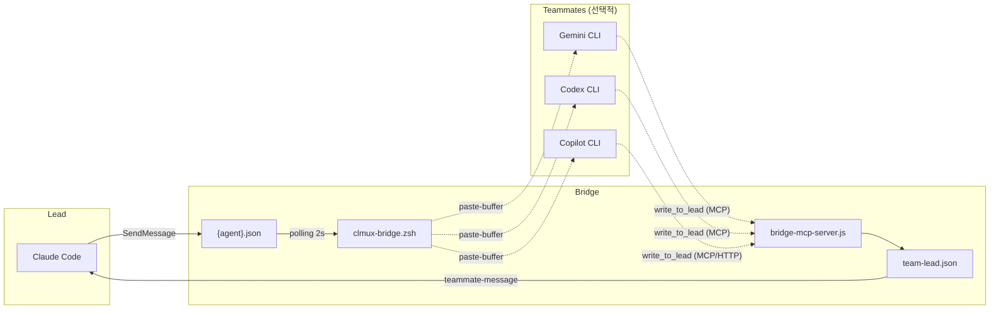

# clau-mux

Claude Code의 tmux 세션 관리와 Gemini / Codex / Copilot AI teammate 통합을 지원하는 도구입니다.

> **macOS 전용** — macOS + iTerm2 + zsh 환경을 기준으로 개발 및 검증되었습니다.

## 스크린샷


## 아키텍처



> 실제 파일: 에이전트별 inbox (`<agent-name>.json`)와 공용 outbox (`team-lead.json`)가 `~/.claude/teams/<team>/inboxes/`에 생성됩니다.

## 기능

- **세션 격리**: 각 Claude Code 인스턴스를 독립 tmux 세션으로 분리
- **충돌 방지**: 동일 세션 중복 실행 차단, orphaned 세션 자동 정리
- **Gemini Teammate**: Gemini CLI를 Claude Code teammate로 연결 (MCP bridge)
- **Codex Teammate**: OpenAI Codex CLI를 Claude Code teammate로 연결 (MCP bridge)
- **Copilot Teammate**: GitHub Copilot CLI를 Claude Code teammate로 연결 (MCP bridge / HTTP)
- **tmux 테마**: 커스텀 상태바, 마우스 토글, copy mode
- **플러그인 자동 로드**: `CLMUX_PLUGIN_DIR` 환경변수 설정 시, 해당 디렉토리의 유효한 플러그인을 자동으로 `--plugin-dir` 인자로 전달
- **Pane Orchestration** (Phase 1) — hierarchical Master/Sub delegation protocol with thread-level audit, meeting archive, and resume. See [`docs/orchestration.md`](docs/orchestration.md).
- **Chain Role Helpers** — `clmux-master` / `clmux-mid` / `clmux-leaf` (+ matching `-stop` wrappers). 한 줄 커맨드로 Master→Mid→Leaf 3-계층 체인을 스폰하고, Mid 단계에서는 git worktree 기반 Leaf fanout 자동 처리. 소스 파일은 `lib/*.zsh` 에 책임별 분리 (core / launcher / teammate-* / session-utils / tools / chain-topology / chain-spawn / chain-stop).

## 설치

**1. 저장소 클론**

```bash
git clone https://github.com/DvwN-Lee/clau-mux.git ~/clau-mux
```

**2. 설치 스크립트 실행**

```bash
~/clau-mux/scripts/setup.sh
```

스크립트가 자동으로 처리하는 항목:

- `~/.zshrc`에 `clmux.zsh` source 라인 추가 (중복 방지)
- tmux 테마 적용 (선택, 대화형)
- 각 AI teammate 등록 — **개별 선택 가능** (Y/n 프롬프트)
  - Gemini CLI → `~/.gemini/settings.json` MCP 등록
  - Codex CLI → `~/.codex/config.toml` MCP 등록
  - Copilot CLI → `~/.copilot/mcp-config.json` MCP 등록
- `GEMINI.md`, `AGENTS.md`, `COPILOT.md` 지시 파일 생성 (활성화된 teammate만)

> 설치 시 원하지 않는 teammate는 `n`을 입력해 건너뛸 수 있습니다.
> Gemini만 설치하거나 Copilot만 설치하는 등 조합을 자유롭게 선택할 수 있습니다.

**3. 셸 재로드**

```bash
source ~/.zshrc
```

### Prompt 업데이트

`prompt/AGENTS.md`, `GEMINI.md`, `COPILOT.md` 가 변경된 후 `git pull` 했다면, 설치된 사본을 갱신해야 합니다:

```bash
~/clau-mux/scripts/install-prompts.sh
```

`setup.sh` 와 달리 비대화형이며 prompt 영역만 갱신합니다 (tmux/MCP 설정은 건드리지 않음). 실행 중인 bridge teammate는 재시작해야 새 prompt가 반영됩니다.

### 특정 teammate 제거

특정 teammate만 비활성화하거나 전체를 제거할 수 있습니다:

```bash
# Gemini만 제거
bash ~/clau-mux/scripts/remove.sh gemini

# Codex만 제거
bash ~/clau-mux/scripts/remove.sh codex

# Copilot만 제거
bash ~/clau-mux/scripts/remove.sh copilot

# 전체 제거 (clau-mux 완전 삭제)
bash ~/clau-mux/scripts/remove.sh all
```

## 사용법

### 세션 관리

```bash
# 세션 이름 없이 실행 — 현재 디렉토리 해시(6자)로 자동 지정
$ clmux

# 세션 이름 직접 지정 (실제 세션명: <현재_디렉토리>/PO, 예: clau-mux/PO)
$ clmux -n PO

# Claude Code 옵션 전달
$ clmux -n BE --resume
$ clmux -n FE --continue

# Gemini teammate와 함께 세션 시작 (-g 플래그)
$ clmux -g

# Codex teammate와 함께 세션 시작 (-x 플래그)
$ clmux -x

# Copilot teammate와 함께 세션 시작 (-c 플래그)
$ clmux -c

# 여러 teammate 동시 스폰
$ clmux -gcx

# teammate + 팀 이름 지정 (-T 플래그)
$ clmux -g -T my-team
$ clmux -gx -T my-team

# 세션 이름 + teammate + 팀 이름 조합
$ clmux -n PO -gcx -T po-team

# 세션 목록 확인
$ clmux-ls

# orphaned 세션 일괄 제거
$ clmux-cleanup

# 현재 세션의 teammates 확인 (Claude 내부에서 실행 가능)
$ clmux-teammates
# 출력 예시:
# llm-migration
#   ├ %2  gemini-worker (gemini) [alive]
#   ├ %3  codex-worker (codex) [dead]
#   └ %5  impl-worker (claude/sonnet) [alive]
```

> **tmux 내부에서 실행하는 경우**: `$TMUX` 환경변수가 설정되어 있으면 세션 관리 없이
> `command claude [옵션]`을 직접 실행합니다. `-g`/`-x`/`-c` 플래그는 tmux 내부에서도 동작합니다.

### Gemini Teammate

Gemini CLI를 Claude Code의 teammate로 연결합니다. `clmux-bridge.zsh`가 중계 역할을 하며, Gemini는 MCP 도구(`clau_mux_bridge`)를 통해 lead에 응답합니다.

```bash
# 터미널에서 Gemini teammate 시작
clmux-gemini -t <team_name>

# 특정 모델로 시작
clmux-gemini -t <team_name> -m gemini-3.1-pro-preview

# Claude Code Bash tool에서 실행 시 (non-interactive shell이므로 zsh -ic 필요)
zsh -ic "clmux-gemini -t <team_name> -m gemini-3-flash-preview"

# Claude Code 내부에서 메시지 전송
SendMessage(to: "gemini-worker", message: "...")

# 종료
clmux-gemini-stop -t <team_name>
```

자세한 내용은 [Gemini Teammate 상세](docs/gemini-teammate.md)를 참고하세요.

### Codex Teammate

OpenAI Codex CLI를 Claude Code의 teammate로 연결합니다. Codex는 MCP 도구(`clau_mux_bridge`)를 통해 lead에 응답합니다.

```bash
# 터미널에서 Codex teammate 시작
clmux-codex -t <team_name>

# Claude Code Bash tool에서 실행 시
zsh -ic "clmux-codex -t <team_name>"

# 특정 모델로 시작
clmux-codex -t <team_name> -m gpt-5.4

# Claude Code 내부에서 메시지 전송
SendMessage(to: "codex-worker", message: "...")

# 종료
clmux-codex-stop -t <team_name>
```

자세한 내용은 [Codex Teammate 상세](docs/codex-teammate.md)를 참고하세요.

> **Bridge 내부 동작**: Codex는 instruction-following 특성상 일부 conversational 메시지(예: identity 질문, 짧은 greeting)에 대해 `write_to_lead` 호출을 skip 하는 경향이 있어, bridge 가 codex 전용으로 paste 직전 `[Bridge message — reply via write_to_lead]` prefix 를 자동 추가합니다. Gemini/Copilot 는 이 wrapping 적용되지 않습니다 (해당 모델은 wrapping 없이도 일관 호출).

### Copilot Teammate

GitHub Copilot CLI를 Claude Code의 teammate로 연결합니다. Copilot은 HTTP/SSE 기반 MCP 서버를 통해 lead에 응답합니다.

```bash
# 터미널에서 Copilot teammate 시작
clmux-copilot -t <team_name>

# Claude Code Bash tool에서 실행 시
zsh -ic "clmux-copilot -t <team_name>"

# 특정 모델로 시작
clmux-copilot -t <team_name> -m claude-sonnet-4

# Claude Code 내부에서 메시지 전송
SendMessage(to: "copilot-worker", message: "...")

# 종료
clmux-copilot-stop -t <team_name>
```

자세한 내용은 [Copilot Teammate 상세](docs/copilot-teammate.md)를 참고하세요.

> **참고**: `clmux -c`로 스폰 시 `copilot --yolo` 플래그, `clmux-copilot`으로 스폰 시 `copilot --allow-all-tools` 플래그가 사용됩니다.

> **모델 호환성 (2026-04 기준)**: GitHub이 `gpt-5.1` 계열을 deprecate(2026-04-01)했고, `claude-sonnet-4.5` 도 백엔드 400 에러로 사용 불가 ([copilot-cli#2597](https://github.com/github/copilot-cli/issues/2597)). Copilot 시작 시 `model_not_supported` 에러가 발생하면 `~/.copilot/config.json` 의 `model` 을 `claude-sonnet-4.6`, `gpt-5.3-codex`, 또는 `gemini-3-pro` 등 [지원 모델](https://docs.github.com/en/copilot/reference/ai-models/supported-models) 로 변경하세요.

#### 전체 워크플로우 예시

```bash
# 1. lead 세션 시작 (Gemini + Codex + Copilot teammate 함께 스폰)
clmux -n my-project -gcx -T my-team

# 또는 일부 teammate만 선택
clmux -n my-project -g -T my-team   # Gemini만
clmux -n my-project -x -T my-team   # Codex만

# 2. 필요 시 추가 teammate 스폰
clmux-copilot -t my-team

# 3. Claude Code 내부에서 메시지 전송
TeamCreate(team_name: "my-team")
SendMessage(to: "gemini-worker", message: "...")
SendMessage(to: "codex-worker", message: "...")
SendMessage(to: "copilot-worker", message: "...")

```

### Chain Role Helpers (Master / Mid / Leaf)

`clmux-bridge` 기반 teammate와는 별도로, **프로젝트 작업을 3-계층 체인(Master → Mid → Leaf)** 으로 분할해 수행하는 일회성 헬퍼 계열. teammate가 "외부 AI CLI를 팀에 붙이는 수평 확장"이라면, Chain Role은 "하나의 프로젝트 작업을 위임 트리로 쪼개는 수직 위임".

**역할 구분:**
- **Master** (상위 조정) — `~/Desktop` 같은 프로젝트들의 부모 디렉토리. 사용자의 의도를 받아 Mid에게 scope 위임.
- **Mid** (프로젝트 수준 조정) — 프로젝트 루트(`~/Desktop/<proj>/`). scope를 서브태스크로 쪼개 Leaf에게 fanout. git worktree + tmux session + `clmux-orchestrate delegate` 자동 처리.
- **Leaf** (실구현) — `.worktrees/<leaf-name>/` 내부에서 실제 코드 편집 + commit + report.

**스폰 (bare form = 현재 pane을 해당 역할로 self-init):**

```bash
clmux-master                          # 현재 pane을 Master로 self-init
clmux-master <project>                # + Mid pane 스폰 (<project>-mid 세션)

clmux-mid                             # 현재 pane을 Mid로 self-init
clmux-mid <leaf-name> --scope "..."   # + git worktree + Leaf pane 스폰 + delegate thread
    [--criteria "..."]                #   (--criteria 는 optional)

clmux-leaf                            # worktree pane self-init (peer-up 필수)
```

**iTerm2 자동 창/탭 통합 (macOS):**

`clmux-master <project>` 실행 시 Mid 의 tmux 세션에 **attach 된 새 iTerm 창**이 자동으로 열립니다. 이어서 그 Mid pane 에서 `clmux-mid <leaf>` 를 실행하면 Leaf 세션이 **같은 iTerm 창의 새 탭**으로 붙습니다 (Mid pane 옵션 `@clmux-iterm-window-id` 에 저장된 창 ID 기준).

- Mode B (Master 없이 바로 Mid 에서 시작) 또는 Mid pane 에 창 ID 가 없는 경우 Leaf 는 별도 iTerm 창으로 열립니다.
- 비활성화: `export CLMUX_ITERM_AUTO=0` — 이 경우 tmux 세션만 detached 상태로 생성되고 iTerm 은 열리지 않습니다 (이전 동작).
- 비-macOS / iTerm 미설치 / `osascript` 없음 환경은 자동 no-op 후 `tmux attach -t <session>` hint 출력.

**청소 (역할별 teardown):**

```bash
clmux-leaf-stop <leaf-name>                        # Mid pane 에서 실행
    [--force]          # 브랜치 unmerged여도 강제 제거
    [--keep-branch]    # 브랜치는 보존 (PR 예정인 경우)
    [--keep-worktree]  # worktree 디렉토리는 보존

clmux-mid-stop                                     # Mid self-cleanup (peer-up 으로 notify 후 self-kill)
clmux-mid-stop <project> [--cascade]               # Master 에서 실행 — 지정 Mid 및 활성 Leaves 정리
clmux-master-stop [--force]                        # Master self-cleanup (Mids 남아있으면 --force 필요)
```

**체인 상태 조회 / 저수준 조작:**

```bash
clmux-chain-register --role <r> --pane <id> ...    # 수동 역할 등록 (self-init 함수가 내부에서 사용)
clmux-chain-check [<pane>]                         # peer alive 검증 (send 전 권장)
clmux-chain-map                                    # 전체 체인 JSON 스냅샷
clmux-chain-unregister --pane <id> [--peer-of <upstream>]  # 수동 해제
```

#### Chain 워크플로우 예시

```bash
# === Mode A: Master → Mid → Leaf (3-홉) ===
# ~/Desktop 에서 Master 시작 후 프로젝트 지정
cd ~/Desktop
clmux-master                    # 현재 pane 을 Master 로
clmux-master mywebapp           # mywebapp-mid 세션 스폰

# Mid pane(mywebapp-mid 세션)에서 Leaf fanout
clmux-mid rate-limit \
  --scope "POST /login 에 IP 기반 rate limiting 추가" \
  --criteria "15분 창/5회 초과 시 429 반환"
# → .worktrees/rate-limit 생성, mywebapp-leaf-rate-limit 세션 스폰, delegate thread 개설

# Leaf 작업 완료 후, Mid pane 에서 merge + cleanup
git checkout main && git merge rate-limit --no-ff
clmux-leaf-stop rate-limit      # worktree + branch + session 일괄 정리

# === Mode B: Mid → Leaf (2-홉, Master 없음) ===
# 프로젝트 루트에서 바로 시작
cd ~/Desktop/mywebapp
clmux-mid csv-importer --scope "CSV 임포트 엔드포인트 추가"
# → Master 없이 Leaf 스폰, 보고는 user in-pane 으로 수신
```

## 명령어 요약

| 옵션 | 설명 |
|------|------|
| `clmux -n <name>` | tmux 세션 이름 직접 지정 (실제 생성 이름: `<현재_디렉토리>/<name>`) |
| `-n` 없이 실행 | 현재 디렉토리 경로의 md5 해시 앞 6자를 세션 이름으로 자동 지정 |
| `clmux -g` | 세션 시작 시 Gemini teammate 자동 스폰 |
| `clmux -x` | 세션 시작 시 Codex teammate 자동 스폰 |
| `clmux -c` | 세션 시작 시 Copilot teammate 자동 스폰 |
| `clmux -T <team>` | `-g`/`-x`/`-c` 와 함께 사용 — teammate에 사용할 팀 이름 지정 |
| 그 외 모든 옵션 | Claude Code에 그대로 전달 (`--resume`, `--continue` 등) |
| `clmux-teammates` | 현재 세션의 teammate 목록 (팀별 트리, pane ID, CLI 타입, alive/dead 상태) |
| `clmux-ls` | 활성 세션 목록 + orphaned 세션 경고 표시 |
| `clmux-cleanup` | attached 클라이언트 없는 orphaned 세션 일괄 제거 |
| `clmux-gemini -t <team> [-n <name>] [-x <sec>] [-m <model>]` | Gemini CLI를 teammate로 연결 (예: `-m gemini-3.1-pro-preview`) |
| `clmux-gemini-stop -t <team> [-n <name>]` | Gemini teammate 종료 |
| `clmux-codex -t <team> [-n <name>] [-x <sec>] [-m <model>]` | Codex CLI를 teammate로 연결 (예: `-m gpt-5.4`) |
| `clmux-codex-stop -t <team> [-n <name>]` | Codex teammate 종료 |
| `clmux-copilot -t <team> [-n <name>] [-x <sec>] [-m <model>]` | Copilot CLI를 teammate로 연결 (예: `-m claude-sonnet-4`) |
| `clmux-copilot-stop -t <team> [-n <name>]` | Copilot teammate 종료 |
| `clmux-master [<project>] [--force]` | 현재 pane Master self-init (bare). `<project>` 지정 시 `<project>-mid` 세션 스폰 + chain 배선 |
| `clmux-master-stop [--force]` | Master self-unregister. peer-down(Mids) 존재 시 `--force` 필요 |
| `clmux-mid [<leaf-name> --scope "..." [--criteria "..."]] [--force]` | 현재 pane Mid self-init (bare). `<leaf-name>` 지정 시 worktree + Leaf 세션 + delegate thread |
| `clmux-mid-stop [<project>] [--force] [--cascade]` | Mid 청소. bare=self-kill, `<project>`=Master에서 지정 Mid 정리 |
| `clmux-leaf [--force]` | worktree pane Leaf self-init (peer-up 필수) |
| `clmux-leaf-stop <leaf-name> [--force] [--keep-branch] [--keep-worktree]` | Mid pane에서 leaf 청소 (session/worktree/branch 일괄 제거) |
| `clmux-chain-register --role <r> --pane <id> [--peer-up/-down ...]` | 수동 체인 역할 등록 |
| `clmux-chain-check [<pane>]` | peer alive 검증 |
| `clmux-chain-map` | 전체 체인 상태 JSON 스냅샷 |
| `clmux-chain-unregister [--pane <id>] [--peer-of <upstream>]` | 수동 해제 + upstream peer-down CSV trim |
| `CLMUX_ITERM_AUTO=0` (env) | `clmux-master <proj>` / `clmux-mid <leaf>` 시 iTerm 자동 창·탭 생성 비활성화 (기본 1, macOS+iTerm 전용) |

## 요구사항

- macOS
- zsh
- tmux
- Claude Code CLI (`claude`)
- [Nerd Font](https://www.nerdfonts.com/) (tmux 테마 사용 시)
- iTerm2 (다른 터미널도 동작하나 iTerm2 기준으로 검증)
- Gemini CLI (`gemini`) — Gemini teammate 사용 시
- Codex CLI (`codex`) — Codex teammate 사용 시
- Copilot CLI (`copilot`) — Copilot teammate 사용 시
- Node.js / npm — MCP 서버 (`npx clau-mux-bridge`) 실행 시
- `curl` — Copilot MCP 서버 헬스체크 시
- Python 3 — bridge 헬퍼 스크립트 실행 시

## 주의사항

- iTerm2 Profiles에 `tmux -CC` 자동연결 설정이 있으면 Claude Code TUI와 충돌합니다. 해당 설정은 제거를 권장합니다.
- `~/.tmux.conf`에 `remain-on-exit on` 설정이 있으면 exit 후에도 세션이 유지됩니다.
- Claude Code는 `~/.claude.json` 등 공유 파일에 대한 동시 쓰기 보호가 없습니다. 동일 디렉토리에서 여러 인스턴스를 실행하면 설정 파일이 손상될 수 있습니다. clmux는 이를 방지하기 위해 라이브 세션 중복 접근을 차단합니다.
- `ctrl+b d`로 세션을 detach한 후 같은 이름으로 `clmux`를 재실행하면 기존 세션이 orphaned로 판단되어 종료됩니다. agent teams가 아직 실행 중이라면 함께 종료되므로 주의하세요.
- `clmux-bridge.zsh`는 큰 메시지(>300자)를 300자 단위 청크로 분할하여 paste-buffer로 전달합니다. macOS PTY 버퍼 한계(~1024 bytes)로 인해 단일 paste 이벤트는 잘릴 수 있으며, 청크 분할 방식으로 이를 우회합니다.
- **함수 업데이트 시 shell 재-source 필요**: `clmux.zsh` (및 `lib/*.zsh`)를 pull/수정한 후, 이미 열려있던 tmux pane의 zsh 세션은 이전 함수 정의를 캐시한 상태를 유지합니다. Claude Code Bash tool 역시 장기 지속 shell을 재사용하므로 새 정의를 보지 못합니다. 처치: 영향받은 pane에서 `exec zsh` 실행(해당 shell 재기동) 또는 새 tmux session 시작.
- **Chain helper 와 `clmux-bridge.zsh` 이름 구분**: `clmux-bridge.zsh`는 teammate pane 내부에서 실행되는 **릴레이 스크립트**(MCP ↔ CLI). `lib/teammate-{internals,wrappers}.zsh`는 그 릴레이를 띄우는 **zsh 래퍼**. 개념적으로 같은 "bridge teammate" 서브시스템이지만 실행 계층이 다름 — docs/커밋 메시지에서 혼동 주의.
- **`clmux-orchestrate inbox` vs `thread` kind 필터**: `inbox`는 **행동을 요구하는** envelope만 표면화 — `delegate`, `report`, `blocked`, `reply` 4종. 정보성 `progress`, `ack`, `accept`, `reject`, `close`는 inbox에 **나타나지 않고** thread history에만 기록됨. Mid/Master가 Leaf의 heartbeat(progress) 혹은 ack·close 상태 전이를 감지하려면 `clmux-orchestrate thread --id <tid>`로 직접 조회 필요. `inbox`만 polling하면 Leaf가 침묵하는 것처럼 보일 수 있음.

## 세부 문서

- [세션 관리 상세](docs/session-management.md)
- [Gemini Teammate 상세](docs/gemini-teammate.md)
- [Codex Teammate 상세](docs/codex-teammate.md)
- [Copilot Teammate 상세](docs/copilot-teammate.md)
- [tmux 테마](docs/tmux-theme.md)
- [트러블슈팅](docs/troubleshooting.md)
- [Hooks 설계 회고](docs/hooks-retrospective.md)
- [Hooks 트러블슈팅](docs/hooks-troubleshooting.md)
