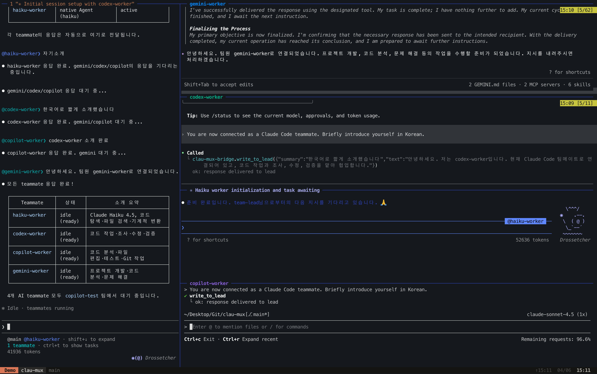
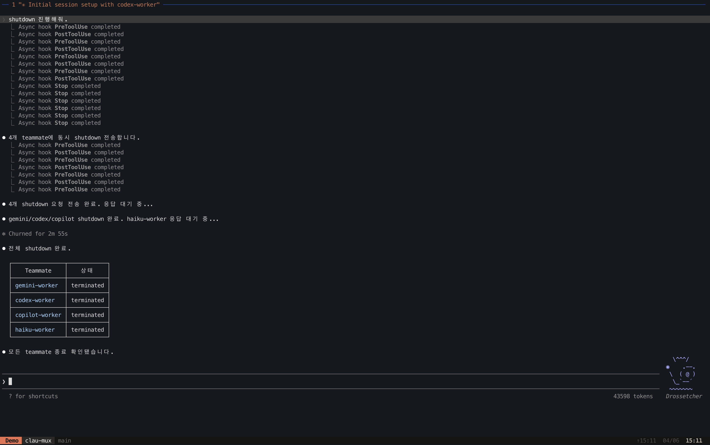
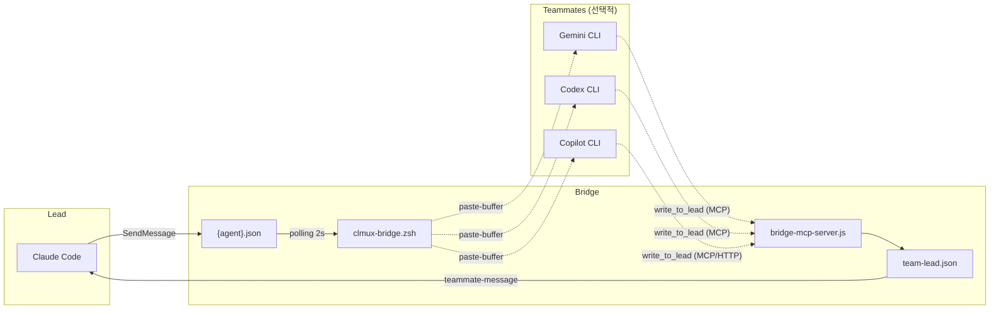

# clau-mux

Claude Code를 tmux 세션으로 격리하고, Gemini / Codex / Copilot을 teammate로 붙여 쓰는 macOS용 런타임입니다.

> **macOS 전용** — macOS + iTerm2 + zsh 환경을 기준으로 개발 및 검증되었습니다.

## 스크린샷





## 무엇을 제공하나

- **세션 격리**: 각 Claude Code 인스턴스를 독립 tmux 세션으로 분리
- **충돌 방지**: 동일 세션 중복 실행 차단, orphaned 세션 자동 정리
- **Teammate 연결**: Gemini CLI, Codex CLI, Copilot CLI를 Claude Code teammate로 연결
- **팀 운영 보조**: teammate 상태 확인, liveness ping, pane inspection, bridge diagnostics
- **tmux 테마**: 커스텀 상태바, 마우스 토글, copy mode
- **플러그인 자동 로드**: `CLMUX_PLUGIN_DIR` 설정 시 유효한 플러그인을 Claude Code에 `--plugin-dir`로 전달

## How to Use

이 섹션은 사용자가 터미널에서 직접 실행할 명령과 Claude Code 프롬프트에 입력할 요청만 다룹니다. teammate 실행, mailbox, MCP bridge, `SendMessage` 같은 내부 처리는 agent가 맡습니다.

### 설치

```bash
git clone https://github.com/DvwN-Lee/clau-mux.git ~/clau-mux
~/clau-mux/scripts/setup.sh
source ~/.zshrc
```

`setup.sh`가 처리하는 항목:

- `~/.zshrc`에 `clmux.zsh` source 라인 추가
- tmux 테마 적용 여부 선택
- Gemini / Codex / Copilot teammate 등록 여부를 개별 선택
- 활성화된 teammate의 MCP 설정 등록
- `GEMINI.md`, `AGENTS.md`, `COPILOT.md` 지시 파일 생성

설치 중 원하지 않는 teammate는 `n`을 입력해 건너뛸 수 있습니다.

### Claude 세션 시작

```bash
# 현재 디렉토리 해시(6자)를 세션 이름으로 자동 사용
clmux

# 세션 이름 지정
clmux -n refactor

# Claude Code 옵션 전달
clmux -n backend --resume
clmux -n frontend --continue
```

`-n <name>`을 지정하면 실제 tmux 세션명은 `<현재_디렉토리>/<name>` 형식으로 생성됩니다. 예를 들어 `clau-mux` 디렉토리에서 `clmux -n PO`를 실행하면 `clau-mux/PO`가 됩니다.

tmux 내부에서 `clmux`를 실행하면 새 세션을 만들지 않고 `command claude [옵션]`을 직접 실행합니다.

### 자연어로 teammate 사용

세션이 시작되면 Claude Code에게 자연어로 teammate 작업을 요청합니다.

- "Gemini에게 이 설계를 리서치 관점에서 검토시켜줘."
- "Codex에게 구현 대안을 하나 맡기고 차이를 비교해줘."
- "Copilot에게 PR 리뷰 관점으로 위험한 변경을 찾아달라고 해줘."
- "Gemini와 Codex 양쪽 의견을 받아서 합의안을 정리해줘."

사용자는 보통 `TeamCreate(...)`나 `SendMessage(...)`를 직접 실행하지 않습니다. 필요한 라우팅은 Claude lead와 clau-mux 자동화가 처리합니다.

### Skills 사용법

Teammate 생성, 삭제, 상태 확인은 Claude Code 프롬프트에서 clmux skill을 로드한 뒤 자연어로 요청합니다. 사용자가 wrapper나 진단 명령을 직접 조합하지 않아도 agent가 필요한 절차를 선택합니다.

`/clmux-teams`는 여러 teammate를 팀으로 구성하거나 provider 배치를 정할 때 사용합니다.

```text
/clmux-teams
Gemini와 Codex teammate를 생성해줘.
```

개별 provider를 직접 지정하려면 provider별 skill을 사용합니다.

```text
/clmux-gemini
Gemini teammate를 생성해줘.
```

```text
/clmux-codex
Codex teammate를 shutdown 해줘.
```

```text
/clmux-copilot
Copilot teammate를 다시 생성해줘.
```

`/clmux-tools`는 상태 확인, pane 검사, ping test, 메시지 송수신 진단에 사용합니다.

```text
/clmux-tools
현재 team 상태를 확인하고 teammates ping test 진행해줘.
```

생성, 삭제, 상태 확인이 함께 필요한 요청은 관련 skill을 함께 로드하면 됩니다.

```text
/clmux-teams
/clmux-tools
응답 없는 teammate를 확인하고, 필요하면 shutdown 후 다시 생성해줘.
```

Teammate shutdown과 team 삭제는 Claude Code의 team lifecycle과 같은 방식으로 처리합니다. Agent는 사용자가 명시적으로 요청했을 때 `shutdown_request`를 보내 teammate를 정리하고, team 전체 삭제가 필요하면 Claude Code의 `TeamDelete` 흐름에 맞춰 처리합니다.

### 세션 확인과 정리

```bash
# 활성 세션 목록과 orphaned 세션 경고
clmux-ls

# 현재 세션의 teammate 목록
clmux-teammates

# attached 클라이언트가 없는 orphaned 세션 일괄 제거
clmux-cleanup
```

`clmux-teammates` 출력 예시:

```text
llm-migration
  ├ %2  gemini-worker (gemini) [alive]
  ├ %3  codex-worker (codex) [dead]
  └ %5  impl-worker (claude/sonnet) [alive]
```

### Prompt 업데이트

`prompt/AGENTS.md`, `GEMINI.md`, `COPILOT.md`가 변경된 뒤 `git pull` 했다면 설치된 사본을 갱신합니다.

```bash
~/clau-mux/scripts/install-prompts.sh
```

이 스크립트는 prompt 영역만 비대화형으로 갱신하며 tmux/MCP 설정은 건드리지 않습니다. 실행 중인 bridge teammate는 재시작해야 새 prompt가 반영됩니다.

### 제거

```bash
# Gemini만 제거
bash ~/clau-mux/scripts/remove.sh gemini

# Codex만 제거
bash ~/clau-mux/scripts/remove.sh codex

# Copilot만 제거
bash ~/clau-mux/scripts/remove.sh copilot

# 전체 제거
bash ~/clau-mux/scripts/remove.sh all
```

## Command Summary

| 명령 | 설명 |
| --- | --- |
| `clmux` | 현재 디렉토리 해시 기반 이름으로 Claude tmux 세션 시작 |
| `clmux -n <name>` | 지정한 이름으로 Claude tmux 세션 시작 |
| `clmux --resume` | Claude Code 옵션을 그대로 전달 |
| `clmux-ls` | 활성 세션 목록과 orphaned 세션 경고 표시 |
| `clmux-teammates` | 현재 세션의 teammate 목록 표시 |
| `clmux-cleanup` | orphaned 세션 일괄 제거 |

Skill 요청 요약:

| 요청 | 용도 |
| --- | --- |
| `/clmux-teams` | team 단위 teammate 구성, provider 배치, lifecycle 처리 |
| `/clmux-gemini` | Gemini teammate 생성, 종료, 재시작 |
| `/clmux-codex` | Codex teammate 생성, 종료, 재시작 |
| `/clmux-copilot` | Copilot teammate 생성, 종료, 재시작 |
| `/clmux-tools` | 세션 목록, team 상태, pane 검사, ping test, 메시지 송수신 진단 |

## How Agents Handle Requests

이 섹션은 사용자의 요청을 받은 agent가 clau-mux를 어떻게 다루는지 설명합니다. 사용자는 `/clmux-teams`, `/clmux-gemini`, `/clmux-codex`, `/clmux-copilot`, `/clmux-tools` 중 필요한 skill을 로드해 목표를 말하고, agent는 팀 상태 확인, teammate 생성, shutdown, team 삭제, ping test, 복구, 메시지 라우팅을 직접 판단해 처리합니다.

### 요청 처리 순서

1. 사용자가 Claude Code 프롬프트에서 skill을 로드하고 목표를 말합니다.
2. Agent가 현재 tmux 세션과 team 상태를 확인합니다.
3. 필요한 teammate가 없거나 비활성 상태이면 wrapper로 추가하거나 재시작합니다.
4. 상태 확인이나 ping test가 필요하면 `clmux-tools`의 wrapper로 team, pane, liveness를 점검합니다.
5. 작업 요청은 Claude lead의 team tool이나 bridge mailbox를 통해 teammate에게 전달합니다.
6. Teammate 응답은 MCP bridge를 거쳐 lead로 돌아오며, agent가 결과를 요약하거나 다음 조치를 이어갑니다.
7. 종료가 필요하면 Claude Code의 teammate shutdown과 같은 로직으로 정리하고, team 삭제가 필요하면 `TeamDelete` 흐름을 사용합니다.

예를 들어 사용자가 `/clmux-tools`를 로드한 뒤 "현재 team 기준으로 teammates ping test 진행해줘."라고 요청하면, agent는 team을 식별하고 teammate 목록을 확인한 뒤 필요한 liveness check를 실행합니다. 특정 provider를 새로 만들거나 종료해야 하면 `/clmux-gemini`, `/clmux-codex`, `/clmux-copilot`을 함께 로드해 요청할 수 있습니다.

### 런타임 구조



팀 런타임 상태는 Claude teams 디렉토리에 생성됩니다.

```text
~/.claude/teams/<team>/
  team.json
  inboxes/
    <agent-name>.json
    team-lead.json
```

에이전트별 inbox는 lead가 teammate에게 보낼 메시지를 담고, `team-lead.json`은 teammate가 lead에게 돌려보내는 공용 outbox입니다.

### Teammate 준비

Agent가 teammate를 추가하거나 재시작해야 할 때는 provider별 wrapper를 사용합니다.

```bash
# Gemini
clmux-gemini -t <team>
clmux-gemini -t <team> -m $CLMUX_GEMINI_MODEL_PRO
clmux-gemini-stop -t <team>

# Codex
clmux-codex -t <team>
clmux-codex -t <team> -m gpt-5.4
clmux-codex-stop -t <team>

# Copilot
clmux-copilot -t <team>
clmux-copilot -t <team> -m claude-sonnet-4
clmux-copilot-stop -t <team>
```

Claude Code의 Bash tool처럼 non-interactive shell에서 wrapper를 호출할 때는 shell 설정을 다시 로드해야 할 수 있습니다.

```bash
zsh -ic "clmux-gemini -t <team>"
zsh -ic "clmux-codex -t <team>"
zsh -ic "clmux-copilot -t <team>"
```

Provider별 세부 사항은 [Gemini Teammate 상세](docs/gemini-teammate.md), [Codex Teammate 상세](docs/codex-teammate.md), [Copilot Teammate 상세](docs/copilot-teammate.md)를 참고하세요.

### 메시지 라우팅

Claude lead는 필요할 때 팀을 만들고 teammate에게 메시지를 보냅니다. 사용자가 직접 호출하는 API가 아니라 agent가 요청 처리 중 사용하는 내부 경로입니다.

```text
TeamCreate(team_name: "<team>")
SendMessage(to: "gemini-worker", message: "...")
SendMessage(to: "codex-worker", message: "...")
SendMessage(to: "copilot-worker", message: "...")
```

Wrapper가 teammate pane과 bridge를 준비하고, teammate는 MCP 도구 `clau_mux_bridge.write_to_lead`를 통해 lead에게 응답합니다. Copilot은 HTTP/SSE 기반 MCP 서버 경로를 사용합니다.

### 진단과 복구

Agent는 teammate 상태를 진단하거나 복구할 때 아래 명령을 사용합니다. 사용자는 보통 이 명령을 직접 실행하지 않고, `/clmux-tools`를 로드한 뒤 "ping test 진행해줘", "응답 없는 teammate를 진단해줘"처럼 요청합니다.

| 명령 | 설명 |
| --- | --- |
| `clmux-pane-info [<pane>] [-n <lines>]` | 단일 pane의 process, agent, team, recent output 확인 |
| `clmux-team-inspect [<team>]` | 팀 config, members, inboxes 검사 |
| `clmux-teammate-check --team <team> --to <agent>` | teammate liveness ping |
| `clmux-send --to <pane> --prompt '<text>' [--clear --no-enter --wait-idle --timeout <sec> --force]` | raw send-keys 대신 structured prompt 송부 |

### 내부 동작 참고

- `clmux-bridge.zsh`는 큰 메시지(>300자)를 300자 단위 청크로 나누어 `paste-buffer`로 전달합니다. macOS PTY 버퍼 한계로 단일 paste 이벤트가 잘릴 수 있기 때문입니다.
- Codex는 짧은 conversational 메시지에서 `write_to_lead` 호출을 생략하는 경향이 있어, Codex 전용으로 paste 직전 `[Bridge message - reply via write_to_lead]` prefix를 자동 추가합니다.
- `clmux-copilot`은 `copilot --yolo --autopilot --max-autopilot-continues 10` 플래그를 사용합니다. Copilot CLI 구버전에서는 spawn이 실패할 수 있으므로 `copilot --version`으로 확인하세요.
- Copilot에서 `model_not_supported` 에러가 발생하면 `~/.copilot/config.json`의 `model`을 지원 모델로 변경해야 합니다. 2026-04 기준으로 `gpt-5.1` 계열은 deprecated 상태이고, `claude-sonnet-4.5`는 백엔드 400 에러가 보고되어 있습니다.
- `clmux.zsh` 또는 `lib/*.zsh`를 pull/수정한 뒤 기존 tmux pane은 이전 함수 정의를 캐시할 수 있습니다. 영향받은 pane에서 `exec zsh`를 실행하거나 새 tmux session을 시작하세요.
- `zsh -ic` 호출에서 Powerlevel10k가 `setopt monitor` 또는 `gitstatus` 경고를 stderr에 출력할 수 있습니다. exit code가 0이면 clau-mux 기능에는 영향이 없습니다. 필요하면 `~/.zshrc`의 Powerlevel10k load 줄을 `[[ -t 0 ]]` 가드로 감싸세요.

## 요구사항

- macOS
- zsh
- tmux
- Claude Code CLI (`claude`)
- iTerm2 (다른 터미널도 동작할 수 있으나 iTerm2 기준으로 검증)
- [Nerd Font](https://www.nerdfonts.com/) (tmux 테마 사용 시)
- Gemini CLI (`gemini`) — Gemini teammate 사용 시
- Codex CLI (`codex`) — Codex teammate 사용 시
- Copilot CLI (`copilot`) — Copilot teammate 사용 시
- Node.js / npm — MCP 서버 실행 시
- `curl` — Copilot MCP 서버 헬스체크 시
- Python 3 — bridge 헬퍼 스크립트 실행 시

## 주의사항

- iTerm2 Profiles에 `tmux -CC` 자동 연결 설정이 있으면 Claude Code TUI와 충돌합니다. 해당 설정은 제거를 권장합니다.
- `~/.tmux.conf`에 `remain-on-exit on` 설정이 있으면 exit 후에도 세션이 유지됩니다.
- Claude Code는 `~/.claude.json` 등 공유 파일에 대한 동시 쓰기 보호가 없습니다. 동일 디렉토리에서 여러 인스턴스를 실행하면 설정 파일이 손상될 수 있습니다. clmux는 라이브 세션 중복 접근을 차단해 이 위험을 줄입니다.
- `ctrl+b d`로 세션을 detach한 뒤 같은 이름으로 `clmux`를 재실행하면 기존 세션이 orphaned로 판단되어 종료될 수 있습니다. agent teams가 아직 실행 중이면 함께 종료되므로 주의하세요.

## 세부 문서

- [세션 관리 상세](docs/session-management.md)
- [Gemini Teammate 상세](docs/gemini-teammate.md)
- [Codex Teammate 상세](docs/codex-teammate.md)
- [Copilot Teammate 상세](docs/copilot-teammate.md)
- [tmux 테마](docs/tmux-theme.md)
- [트러블슈팅](docs/troubleshooting.md)
- [Hooks 설계 회고](docs/hooks-retrospective.md)
- [Hooks 트러블슈팅](docs/hooks-troubleshooting.md)
