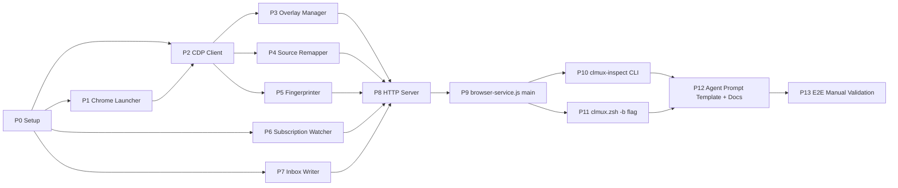

# Browser Inspect Tool Implementation Plan

> **For agentic workers:** REQUIRED SUB-SKILL: Use superpowers:subagent-driven-development (recommended) or superpowers:executing-plans to implement this plan task-by-task. Steps use checkbox (`- [ ]`) syntax for tracking.

**Goal:** clau-mux에 `clmux -b` 플래그를 추가해 격리 Chrome + Node.js daemon + overlay + CLI로 구성된 "Browser Inspect Tool"을 구현한다. 사용자가 브라우저에서 요소를 클릭하면 소스 위치 + 실측 computed style 등 4-section payload가 구독 중인 agent의 inbox에 자동 주입되어 frontend debugging이 자연어 프롬프트 대신 구조화된 데이터로 이루어지도록 한다.

**Architecture:** Lead-hosted background daemon (Node.js, clau-mux의 `bridge-mcp-server.js` 패턴 복제). CDP Overlay inspect mode로 click 이벤트 캡처 → Multi-tier source remapping (React/Vue/Svelte/Solid 런타임 hook 우선, build-time injection fallback) → Reality fingerprint 생성 (CDP `CSS.getMatchedStylesForNode` + `Accessibility.getPartialAXTree`, 5000 token budget) → `.inspect-subscriber` 파일 기반 구독 모델 → atomic inbox write (clmux-bridge.zsh가 polling). NOT MCP. 스크린샷 금지. Chrome은 `--remote-debugging-port=0 --user-data-dir=<isolated>`로 격리.

**Tech Stack:**
- **Node.js 20+ LTS** (plain JavaScript + JSDoc types, `bridge-mcp-server.js` 패턴)
- **chrome-remote-interface** (MIT) — CDP client
- **Chrome 130+** — CDP. **주의: 일부 Experimental API 사용** (`Target.setAutoAttach.flatten`, `Overlay.*`, `Accessibility.getPartialAXTree`). 다른 Chromium 기반 브라우저에서 호환성 보장 안 됨. feature detection + graceful degradation 필수 (Task 6 참조).
- **node:test** (built-in) — TDD test runner
- **zsh / bash** — CLI wrapper + clmux.zsh integration

**Review acknowledgment (2026-04-08):** 이 plan은 3-way review를 통과함 — copilot-worker (GitHub/PR/integration), codex-worker (CDP/security/lifecycle), gemini-worker (Frontend/UX). 9 BLOCKER + 5 HIGH + 4 MEDIUM 수정 반영 완료.

---

## Spec References

이 plan은 다음 spec 문서의 결정을 구현한다:

- **Design**: `.worktrees/feat-browser-inspect/docs/superpowers/specs/2026-04-07-browser-inspect-tool-design.md`
- **Requirements**: `.worktrees/feat-browser-inspect/docs/superpowers/specs/2026-04-08-browser-inspect-requirements.md` (25 FR + 17 NFR + 7 UC)
- **Architecture**: `.worktrees/feat-browser-inspect/docs/superpowers/specs/2026-04-08-browser-inspect-architecture.md` (C4 + 8 ADR + 5 risks)

각 Task 헤더의 `Implements` 필드가 FR/NFR ID와 architecture section을 참조한다.

---

## File Structure

### 신규 생성 파일

```
/Users/idongju/Desktop/Git/clau-mux/
├── browser-service/                              # 신규 디렉토리
│   ├── browser-service.js                        # main entry — launches everything
│   ├── chrome-launcher.js                        # Chrome binary 탐지 + spawn + port 발견
│   ├── cdp-client.js                             # CDP connection + reconnect logic
│   ├── overlay-manager.js                        # Overlay.setInspectMode + SPA nav 처리
│   ├── source-remapper.js                        # Multi-tier 역매핑 (T1/T2/T4)
│   ├── fingerprinter.js                          # reality_fingerprint 생성
│   ├── subscription-watcher.js                   # .inspect-subscriber file watch
│   ├── inbox-writer.js                           # atomic inbox JSON append
│   ├── http-server.js                            # localhost HTTP API
│   ├── overlay-bootstrap.js                      # 브라우저 주입용 JS (overlay UI + bindings)
│   ├── history-api-hook.js                       # 브라우저 주입용 JS (pushState/replaceState wrap)
│   ├── logger.js                                 # 로깅 유틸
│   ├── path-utils.js                             # inbox path validation
│   ├── framework-detector.js                     # React/Vue/Svelte/Solid 감지
│   ├── payload-builder.js                        # 4-section payload 조립
│   └── tests/
│       ├── chrome-launcher.test.js
│       ├── source-remapper.test.js
│       ├── fingerprinter.test.js
│       ├── inbox-writer.test.js
│       ├── path-utils.test.js
│       ├── framework-detector.test.js
│       ├── payload-builder.test.js
│       ├── subscription-watcher.test.js
│       ├── http-server.test.js
│       ├── logger.test.js
│       ├── integration.test.js
│       └── fixtures/
│           ├── devtools-active-port.txt
│           └── sample-matched-styles.json
├── bin/
│   └── clmux-inspect                             # CLI wrapper (bash)
├── docs/
│   ├── browser-inspect-tool.md                   # 사용자 가이드
│   └── browser-inspect-agent-prompt.md           # agent prompt template
└── examples/
    └── react-test-app/                           # E2E 수동 테스트용 샘플 Vite+React 앱
```

### 수정 파일

```
├── clmux.zsh                                     # -b 플래그 추가 + _clmux_launch_browser_service 함수
├── package.json                                  # chrome-remote-interface 의존성 + engines 필드
├── scripts/setup.sh                              # clmux-inspect PATH 등록
├── scripts/remove.sh                             # browser-service cleanup 추가 (macOS + Linux)
├── CHANGELOG.md                                  # 1.3.0 릴리즈 노트 (신규 시)
└── README.md                                     # BIT 섹션 추가
```

### Port 파일 분리 (B1 fix)

`.browser-service.port` 와 `.chrome-debug.port`는 **서로 다른 파일**이다:

| 파일 | 내용 | 소유자 |
|---|---|---|
| `~/.claude/teams/$team/.chrome-debug.port` | Chrome `--remote-debugging-port=0`이 할당받은 실제 포트 (CDP WebSocket용) | Task 5 chrome-launcher |
| `~/.claude/teams/$team/.browser-service.port` | browser-service daemon의 HTTP 서버 포트 (clmux-inspect CLI가 연결) | Task 14 main entry |

**주의**: 초안에서는 두 파일이 같은 이름이었으나 의미 충돌(port collision)이 발생하므로 분리함.

---

## Phase Dependency Graph



**병렬 가능**: P1+P6+P7 (no interdeps), P4+P5 (after P2), P10+P11 (after P9).

---

## Task 0: 프로젝트 셋업

**Files:**
- Modify: `/Users/idongju/Desktop/Git/clau-mux/package.json` (add chrome-remote-interface 의존성)
- Create: `/Users/idongju/Desktop/Git/clau-mux/browser-service/` directory tree

**Implements:** 프로젝트 스캐폴드 (FR-101 준비)

- [ ] **Step 0.1: browser-service/ 디렉토리 생성**

```bash
cd /Users/idongju/Desktop/Git/clau-mux
mkdir -p browser-service/tests/fixtures bin
```

- [ ] **Step 0.2: chrome-remote-interface 의존성 + engines 필드 추가**

기존 `package.json`을 수정해 dependencies + engines 섹션 추가:

```json
{
  "dependencies": {
    "chrome-remote-interface": "^0.33.2"
  },
  "engines": {
    "node": ">=20.0.0"
  }
}
```

> **근거 (B6 — Copilot review)**: `chrome-remote-interface`는 Node 16+ 요구. clau-mux 기존 `package.json`에 `engines` 필드 없어 Node 14/16 사용자가 silent failure 겪을 수 있음. Node 20 LTS 명시로 방어.

Run:
```bash
cd /Users/idongju/Desktop/Git/clau-mux
npm install chrome-remote-interface@^0.33.2
```

Expected: `added N packages`, `package-lock.json` 생성 또는 업데이트. `npm install` 이 Node 20 미만이면 warning 출력.

- [ ] **Step 0.3: 첫 commit**

```bash
cd /Users/idongju/Desktop/Git/clau-mux/.worktrees/feat-browser-inspect
git add package.json package-lock.json browser-service/
git commit -m "chore: scaffold browser-service directory + add chrome-remote-interface dep"
```

---

## Task 1: logger 유틸리티 (pure unit test)

**Files:**
- Create: `browser-service/logger.js`
- Create: `browser-service/tests/logger.test.js`

**Implements:** NFR-601 (daemon log file format), NFR-603 (debug mode)

- [ ] **Step 1.1: 실패 테스트 작성**

`browser-service/tests/logger.test.js`:

```js
import { test } from 'node:test';
import assert from 'node:assert/strict';
import { formatLogLine, createLogger } from '../logger.js';

test('formatLogLine produces ISO-timestamp [LEVEL] [component] message format', () => {
  const line = formatLogLine({
    level: 'INFO',
    component: 'overlay-manager',
    message: 'inspect mode enabled',
    timestamp: '2026-04-08T10:23:41.123Z',
  });
  assert.equal(line, '[2026-04-08T10:23:41.123Z] [INFO] [overlay-manager] inspect mode enabled');
});

test('createLogger debug() is no-op when CLMUX_DEBUG not set', () => {
  delete process.env.CLMUX_DEBUG;
  const messages = [];
  const logger = createLogger('test', { sink: (line) => messages.push(line) });
  logger.debug('secret payload');
  assert.equal(messages.length, 0);
});

test('createLogger debug() emits when CLMUX_DEBUG=1', () => {
  process.env.CLMUX_DEBUG = '1';
  const messages = [];
  const logger = createLogger('test', { sink: (line) => messages.push(line) });
  logger.debug('visible');
  assert.equal(messages.length, 1);
  assert.match(messages[0], /\[DEBUG\] \[test\] visible/);
  delete process.env.CLMUX_DEBUG;
});
```

- [ ] **Step 1.2: 테스트 실패 확인**

```bash
cd /Users/idongju/Desktop/Git/clau-mux
node --test browser-service/tests/logger.test.js
```

Expected: FAIL — `Cannot find module '../logger.js'`.

- [ ] **Step 1.3: 최소 구현**

`browser-service/logger.js`:

```js
/**
 * @typedef {'DEBUG'|'INFO'|'WARN'|'ERROR'} LogLevel
 * @typedef {{ level: LogLevel, component: string, message: string, timestamp?: string }} LogEntry
 */

export function formatLogLine(entry) {
  const ts = entry.timestamp ?? new Date().toISOString();
  return `[${ts}] [${entry.level}] [${entry.component}] ${entry.message}`;
}

export function createLogger(component, opts = {}) {
  const sink = opts.sink ?? ((line) => process.stderr.write(line + '\n'));
  const emit = (level, message) => sink(formatLogLine({ level, component, message }));
  return {
    info: (msg) => emit('INFO', msg),
    warn: (msg) => emit('WARN', msg),
    error: (msg) => emit('ERROR', msg),
    debug: (msg) => {
      if (process.env.CLMUX_DEBUG === '1') emit('DEBUG', msg);
    },
  };
}
```

- [ ] **Step 1.4: 테스트 통과 확인**

```bash
node --test browser-service/tests/logger.test.js
```

Expected: `tests 3`, `pass 3`, `fail 0`.

- [ ] **Step 1.5: commit**

```bash
git add browser-service/logger.js browser-service/tests/logger.test.js
git commit -m "feat(browser-service): logger utility with debug gating"
```

---

## Task 2: path-utils (inbox 경로 검증)

**Files:**
- Create: `browser-service/path-utils.js`
- Create: `browser-service/tests/path-utils.test.js`

**Implements:** NFR-303 (파일 권한 0600), 보안 매트릭스 (path injection 방지, bridge-mcp-server.js 동일 패턴)

> **B4 fix (Codex review)**: 초안은 `path.normalize()` 후 `includes('..')` 체크했으나 normalize가 이미 `..`를 제거하므로 무의미. 범위도 `~/.claude/**/*.json` 전체로 너무 넓었음. 이 버전은 `path.resolve()` 기반 prefix 체크 + `~/.claude/teams/<team>/inboxes/<agent>.json` exact pattern 검증.

- [ ] **Step 2.1: 실패 테스트 작성**

`browser-service/tests/path-utils.test.js`:

```js
import { test } from 'node:test';
import assert from 'node:assert/strict';
import os from 'node:os';
import path from 'node:path';
import fs from 'node:fs';
import { validateInboxPath, InvalidInboxPathError } from '../path-utils.js';

const home = os.homedir();

test('accepts valid inbox path under ~/.claude/teams/<team>/inboxes/', () => {
  const p = path.join(home, '.claude', 'teams', 'proj', 'inboxes', 'gemini-worker.json');
  assert.doesNotThrow(() => validateInboxPath(p));
});

test('rejects path outside ~/.claude', () => {
  assert.throws(() => validateInboxPath('/tmp/evil.json'), InvalidInboxPathError);
});

test('rejects ~/.claude but not in teams/*/inboxes/', () => {
  const p = path.join(home, '.claude', 'random.json');
  assert.throws(() => validateInboxPath(p), InvalidInboxPathError);
});

test('rejects teams/*/config.json (not inboxes)', () => {
  const p = path.join(home, '.claude', 'teams', 'proj', 'config.json');
  assert.throws(() => validateInboxPath(p), InvalidInboxPathError);
});

test('rejects .. traversal via unresolved path', () => {
  const p = home + '/.claude/teams/proj/inboxes/../../../../etc/passwd.json';
  assert.throws(() => validateInboxPath(p), InvalidInboxPathError);
});

test('rejects non-json extension', () => {
  const p = path.join(home, '.claude', 'teams', 'proj', 'inboxes', 'foo.txt');
  assert.throws(() => validateInboxPath(p), InvalidInboxPathError);
});

test('rejects nested subdirectory under inboxes', () => {
  const p = path.join(home, '.claude', 'teams', 'proj', 'inboxes', 'nested', 'foo.json');
  assert.throws(() => validateInboxPath(p), InvalidInboxPathError);
});
```

- [ ] **Step 2.2: 테스트 실패 확인**

```bash
node --test browser-service/tests/path-utils.test.js
```

Expected: FAIL — `Cannot find module`.

- [ ] **Step 2.3: 구현 (B4 — resolve + exact pattern)**

`browser-service/path-utils.js`:

```js
import os from 'node:os';
import path from 'node:path';

export class InvalidInboxPathError extends Error {
  constructor(reason, targetPath) {
    super(`invalid inbox path: ${reason} (${targetPath})`);
    this.name = 'InvalidInboxPathError';
  }
}

// Exact allowed pattern: ~/.claude/teams/<team>/inboxes/<agent>.json
// - team: single path segment (no /, no ..)
// - agent: single path segment ending in .json
const INBOX_PATTERN = /^teams\/[^/]+\/inboxes\/[^/]+\.json$/;

/**
 * Validates inbox path. Mirrors bridge-mcp-server.js security pattern with tighter scope.
 * Uses path.resolve() (not normalize) to fully expand relative segments and symlinks.
 *
 * @param {string} inboxPath absolute path
 * @throws {InvalidInboxPathError}
 */
export function validateInboxPath(inboxPath) {
  if (typeof inboxPath !== 'string' || inboxPath.length === 0) {
    throw new InvalidInboxPathError('empty or non-string', inboxPath);
  }

  const home = os.homedir();
  const claudeRoot = path.resolve(home, '.claude');
  const resolved = path.resolve(inboxPath);

  // Must be under ~/.claude
  if (!resolved.startsWith(claudeRoot + path.sep)) {
    throw new InvalidInboxPathError('not under ~/.claude', inboxPath);
  }

  // Must match exact inbox pattern
  const relative = path.relative(claudeRoot, resolved);
  if (!INBOX_PATTERN.test(relative)) {
    throw new InvalidInboxPathError(
      `not a valid inbox path (expected teams/<team>/inboxes/<agent>.json, got ${relative})`,
      inboxPath,
    );
  }

  if (!resolved.endsWith('.json')) {
    throw new InvalidInboxPathError('not a .json file', inboxPath);
  }
}
```

- [ ] **Step 2.4: 테스트 통과 확인**

```bash
node --test browser-service/tests/path-utils.test.js
```

Expected: `pass 7`, `fail 0`.

- [ ] **Step 2.5: commit**

```bash
git add browser-service/path-utils.js browser-service/tests/path-utils.test.js
git commit -m "feat(browser-service): path-utils with inbox validation (bridge-mcp-server.js pattern)"
```

---

## Task 3: inbox-writer (atomic append)

**Files:**
- Create: `browser-service/inbox-writer.js`
- Create: `browser-service/tests/inbox-writer.test.js`

**Implements:** FR-503 (atomic append), FR-504 (in-flight 보존), architecture §6.7

- [ ] **Step 3.1: 실패 테스트 작성**

`browser-service/tests/inbox-writer.test.js`:

```js
import { test, beforeEach, afterEach } from 'node:test';
import assert from 'node:assert/strict';
import fs from 'node:fs';
import os from 'node:os';
import path from 'node:path';
import { writeToInbox, MAX_ENTRIES } from '../inbox-writer.js';

let tmpHome;
let teamDir;

beforeEach(() => {
  tmpHome = fs.mkdtempSync(path.join(os.tmpdir(), 'clmux-test-'));
  process.env.HOME = tmpHome;
  teamDir = path.join(tmpHome, '.claude', 'teams', 'test-team');
  fs.mkdirSync(path.join(teamDir, 'inboxes'), { recursive: true });
});

afterEach(() => {
  fs.rmSync(tmpHome, { recursive: true, force: true });
});

test('appends entry to empty inbox', () => {
  const payload = { user_intent: 'padding 이상', pointing: {}, source_location: {}, reality_fingerprint: {} };
  writeToInbox(teamDir, 'gemini-worker', payload);

  const inbox = path.join(teamDir, 'inboxes', 'gemini-worker.json');
  const entries = JSON.parse(fs.readFileSync(inbox, 'utf8'));
  assert.equal(entries.length, 1);
  assert.equal(entries[0].from, 'browser-inspect');
  assert.match(entries[0].summary, /browser-inspect:/);
  assert.ok(entries[0].text);
});

test('atomic write does not leave .tmp files on success', () => {
  writeToInbox(teamDir, 'gemini-worker', { user_intent: 'test' });
  const files = fs.readdirSync(path.join(teamDir, 'inboxes'));
  assert.deepEqual(files.filter(f => f.endsWith('.tmp')), []);
});

test('caps at MAX_ENTRIES (50)', () => {
  for (let i = 0; i < MAX_ENTRIES + 10; i++) {
    writeToInbox(teamDir, 'gemini-worker', { user_intent: `msg ${i}` });
  }
  const entries = JSON.parse(fs.readFileSync(path.join(teamDir, 'inboxes', 'gemini-worker.json'), 'utf8'));
  assert.equal(entries.length, MAX_ENTRIES);
  assert.match(entries[MAX_ENTRIES - 1].text, /msg 59/);
});

test('file permission 0600 after write', () => {
  writeToInbox(teamDir, 'gemini-worker', { user_intent: 'test' });
  const mode = fs.statSync(path.join(teamDir, 'inboxes', 'gemini-worker.json')).mode & 0o777;
  assert.equal(mode, 0o600);
});

test('rejects path outside ~/.claude', () => {
  assert.throws(() => writeToInbox('/tmp/evil', 'worker', {}));
});
```

- [ ] **Step 3.2: 테스트 실패 확인**

```bash
node --test browser-service/tests/inbox-writer.test.js
```

Expected: FAIL — module not found.

- [ ] **Step 3.3: 구현**

`browser-service/inbox-writer.js`:

```js
import fs from 'node:fs';
import path from 'node:path';
import crypto from 'node:crypto';
import { validateInboxPath } from './path-utils.js';

export const MAX_ENTRIES = 50;

export function writeToInbox(teamDir, subscriber, payload) {
  const inboxPath = path.join(teamDir, 'inboxes', `${subscriber}.json`);
  validateInboxPath(inboxPath);

  let entries = [];
  try {
    const raw = fs.readFileSync(inboxPath, 'utf8');
    entries = JSON.parse(raw);
    if (!Array.isArray(entries)) entries = [];
  } catch {
    entries = [];
  }

  const summary = `browser-inspect: ${String(payload.user_intent || '').slice(0, 60)}`;
  entries.push({
    from: 'browser-inspect',
    text: JSON.stringify(payload),
    timestamp: new Date().toISOString(),
    read: false,
    summary,
  });

  if (entries.length > MAX_ENTRIES) {
    entries = entries.slice(-MAX_ENTRIES);
  }

  const tmp = inboxPath + '.' + crypto.randomBytes(4).toString('hex') + '.tmp';
  fs.writeFileSync(tmp, JSON.stringify(entries, null, 2), { mode: 0o600 });
  fs.renameSync(tmp, inboxPath);
  // M6 fix: explicit chmod after rename — mode option only affects new file creation,
  // not overwrites of existing files with different permissions.
  try { fs.chmodSync(inboxPath, 0o600); } catch { /* best-effort */ }
}
```

- [ ] **Step 3.4: 테스트 통과 확인**

```bash
node --test browser-service/tests/inbox-writer.test.js
```

Expected: `pass 5`, `fail 0`.

- [ ] **Step 3.5: commit**

```bash
git add browser-service/inbox-writer.js browser-service/tests/inbox-writer.test.js
git commit -m "feat(browser-service): inbox-writer with atomic append + 50-entry cap"
```

---

## Task 4: subscription-watcher

**Files:**
- Create: `browser-service/subscription-watcher.js`
- Create: `browser-service/tests/subscription-watcher.test.js`

**Implements:** FR-501 (`.inspect-subscriber` 파일 기반), FR-504 (구독자 변경), architecture §6.6

- [ ] **Step 4.1: 실패 테스트 작성**

`browser-service/tests/subscription-watcher.test.js`:

```js
import { test, beforeEach, afterEach } from 'node:test';
import assert from 'node:assert/strict';
import fs from 'node:fs';
import os from 'node:os';
import path from 'node:path';
import { watchSubscriber, readSubscriber, writeSubscriber } from '../subscription-watcher.js';

let teamDir;

beforeEach(() => {
  teamDir = fs.mkdtempSync(path.join(os.tmpdir(), 'clmux-sub-'));
});
afterEach(() => {
  fs.rmSync(teamDir, { recursive: true, force: true });
});

test('readSubscriber returns null when file missing', () => {
  assert.equal(readSubscriber(teamDir), null);
});

test('writeSubscriber + readSubscriber round-trip', () => {
  writeSubscriber(teamDir, 'gemini-worker');
  assert.equal(readSubscriber(teamDir), 'gemini-worker');
});

test('writeSubscriber creates file with 0600 permission', () => {
  writeSubscriber(teamDir, 'codex-worker');
  const mode = fs.statSync(path.join(teamDir, '.inspect-subscriber')).mode & 0o777;
  assert.equal(mode, 0o600);
});

test('writeSubscriber("") clears subscriber', () => {
  writeSubscriber(teamDir, 'gemini-worker');
  writeSubscriber(teamDir, '');
  assert.equal(readSubscriber(teamDir), null);
});

test('watchSubscriber fires onChange when file updated', async () => {
  const changes = [];
  const stop = watchSubscriber(teamDir, (sub) => changes.push(sub));
  await new Promise((r) => setTimeout(r, 100));
  writeSubscriber(teamDir, 'gemini-worker');
  await new Promise((r) => setTimeout(r, 300));
  stop();
  assert.ok(changes.includes('gemini-worker'), `expected gemini-worker in ${JSON.stringify(changes)}`);
});
```

- [ ] **Step 4.2: 테스트 실패 확인**

```bash
node --test browser-service/tests/subscription-watcher.test.js
```

Expected: FAIL.

- [ ] **Step 4.3: 구현**

`browser-service/subscription-watcher.js`:

```js
import fs from 'node:fs';
import path from 'node:path';

const SUB_FILE = '.inspect-subscriber';
const POLL_INTERVAL_MS = 2000;

export function readSubscriber(teamDir) {
  const file = path.join(teamDir, SUB_FILE);
  try {
    const content = fs.readFileSync(file, 'utf8').trim();
    return content.length > 0 ? content : null;
  } catch {
    return null;
  }
}

export function writeSubscriber(teamDir, agent) {
  const file = path.join(teamDir, SUB_FILE);
  fs.writeFileSync(file, agent, { mode: 0o600 });
  // M6 fix: explicit chmod — mode option only affects creation
  try { fs.chmodSync(file, 0o600); } catch { /* best-effort */ }
}

export function watchSubscriber(teamDir, onChange) {
  const file = path.join(teamDir, SUB_FILE);
  let lastValue = readSubscriber(teamDir);
  onChange(lastValue);

  let watcher = null;
  let pollTimer = null;
  let stopped = false;

  const check = () => {
    if (stopped) return;
    const current = readSubscriber(teamDir);
    if (current !== lastValue) {
      lastValue = current;
      onChange(current);
    }
  };

  const tryFsWatch = () => {
    try {
      watcher = fs.watch(file, { persistent: false }, check);
      watcher.on('error', () => {
        if (watcher) watcher.close();
        watcher = null;
        startPolling();
      });
    } catch {
      startPolling();
    }
  };

  const startPolling = () => {
    pollTimer = setInterval(check, POLL_INTERVAL_MS);
  };

  if (fs.existsSync(file)) {
    tryFsWatch();
  } else {
    startPolling();
    try {
      const dirWatcher = fs.watch(teamDir, { persistent: false }, (_event, name) => {
        if (name === SUB_FILE && fs.existsSync(file)) {
          dirWatcher.close();
          if (pollTimer) { clearInterval(pollTimer); pollTimer = null; }
          tryFsWatch();
          check();
        }
      });
    } catch { /* directory doesn't exist yet */ }
  }

  return () => {
    stopped = true;
    if (watcher) watcher.close();
    if (pollTimer) clearInterval(pollTimer);
  };
}
```

- [ ] **Step 4.4: 테스트 통과 확인**

```bash
node --test browser-service/tests/subscription-watcher.test.js
```

Expected: `pass 5`, `fail 0`.

- [ ] **Step 4.5: commit**

```bash
git add browser-service/subscription-watcher.js browser-service/tests/subscription-watcher.test.js
git commit -m "feat(browser-service): subscription-watcher with fs.watch + polling fallback"
```

---

## Task 5: chrome-launcher (바이너리 탐지)

**Files:**
- Create: `browser-service/chrome-launcher.js`
- Create: `browser-service/tests/chrome-launcher.test.js`
- Create: `browser-service/tests/fixtures/devtools-active-port.txt`

**Implements:** FR-102 (격리 Chrome launch), C6 (보안 mandate), architecture §6.1

- [ ] **Step 5.1: fixture 준비**

`browser-service/tests/fixtures/devtools-active-port.txt`:
```
54321
/devtools/browser/abc123
```

- [ ] **Step 5.2: 실패 테스트 작성**

`browser-service/tests/chrome-launcher.test.js`:

```js
import { test } from 'node:test';
import assert from 'node:assert/strict';
import fs from 'node:fs';
import os from 'node:os';
import path from 'node:path';
import { fileURLToPath } from 'node:url';
import {
  detectChromeBinary,
  pollDevToolsActivePort,
  DevToolsPortTimeoutError,
} from '../chrome-launcher.js';

const __dirname = path.dirname(fileURLToPath(import.meta.url));

test('detectChromeBinary returns string path on macOS', { skip: process.platform !== 'darwin' }, () => {
  const bin = detectChromeBinary();
  assert.ok(typeof bin === 'string');
  assert.ok(bin.includes('Chrome') || bin.includes('chrome'));
});

test('pollDevToolsActivePort reads port from file', async () => {
  const profileDir = fs.mkdtempSync(path.join(os.tmpdir(), 'clmux-chrome-test-'));
  try {
    fs.copyFileSync(
      path.join(__dirname, 'fixtures', 'devtools-active-port.txt'),
      path.join(profileDir, 'DevToolsActivePort'),
    );
    const port = await pollDevToolsActivePort(profileDir, { timeoutMs: 500, retryIntervalMs: 50 });
    assert.equal(port, 54321);
  } finally {
    fs.rmSync(profileDir, { recursive: true, force: true });
  }
});

test('pollDevToolsActivePort throws DevToolsPortTimeoutError on timeout', async () => {
  const profileDir = fs.mkdtempSync(path.join(os.tmpdir(), 'clmux-chrome-test-'));
  try {
    await assert.rejects(
      pollDevToolsActivePort(profileDir, { timeoutMs: 200, retryIntervalMs: 50 }),
      DevToolsPortTimeoutError,
    );
  } finally {
    fs.rmSync(profileDir, { recursive: true, force: true });
  }
});
```

- [ ] **Step 5.3: 테스트 실패 확인**

```bash
node --test browser-service/tests/chrome-launcher.test.js
```

Expected: FAIL — module not found.

- [ ] **Step 5.4: 구현**

`browser-service/chrome-launcher.js`:

```js
import fs from 'node:fs';
import path from 'node:path';
import { spawn } from 'node:child_process';

const MACOS_PATHS = [
  '/Applications/Google Chrome.app/Contents/MacOS/Google Chrome',
  '/Applications/Google Chrome Beta.app/Contents/MacOS/Google Chrome Beta',
  '/Applications/Chromium.app/Contents/MacOS/Chromium',
];

const LINUX_PATHS = [
  '/usr/bin/google-chrome',
  '/usr/bin/google-chrome-stable',
  '/usr/bin/chromium-browser',
  '/usr/bin/chromium',
];

export class ChromeBinaryNotFoundError extends Error {
  constructor() {
    super('Chrome/Chromium binary not found. Install Google Chrome or set CHROME_BIN env var.');
    this.name = 'ChromeBinaryNotFoundError';
  }
}

export class DevToolsPortTimeoutError extends Error {
  constructor(profileDir) {
    super(`DevToolsActivePort file not created within timeout: ${profileDir}`);
    this.name = 'DevToolsPortTimeoutError';
  }
}

export function detectChromeBinary() {
  if (process.env.CHROME_BIN && fs.existsSync(process.env.CHROME_BIN)) {
    return process.env.CHROME_BIN;
  }
  const candidates = process.platform === 'darwin' ? MACOS_PATHS : LINUX_PATHS;
  for (const p of candidates) {
    if (fs.existsSync(p)) return p;
  }
  throw new ChromeBinaryNotFoundError();
}

export async function pollDevToolsActivePort(profileDir, opts = {}) {
  const timeoutMs = opts.timeoutMs ?? 5000;
  const retryIntervalMs = opts.retryIntervalMs ?? 200;
  const portFile = path.join(profileDir, 'DevToolsActivePort');
  const deadline = Date.now() + timeoutMs;

  while (Date.now() < deadline) {
    if (fs.existsSync(portFile)) {
      try {
        const content = fs.readFileSync(portFile, 'utf8');
        const firstLine = content.split('\n')[0].trim();
        const port = parseInt(firstLine, 10);
        if (!isNaN(port) && port > 0) return port;
      } catch { /* retry */ }
    }
    await new Promise((r) => setTimeout(r, retryIntervalMs));
  }
  throw new DevToolsPortTimeoutError(profileDir);
}

export async function launchChrome({ teamDir, profileDir, logPath }) {
  fs.mkdirSync(profileDir, { recursive: true });
  const stalePort = path.join(profileDir, 'DevToolsActivePort');
  if (fs.existsSync(stalePort)) fs.unlinkSync(stalePort);

  const chromeBin = detectChromeBinary();
  const logFd = fs.openSync(logPath, 'a');

  const proc = spawn(chromeBin, [
    '--remote-debugging-port=0',
    `--user-data-dir=${profileDir}`,
    '--no-first-run',
    '--no-default-browser-check',
    '--disable-default-apps',
    '--disable-background-networking',
    '--disable-component-update',
    '--disable-sync',
    'about:blank',
  ], { detached: true, stdio: ['ignore', logFd, logFd] });
  proc.unref();

  const port = await pollDevToolsActivePort(profileDir, { timeoutMs: 5000, retryIntervalMs: 200 });
  const endpoint = `ws://127.0.0.1:${port}`;

  // B1 fix: Chrome CDP port written to .chrome-debug.port (NOT .browser-service.port).
  // .browser-service.port is reserved for the Node HTTP server (written by browser-service.js).
  const chromePidPath = path.join(teamDir, '.chrome.pid');
  const chromeDebugPortPath = path.join(teamDir, '.chrome-debug.port');
  fs.writeFileSync(chromePidPath, String(proc.pid), { mode: 0o600 });
  fs.writeFileSync(chromeDebugPortPath, String(port), { mode: 0o600 });
  // M6 fix: explicit chmod on overwrite
  try {
    fs.chmodSync(chromePidPath, 0o600);
    fs.chmodSync(chromeDebugPortPath, 0o600);
  } catch { /* best-effort */ }

  return { endpoint, pid: proc.pid, port };
}
```

- [ ] **Step 5.5: 테스트 통과 확인**

```bash
node --test browser-service/tests/chrome-launcher.test.js
```

Expected: `pass 3, fail 0` (macOS test is skipped on non-darwin).

- [ ] **Step 5.6: commit**

```bash
git add browser-service/chrome-launcher.js browser-service/tests/chrome-launcher.test.js browser-service/tests/fixtures/devtools-active-port.txt
git commit -m "feat(browser-service): chrome-launcher with binary detection + DevToolsActivePort polling"
```

---

## Task 6: cdp-client (연결 + 도메인 활성화 + real disconnect 감지)

**Files:**
- Create: `browser-service/cdp-client.js`

**Implements:** architecture §6.2, NFR-201 (재연결 3회 cap), NFR-202 (crash 감지 < 10s)

> **B3 fix (Codex review)**:
> - 초안은 5회 cap이었으나 **SRS NFR-201은 3회 cap** → 수정.
> - 초안은 `work()` 영구 대기 시 idle WebSocket disconnect가 감지 안 됨 → `client.on('disconnect')` + `Target.targetCrashed` + Chrome PID watcher로 능동 감지.
> - H1 fix: `Target.setAutoAttach.flatten`은 experimental → feature detection fallback 추가.

> **Note**: CDP client는 real Chrome 없이 단위 테스트가 어렵다. integration test로 다룬다 (Task 22).

- [ ] **Step 6.1: 구현 (NFR-201 3회 cap + real disconnect)**

`browser-service/cdp-client.js`:

```js
import CDP from 'chrome-remote-interface';
import fs from 'node:fs';
import { createLogger } from './logger.js';

const log = createLogger('cdp-client');

export async function initCDPClient(endpoint) {
  const url = new URL(endpoint);
  const client = await CDP({ host: url.hostname, port: parseInt(url.port, 10) });

  await Promise.all([
    client.DOM.enable(),
    client.CSS.enable(),
    client.Overlay.enable(),
    client.Accessibility.enable(),
    client.Page.enable(),
    client.Runtime.enable(),
  ]);

  // H1 fix: Target.setAutoAttach.flatten is experimental — try with fallback
  try {
    await client.Target.setAutoAttach({
      autoAttach: true,
      waitForDebuggerOnStart: false,
      flatten: true,
    });
    log.info('Target.setAutoAttach(flatten: true) enabled');
  } catch (err) {
    log.warn(`Target.setAutoAttach(flatten) unavailable: ${err.message}. Falling back without flatten — iframe session management degraded.`);
    try {
      await client.Target.setAutoAttach({ autoAttach: true, waitForDebuggerOnStart: false });
    } catch (err2) {
      log.warn(`Target.setAutoAttach unavailable: ${err2.message}. Cross-frame inspection disabled.`);
    }
  }

  log.info(`CDP client initialized (${endpoint})`);
  return client;
}

// B3 fix: SRS NFR-201 requires 3-attempt cap (was 5 in initial draft)
const BACKOFFS_MS = [1000, 2000, 4000];  // 1s immediate, then 2s, 4s

/**
 * Wraps daemon work with reconnect logic.
 * Detects disconnect via 3 sources:
 *   1. client.on('disconnect') — WebSocket-level disconnect
 *   2. Target.targetCrashed — tab/worker crash event
 *   3. Chrome PID watcher — OS-level process exit (FR-202 < 10s detection)
 *
 * @param {string} endpoint
 * @param {(client) => Promise<void>} work
 * @param {{ chromePidPath?: string, onReconnect?: (attempt: number) => void, onGiveUp?: () => void }} opts
 */
export async function withReconnect(endpoint, work, opts = {}) {
  let attempt = 0;

  while (true) {
    let client;
    try {
      client = await initCDPClient(endpoint);
    } catch (err) {
      if (attempt >= BACKOFFS_MS.length) {
        log.error(`CDP reconnect cap reached (${BACKOFFS_MS.length} attempts). Giving up.`);
        if (opts.onGiveUp) opts.onGiveUp();
        throw err;
      }
      const delay = BACKOFFS_MS[attempt];
      log.warn(`CDP connect failed (attempt ${attempt + 1}/${BACKOFFS_MS.length}): ${err.message}. Retry in ${delay}ms`);
      await new Promise((r) => setTimeout(r, delay));
      attempt++;
      if (opts.onReconnect) opts.onReconnect(attempt);
      continue;
    }

    // Wire up disconnect detection — fires lost-connection error inside work()
    let disconnected = false;
    const disconnectPromise = new Promise((_resolve, reject) => {
      client.on('disconnect', () => {
        disconnected = true;
        reject(new Error('CDP_DISCONNECT: WebSocket closed'));
      });
      client.on('error', (err) => {
        disconnected = true;
        reject(new Error(`CDP_ERROR: ${err.message}`));
      });
      // Target.targetCrashed (experimental)
      try {
        client.Target.on('targetCrashed', ({ targetId }) => {
          disconnected = true;
          reject(new Error(`CDP_TARGET_CRASHED: ${targetId}`));
        });
      } catch { /* event not available */ }
    });

    // Chrome PID watcher — polls OS process every 2s, rejects if dead
    let pidWatcher = null;
    if (opts.chromePidPath) {
      pidWatcher = setInterval(() => {
        try {
          const pid = parseInt(fs.readFileSync(opts.chromePidPath, 'utf8').trim(), 10);
          if (!pid) return;
          try { process.kill(pid, 0); } // signal 0 = existence check
          catch {
            disconnected = true;
            log.error(`Chrome PID ${pid} dead (OS-level detection)`);
          }
        } catch { /* pid file missing */ }
      }, 2000);
    }

    try {
      await Promise.race([work(client), disconnectPromise]);
      return; // work completed normally
    } catch (err) {
      log.warn(`CDP session ended: ${err.message}`);
      try { await client.close(); } catch { /* ignore */ }
      if (pidWatcher) clearInterval(pidWatcher);

      if (attempt >= BACKOFFS_MS.length) {
        log.error('CDP reconnect cap reached after session failure. Giving up.');
        if (opts.onGiveUp) opts.onGiveUp();
        throw err;
      }

      // NFR-201: 1차 즉시, 2차+ exponential backoff
      const delay = attempt === 0 ? 0 : BACKOFFS_MS[attempt];
      log.warn(`Reconnecting in ${delay}ms (attempt ${attempt + 1}/${BACKOFFS_MS.length})`);
      if (delay > 0) await new Promise((r) => setTimeout(r, delay));
      attempt++;
      if (opts.onReconnect) opts.onReconnect(attempt);
    }
  }
}
```

- [ ] **Step 6.2: 문법 확인**

```bash
node --check browser-service/cdp-client.js
```

Expected: no output.

- [ ] **Step 6.3: commit**

```bash
git add browser-service/cdp-client.js
git commit -m "feat(browser-service): cdp-client with 3-cap reconnect + real disconnect detection (NFR-201)"
```

---

## Task 7: overlay-bootstrap.js (브라우저 주입 JS — DOM-safe)

**Files:**
- Create: `browser-service/overlay-bootstrap.js`
- Create: `browser-service/history-api-hook.js`

**Implements:** FR-201 (toggle), FR-203 (코멘트 입력), FR-204 (SPA nav), architecture §6.3

이 두 파일은 Chrome 페이지에 `Page.addScriptToEvaluateOnNewDocument`로 주입되는 JavaScript이다. Node.js daemon은 `fs.readFileSync`로 읽어서 CDP에 전달한다.

**보안 주의**: overlay 팝업 UI는 `createElement` + `textContent` + `appendChild` 패턴으로 구성한다. `innerHTML` 대입은 사용하지 않는다 (XSS 안전, best practice).

- [ ] **Step 7.1: overlay-bootstrap.js 작성 (DOM methods 사용)**

`browser-service/overlay-bootstrap.js`:

```js
// Injected into every new document via Page.addScriptToEvaluateOnNewDocument.
// Runs in browser page context, NOT Node.js.
// Bindings: clmuxInspectComment (called when user submits comment)

(function clmuxBootstrap() {
  if (window.__clmux_bootstrap_installed) return;
  window.__clmux_bootstrap_installed = true;

  window.__clmux_inspect_active = false;
  window.__clmux_subscriber_label = '(none)';

  function ensureLabel() {
    let label = document.getElementById('__clmux_label');
    if (!label) {
      label = document.createElement('div');
      label.id = '__clmux_label';
      label.style.cssText = [
        'position: fixed', 'top: 10px', 'right: 10px', 'z-index: 2147483647',
        'background: rgba(0,0,0,0.85)', 'color: white', 'padding: 6px 12px',
        'font: 12px system-ui, sans-serif', 'border-radius: 4px',
        'pointer-events: none', 'display: none',
      ].join(';');
      (document.body || document.documentElement).appendChild(label);
    }
    return label;
  }

  function updateLabel(subscriber) {
    window.__clmux_subscriber_label = subscriber || '(none)';
    const label = ensureLabel();
    if (window.__clmux_inspect_active) {
      label.textContent = 'clmux inspect \u2192 ' + window.__clmux_subscriber_label;
      label.style.display = 'block';
    } else {
      label.style.display = 'none';
    }
  }

  // Build comment popup using DOM methods (no innerHTML — XSS-safe)
  function buildCommentPopup() {
    const existing = document.getElementById('__clmux_comment_popup');
    if (existing) existing.remove();

    const popup = document.createElement('div');
    popup.id = '__clmux_comment_popup';
    popup.style.cssText = [
      'position: fixed', 'top: 50%', 'left: 50%',
      'transform: translate(-50%, -50%)', 'z-index: 2147483647',
      'background: white', 'border: 2px solid #4285f4', 'border-radius: 8px',
      'padding: 16px', 'box-shadow: 0 4px 20px rgba(0,0,0,0.3)',
      'font: 14px system-ui, sans-serif', 'min-width: 320px',
    ].join(';');

    const title = document.createElement('div');
    title.textContent = 'clmux inspect \u2014 \uCF54\uBA58\uD2B8 (\uC120\uD0DD)';
    title.style.cssText = 'margin-bottom: 8px; font-weight: bold; color: #333';
    popup.appendChild(title);

    const input = document.createElement('input');
    input.type = 'text';
    input.id = '__clmux_comment_input';
    input.placeholder = '\uC608: padding\uC774 \uC774\uC0C1\uD574 / \uC0C9\uC0C1\uC774 \uD14C\uB9C8\uC640 \uC548 \uB9DE\uC74C';
    input.style.cssText = [
      'width: 100%', 'padding: 8px', 'border: 1px solid #ccc',
      'border-radius: 4px', 'box-sizing: border-box',
    ].join(';');
    popup.appendChild(input);

    const btnRow = document.createElement('div');
    btnRow.style.cssText = 'margin-top: 12px; text-align: right';

    const cancelBtn = document.createElement('button');
    cancelBtn.id = '__clmux_comment_cancel';
    cancelBtn.textContent = '\uCDE8\uC18C';
    cancelBtn.style.cssText = [
      'padding: 6px 12px', 'margin-right: 8px',
      'border: 1px solid #ccc', 'background: white',
      'border-radius: 4px', 'cursor: pointer',
    ].join(';');
    btnRow.appendChild(cancelBtn);

    const submitBtn = document.createElement('button');
    submitBtn.id = '__clmux_comment_submit';
    submitBtn.textContent = '\uC81C\uCD9C';
    submitBtn.style.cssText = [
      'padding: 6px 12px', 'background: #4285f4', 'color: white',
      'border: none', 'border-radius: 4px', 'cursor: pointer',
    ].join(';');
    btnRow.appendChild(submitBtn);

    popup.appendChild(btnRow);
    document.body.appendChild(popup);
    return { popup, input, submitBtn, cancelBtn };
  }

  function showCommentPopup(onSubmit) {
    const { popup, input, submitBtn, cancelBtn } = buildCommentPopup();
    input.focus();

    const doSubmit = () => {
      const value = input.value || '';
      popup.remove();
      onSubmit(value);
    };
    submitBtn.addEventListener('click', doSubmit);
    cancelBtn.addEventListener('click', () => { popup.remove(); onSubmit(''); });
    input.addEventListener('keydown', (e) => {
      if (e.key === 'Enter') { e.preventDefault(); doSubmit(); }
      if (e.key === 'Escape') { popup.remove(); onSubmit(''); }
    });
  }

  window.__clmux_set_active = function (active, subscriber) {
    window.__clmux_inspect_active = !!active;
    updateLabel(subscriber);
  };

  window.__clmux_prompt_comment = function () {
    return new Promise((resolve) => {
      showCommentPopup((comment) => {
        if (typeof window.clmuxInspectComment === 'function') {
          window.clmuxInspectComment(comment);
        }
        resolve(comment);
      });
    });
  };

  if (document.readyState === 'loading') {
    document.addEventListener('DOMContentLoaded', () => ensureLabel());
  } else {
    ensureLabel();
  }
})();
```

- [ ] **Step 7.2: history-api-hook.js 작성**

`browser-service/history-api-hook.js`:

```js
// Injected via Runtime.evaluate after each Page.frameNavigated.
// Wraps history.pushState/replaceState to emit custom events.

(function clmuxHistoryHook() {
  if (window.__clmux_history_hook_installed) return;
  window.__clmux_history_hook_installed = true;

  const origPush = history.pushState;
  const origReplace = history.replaceState;

  history.pushState = function (...args) {
    const result = origPush.apply(this, args);
    window.dispatchEvent(new CustomEvent('clmux:navigate', { detail: { type: 'push', url: location.href } }));
    return result;
  };

  history.replaceState = function (...args) {
    const result = origReplace.apply(this, args);
    window.dispatchEvent(new CustomEvent('clmux:navigate', { detail: { type: 'replace', url: location.href } }));
    return result;
  };

  window.addEventListener('popstate', () => {
    window.dispatchEvent(new CustomEvent('clmux:navigate', { detail: { type: 'pop', url: location.href } }));
  });
})();
```

- [ ] **Step 7.3: 문법 확인**

```bash
node --check browser-service/overlay-bootstrap.js
node --check browser-service/history-api-hook.js
```

Expected: no output.

- [ ] **Step 7.4: commit overlay-bootstrap (M1 — bisect friendly split)**

```bash
git add browser-service/overlay-bootstrap.js
git commit -m "feat(browser-service): overlay bootstrap JS (DOM-safe, no innerHTML)"
```

- [ ] **Step 7.5: commit history-api-hook**

```bash
git add browser-service/history-api-hook.js
git commit -m "feat(browser-service): history API hook for SPA navigation detection"
```

---

## Task 8: framework-detector

**Files:**
- Create: `browser-service/framework-detector.js`
- Create: `browser-service/tests/framework-detector.test.js`

**Implements:** FR-302 (프레임워크 자동 감지)

- [ ] **Step 8.1: 실패 테스트 작성**

`browser-service/tests/framework-detector.test.js`:

```js
import { test } from 'node:test';
import assert from 'node:assert/strict';
import { buildDetectionExpression, parseDetectionResult } from '../framework-detector.js';

test('buildDetectionExpression returns executable JS string', () => {
  const expr = buildDetectionExpression();
  assert.ok(typeof expr === 'string');
  assert.ok(expr.includes('__reactFiber'));
  assert.ok(expr.includes('__vue__'));
  assert.ok(expr.includes('__svelte_meta'));
});

test('parseDetectionResult recognizes react', () => {
  assert.equal(parseDetectionResult('react'), 'react');
});

test('parseDetectionResult recognizes vue', () => {
  assert.equal(parseDetectionResult('vue'), 'vue');
});

test('parseDetectionResult returns "unknown" on null/empty', () => {
  assert.equal(parseDetectionResult(null), 'unknown');
  assert.equal(parseDetectionResult(''), 'unknown');
  assert.equal(parseDetectionResult('garbage'), 'unknown');
});
```

- [ ] **Step 8.2: 테스트 실패 확인**

```bash
node --test browser-service/tests/framework-detector.test.js
```

Expected: FAIL.

- [ ] **Step 8.3: 구현**

`browser-service/framework-detector.js`:

```js
/**
 * Returns a JS expression that runs in the browser page context
 * and returns 'react' | 'vue' | 'svelte' | 'solid' | 'unknown'.
 */
export function buildDetectionExpression() {
  return `
    (() => {
      try {
        const bodyChild = document.body && document.body.firstElementChild;
        if (bodyChild) {
          const keys = Object.keys(bodyChild);
          if (keys.some(k => k.startsWith('__reactFiber$'))) return 'react';
          if (bodyChild.__vue__) return 'vue';
        }
        if (document.body && document.body.__vue_app__) return 'vue';
        if (document.querySelector && document.querySelector('[data-source-loc]')) return 'solid';
        const anyEl = document.body && document.body.querySelector('*');
        if (anyEl && anyEl.__svelte_meta) return 'svelte';
        return 'unknown';
      } catch (e) { return 'unknown'; }
    })()
  `;
}

const VALID = new Set(['react', 'vue', 'svelte', 'solid']);

export function parseDetectionResult(value) {
  if (typeof value === 'string' && VALID.has(value)) return value;
  return 'unknown';
}
```

- [ ] **Step 8.4: 테스트 통과 확인**

```bash
node --test browser-service/tests/framework-detector.test.js
```

Expected: `pass 4, fail 0`.

- [ ] **Step 8.5: commit**

```bash
git add browser-service/framework-detector.js browser-service/tests/framework-detector.test.js
git commit -m "feat(browser-service): framework-detector (React/Vue/Svelte/Solid)"
```

---

## Task 9: source-remapper (Multi-tier)

**Files:**
- Create: `browser-service/source-remapper.js`
- Create: `browser-service/tests/source-remapper.test.js`

**Implements:** FR-301, FR-302, FR-303, FR-304, FR-305, architecture §6.4

- [ ] **Step 9.1: 실패 테스트 작성 (pure functions)**

`browser-service/tests/source-remapper.test.js`:

```js
import { test } from 'node:test';
import assert from 'node:assert/strict';
import {
  buildReactExtractionExpression,
  buildVueExtractionExpression,
  buildSvelteExtractionExpression,
  buildSolidExtractionExpression,
  buildDataSourceExtractionExpression,
  honestUnknown,
} from '../source-remapper.js';

test('buildReactExtractionExpression references __reactFiber and _debugSource', () => {
  const expr = buildReactExtractionExpression();
  assert.ok(expr.includes('__reactFiber$'));
  assert.ok(expr.includes('_debugSource'));
});

test('buildVueExtractionExpression references __vue__', () => {
  const expr = buildVueExtractionExpression();
  assert.ok(expr.includes('__vue__'));
  assert.ok(expr.includes('__file'));
});

test('buildSvelteExtractionExpression references __svelte_meta.loc', () => {
  const expr = buildSvelteExtractionExpression();
  assert.ok(expr.includes('__svelte_meta'));
  assert.ok(expr.includes('loc'));
});

test('buildSolidExtractionExpression references data-source-loc', () => {
  const expr = buildSolidExtractionExpression();
  assert.ok(expr.includes('data-source-loc'));
});

test('buildDataSourceExtractionExpression references data-source-file attr', () => {
  const expr = buildDataSourceExtractionExpression();
  assert.ok(expr.includes('data-source-file') || expr.includes('data-inspector'));
});

test('honestUnknown returns valid source_location with confidence none', () => {
  const result = honestUnknown('react', 'no metadata found');
  assert.equal(result.framework, 'react');
  assert.equal(result.file, 'source_unknown');
  assert.equal(result.line, null);
  assert.equal(result.sourceMappingConfidence, 'none');
  assert.equal(result.fallbackReason, 'no metadata found');
  assert.equal(result.mapping_tier_used, 4);
});
```

- [ ] **Step 9.2: 테스트 실패 확인**

```bash
node --test browser-service/tests/source-remapper.test.js
```

Expected: FAIL.

- [ ] **Step 9.3: 구현**

`browser-service/source-remapper.js`:

```js
/**
 * Multi-tier source remapper.
 * Tier 1: framework runtime hook (React/Vue/Svelte/Solid)
 * Tier 2: build-time injected data-source-file attribute
 * Tier 4: honest failure (source_unknown)
 * Tier 3 (source-map stacktrace) deferred per R4.
 *
 * Framework hook patterns referenced from (M3 OSS citation):
 *   - svelte-grab: https://github.com/PuruVJ/svelte-grab (svelte-inspector pattern)
 *   - react-dev-inspector: https://github.com/zthxxx/react-dev-inspector (data-inspector-* attrs)
 *   - vite-plugin-vue-inspector: https://github.com/webfansplz/vite-plugin-vue-inspector
 *   - @solid-devtools/locator: https://github.com/thetarnav/solid-devtools
 * See R1 OSS survey (docs/superpowers/research/01-existing-tools-survey.md) for full list.
 */

export function buildReactExtractionExpression() {
  return `
    (() => {
      const el = window.__clmux_inspected_node;
      if (!el) return null;
      const fiberKey = Object.keys(el).find(k => k.startsWith('__reactFiber$') || k.startsWith('__reactInternalInstance$'));
      if (!fiberKey) return null;
      const fiber = el[fiberKey];
      let src = fiber && fiber._debugSource;
      let component = fiber && fiber.type && (fiber.type.displayName || fiber.type.name);
      let via = 'react-devtools-hook';
      if (!src && fiber && fiber._debugOwner) {
        let owner = fiber._debugOwner;
        while (owner && !owner._debugSource) owner = owner._debugOwner;
        if (owner && owner._debugSource) {
          src = owner._debugSource;
          component = owner.type && (owner.type.displayName || owner.type.name);
          via = 'react-devtools-hook-debugOwner';
        }
      }
      if (!src) return null;
      let props = null;
      try {
        if (fiber.memoizedProps && typeof fiber.memoizedProps === 'object') {
          props = {};
          for (const k of Object.keys(fiber.memoizedProps)) {
            if (typeof fiber.memoizedProps[k] !== 'function' && k !== 'children') {
              props[k] = fiber.memoizedProps[k];
            }
          }
        }
      } catch { /* ignore */ }
      return {
        file: src.fileName, line: src.lineNumber, col: src.columnNumber,
        component, props, via,
      };
    })()
  `;
}

export function buildVueExtractionExpression() {
  return `
    (() => {
      const el = window.__clmux_inspected_node;
      if (!el) return null;
      if (el.__vue__) {
        const vm = el.__vue__;
        const file = vm.$options && vm.$options.__file;
        if (file) return { file, line: null, col: null, component: vm.$options.name || null, via: 'vue2-__vue__' };
      }
      let parent = el.__vueParentComponent;
      if (parent) {
        const file = parent.type && parent.type.__file;
        if (file) return { file, line: null, col: null, component: parent.type.name || null, via: 'vue3-component' };
      }
      return null;
    })()
  `;
}

export function buildSvelteExtractionExpression() {
  return `
    (() => {
      const el = window.__clmux_inspected_node;
      if (!el || !el.__svelte_meta) return null;
      const loc = el.__svelte_meta.loc;
      if (!loc) return null;
      return { file: loc.file, line: loc.line || null, col: loc.column || null, component: null, via: 'svelte-meta' };
    })()
  `;
}

export function buildSolidExtractionExpression() {
  return `
    (() => {
      const el = window.__clmux_inspected_node;
      if (!el) return null;
      const attr = el.getAttribute && el.getAttribute('data-source-loc');
      if (!attr) return null;
      const parts = attr.split(':');
      const col = parseInt(parts.pop(), 10);
      const line = parseInt(parts.pop(), 10);
      const file = parts.join(':');
      return { file, line: isNaN(line) ? null : line, col: isNaN(col) ? null : col, component: null, via: 'solid-locator' };
    })()
  `;
}

export function buildDataSourceExtractionExpression() {
  return `
    (() => {
      let el = window.__clmux_inspected_node;
      if (!el) return null;
      while (el && el.nodeType === 1) {
        const file = el.getAttribute && (el.getAttribute('data-source-file') || el.getAttribute('data-inspector-relative-path'));
        if (file) {
          const line = el.getAttribute('data-source-line') || el.getAttribute('data-inspector-line');
          const col = el.getAttribute('data-source-column') || el.getAttribute('data-inspector-column');
          const component = el.getAttribute('data-inspector-component-name') || null;
          return {
            file, line: line ? parseInt(line, 10) : null, col: col ? parseInt(col, 10) : null,
            component, via: 'data-source-attr',
          };
        }
        el = el.parentElement;
      }
      return null;
    })()
  `;
}

export function honestUnknown(framework, reason) {
  return {
    framework,
    file: 'source_unknown',
    line: null,
    component: null,
    mapping_via: 'unknown',
    sourceMappingConfidence: 'none',
    fallbackReason: reason,
    mapping_tier_used: 4,
  };
}

export async function resolveSourceLocation(session, framework) {
  let tier1Expr;
  if (framework === 'react') tier1Expr = buildReactExtractionExpression();
  else if (framework === 'vue') tier1Expr = buildVueExtractionExpression();
  else if (framework === 'svelte') tier1Expr = buildSvelteExtractionExpression();
  else if (framework === 'solid') tier1Expr = buildSolidExtractionExpression();

  if (tier1Expr) {
    try {
      const r = await session.Runtime.evaluate({ expression: tier1Expr, returnByValue: true });
      if (r.result && r.result.value) {
        const v = r.result.value;
        return {
          framework,
          file: v.file,
          line: v.line,
          component: v.component || null,
          props: v.props || null,
          mapping_via: v.via,
          sourceMappingConfidence: v.line ? 'high' : 'medium',
          fallbackReason: null,
          mapping_tier_used: 1,
        };
      }
    } catch { /* fall through */ }
  }

  try {
    const r = await session.Runtime.evaluate({ expression: buildDataSourceExtractionExpression(), returnByValue: true });
    if (r.result && r.result.value) {
      const v = r.result.value;
      return {
        framework,
        file: v.file,
        line: v.line,
        component: v.component,
        mapping_via: 'data-source-attr',
        sourceMappingConfidence: v.line ? 'medium' : 'low',
        fallbackReason: framework === 'react' ? 'react19-no-debugSource-or-no-runtime-hook' : 'tier1-unavailable',
        mapping_tier_used: 2,
      };
    }
  } catch { /* fall through */ }

  return honestUnknown(framework, 'no source metadata found (all tiers exhausted)');
}
```

- [ ] **Step 9.4: 테스트 통과 확인**

```bash
node --test browser-service/tests/source-remapper.test.js
```

Expected: `pass 6, fail 0`.

- [ ] **Step 9.5: commit tests + module shell (M1 bisect split 1/3)**

```bash
git add browser-service/tests/source-remapper.test.js
git commit -m "test(browser-service): source-remapper extraction expression tests"
```

- [ ] **Step 9.6: commit React/Vue framework extractors (bisect split 2/3)**

```bash
git add browser-service/source-remapper.js
git commit -m "feat(browser-service): source-remapper T1 React+Vue runtime hooks"
```

- [ ] **Step 9.7: commit Svelte/Solid + T2 + T4 fallback (bisect split 3/3)**

> Note: steps 9.5–9.7 split the file into logical commits by appending extractors incrementally. If implementing in a single pass, amend the earlier commit instead.

```bash
# (if already committed in one shot, skip — single commit is acceptable)
git log --oneline -5  # verify 3 commits
```

---

## Task 10: fingerprinter

**Files:**
- Create: `browser-service/fingerprinter.js`
- Create: `browser-service/tests/fingerprinter.test.js`
- Create: `browser-service/tests/fixtures/sample-matched-styles.json`

**Implements:** FR-401, FR-402 (<5k tokens), FR-403 (cascade_winner), FR-404 (a11y tree), FR-405 (no screenshots), architecture §6.5

- [ ] **Step 10.1: fixture 준비**

`browser-service/tests/fixtures/sample-matched-styles.json`:

```json
{
  "matchedCSSRules": [
    {
      "rule": {
        "selectorList": { "text": ".card" },
        "style": {
          "cssProperties": [
            { "name": "padding", "value": "12px", "disabled": false }
          ],
          "range": { "startLine": 5, "startColumn": 0, "endLine": 7, "endColumn": 0 }
        },
        "styleSheetId": "src/styles/card.css"
      }
    },
    {
      "rule": {
        "selectorList": { "text": ".card--highlighted" },
        "style": {
          "cssProperties": [
            { "name": "padding", "value": "16px", "disabled": false }
          ],
          "range": { "startLine": 23, "startColumn": 0, "endLine": 25, "endColumn": 0 }
        },
        "styleSheetId": "src/styles/card.css"
      }
    }
  ]
}
```

- [ ] **Step 10.2: 실패 테스트 작성**

`browser-service/tests/fingerprinter.test.js`:

```js
import { test } from 'node:test';
import assert from 'node:assert/strict';
import fs from 'node:fs';
import path from 'node:path';
import { fileURLToPath } from 'node:url';
import {
  TRACKED_STYLE_PROPS,
  extractCascadeWinner,
  computeSubsetFromComputedStyles,
  truncateOuterHTML,
  estimateTokenCount,
} from '../fingerprinter.js';

const __dirname = path.dirname(fileURLToPath(import.meta.url));

test('TRACKED_STYLE_PROPS contains 12 core properties', () => {
  assert.equal(TRACKED_STYLE_PROPS.length, 12);
  assert.ok(TRACKED_STYLE_PROPS.includes('padding'));
  assert.ok(TRACKED_STYLE_PROPS.includes('color'));
  assert.ok(TRACKED_STYLE_PROPS.includes('display'));
});

test('extractCascadeWinner picks last-wins per property', () => {
  const fixture = JSON.parse(fs.readFileSync(
    path.join(__dirname, 'fixtures', 'sample-matched-styles.json'),
    'utf8'
  ));
  const winner = extractCascadeWinner(fixture.matchedCSSRules, ['padding']);
  assert.ok(winner.padding);
  assert.match(winner.padding, /card--highlighted/);
  assert.match(winner.padding, /src\/styles\/card\.css/);
});

test('extractCascadeWinner ignores properties not in tracked list', () => {
  const fixture = JSON.parse(fs.readFileSync(
    path.join(__dirname, 'fixtures', 'sample-matched-styles.json'),
    'utf8'
  ));
  const winner = extractCascadeWinner(fixture.matchedCSSRules, ['margin']);
  assert.deepEqual(winner, {});
});

test('computeSubsetFromComputedStyles returns only tracked props', () => {
  const computed = [
    { name: 'padding', value: '12px' },
    { name: 'background-image', value: 'url(foo.png)' },
    { name: 'color', value: 'rgb(0, 0, 0)' },
    { name: 'display', value: 'flex' },
  ];
  const subset = computeSubsetFromComputedStyles(computed);
  assert.equal(subset.padding, '12px');
  assert.equal(subset.color, 'rgb(0, 0, 0)');
  assert.equal(subset.display, 'flex');
  assert.equal(subset['background-image'], undefined);
});

test('computeSubsetFromComputedStyles redacts base64 data URLs in values (B9)', () => {
  const computed = [
    { name: 'background-color', value: 'url(data:image/png;base64,iVBORw0KGgoAAAANSUhEUgAAAAEAAAABAQMAAAAl21bKAAAABlBMVEUAAADFEx0hAAAAAXRSTlMAQObYZgAAAApJREFUCNdjYAAAAAIAAeIhvDMAAAAASUVORK5CYII=) rgb(0,0,0)' },
  ];
  const subset = computeSubsetFromComputedStyles(computed);
  assert.ok(subset['background-color'].includes('[REDACTED]'));
  assert.ok(!subset['background-color'].includes('iVBORw'));
});

test('truncateOuterHTML limits to 500 chars and strips script tags', () => {
  const html = '<div>' + 'a'.repeat(1000) + '<script>evil()</script>' + '</div>';
  const result = truncateOuterHTML(html);
  assert.ok(result.length <= 520);
  assert.ok(!result.includes('<script'));
});

test('estimateTokenCount returns positive number roughly proportional to length', () => {
  const short = estimateTokenCount('hello');
  const long = estimateTokenCount('hello '.repeat(1000));
  assert.ok(short > 0);
  assert.ok(long > short * 100);
});
```

- [ ] **Step 10.3: 테스트 실패 확인**

```bash
node --test browser-service/tests/fingerprinter.test.js
```

Expected: FAIL.

- [ ] **Step 10.4: 구현**

`browser-service/fingerprinter.js`:

```js
/**
 * Reality Fingerprinter.
 * Target: entire fingerprint <5,000 tokens (FR-402). NO screenshots (FR-405).
 *
 * M3 OSS citation: The 12-property subset + accessibility tree approach is
 * inspired by Zendriver-MCP's token optimization technique (96% reduction from
 * full DOM dump → accessibility tree). See R3 research
 * (docs/superpowers/research/03-github-ecosystem-survey.md).
 */

// M3: 12-property subset from Zendriver-MCP-inspired optimization.
// Covers box model (4), typography (2), color (2), layout (2), visibility (2) = 12 total.
export const TRACKED_STYLE_PROPS = [
  'display', 'position', 'width', 'height',
  'color', 'background-color', 'font-size', 'font-weight',
  'padding', 'margin', 'opacity', 'z-index',
];

const OUTER_HTML_LIMIT = 500;

export function truncateOuterHTML(html) {
  if (!html) return '';
  let cleaned = html.replace(/<script[\s\S]*?<\/script>/gi, '<!--script-stripped-->');
  if (cleaned.length > OUTER_HTML_LIMIT) {
    cleaned = cleaned.slice(0, OUTER_HTML_LIMIT) + '...[truncated]';
  }
  return cleaned;
}

/**
 * Filters out base64 data: URLs embedded in computed style values.
 * B9 fix (Gemini F5): `background-image: url(data:image/png;base64,...)` can leak
 * large inline images into the payload, wasting tokens and potentially exposing secrets.
 * @param {string} value
 * @returns {string}
 */
export function redactBase64DataUrl(value) {
  if (typeof value !== 'string') return value;
  // Replace data:image/*;base64,<content> with data:image/*;base64,[REDACTED]
  return value.replace(
    /data:image\/[a-z.+-]+;base64,[A-Za-z0-9+/=]+/gi,
    'data:image/*;base64,[REDACTED]',
  );
}

export function computeSubsetFromComputedStyles(computed) {
  const subset = {};
  const tracked = new Set(TRACKED_STYLE_PROPS);
  for (const { name, value } of computed) {
    if (tracked.has(name)) {
      // B9 fix: strip inline base64 data URLs before inclusion (FR-405 intent: no visual data)
      subset[name] = redactBase64DataUrl(value);
    }
  }
  return subset;
}

export function extractCascadeWinner(matchedRules, trackedProps) {
  const tracked = new Set(trackedProps);
  const winner = {};
  for (const matched of matchedRules) {
    const rule = matched.rule;
    if (!rule || !rule.style || !rule.style.cssProperties) continue;
    for (const decl of rule.style.cssProperties) {
      if (!tracked.has(decl.name)) continue;
      if (decl.disabled) continue;
      const sheet = rule.styleSheetId || 'inline';
      const range = rule.style.range;
      const loc = range ? `${sheet}:${range.startLine}` : sheet;
      const selectorText = rule.selectorList && rule.selectorList.text ? rule.selectorList.text : '';
      winner[decl.name] = `${loc} (${selectorText})`;
    }
  }
  return winner;
}

export function estimateTokenCount(text) {
  if (!text) return 0;
  return Math.ceil(text.length / 4);
}

export function buildFingerprint(ctx) {
  return {
    computed_style_subset: computeSubsetFromComputedStyles(ctx.computedStyle || []),
    cascade_winner: extractCascadeWinner(ctx.matchedRules || [], TRACKED_STYLE_PROPS),
    bounding_box: ctx.boundingBox || { x: 0, y: 0, w: 0, h: 0 },
    viewport: ctx.viewport || { w: 0, h: 0 },
    scroll_offsets: ctx.scrollOffsets || { x: 0, y: 0 },
    device_pixel_ratio: ctx.devicePixelRatio || 1,
    ax_role_name: ctx.axRoleName || 'generic',
    ax_accessible_name: ctx.axAccessibleName || null,
    _token_budget: '<5000',
  };
}

export function enforceTokenBudget(payload) {
  const json = JSON.stringify(payload);
  const tokenCount = estimateTokenCount(json);
  return { ok: tokenCount < 5000, tokenCount };
}
```

- [ ] **Step 10.5: 테스트 통과 확인**

```bash
node --test browser-service/tests/fingerprinter.test.js
```

Expected: `pass 7, fail 0`.

- [ ] **Step 10.6: commit**

```bash
git add browser-service/fingerprinter.js browser-service/tests/fingerprinter.test.js browser-service/tests/fixtures/sample-matched-styles.json
git commit -m "feat(browser-service): fingerprinter with cascade winner + 12-prop subset + token budget"
```

---

## Task 11: payload-builder (4-section 조립)

**Files:**
- Create: `browser-service/payload-builder.js`
- Create: `browser-service/tests/payload-builder.test.js`

**Implements:** FR-401 (4-section payload), FR-402 (budget), FR-405 (no images)

- [ ] **Step 11.1: 실패 테스트 작성**

`browser-service/tests/payload-builder.test.js`:

```js
import { test } from 'node:test';
import assert from 'node:assert/strict';
import { buildPayload, assertNoVisualData } from '../payload-builder.js';

test('buildPayload assembles all 4 top-level sections', () => {
  const payload = buildPayload({
    userIntent: 'padding 이상',
    pointing: { selector: '.card', outerHTML: '<div class="card"></div>', tag: 'div', attrs: { class: 'card' } },
    sourceLocation: { framework: 'react', file: 'src/Card.tsx', line: 42, component: 'Card', mapping_via: 'react-devtools-hook', sourceMappingConfidence: 'high', mapping_tier_used: 1 },
    fingerprint: { computed_style_subset: {}, cascade_winner: {}, bounding_box: {}, _token_budget: '<5000' },
    url: 'http://localhost:3000/dashboard',
  });

  assert.equal(payload.user_intent, 'padding 이상');
  assert.ok(payload.pointing);
  assert.ok(payload.source_location);
  assert.ok(payload.reality_fingerprint);
  assert.ok(payload.meta);
  assert.ok(payload.meta.timestamp);
  assert.equal(payload.meta.url, 'http://localhost:3000/dashboard');
});

test('buildPayload defaults empty user_intent to ""', () => {
  const payload = buildPayload({
    userIntent: null,
    pointing: { selector: '.x', outerHTML: '', tag: 'div', attrs: {} },
    sourceLocation: { framework: 'unknown', file: 'source_unknown', line: null, component: null, mapping_via: 'unknown', sourceMappingConfidence: 'none', mapping_tier_used: 4 },
    fingerprint: {},
    url: 'http://localhost:3000/',
  });
  assert.equal(payload.user_intent, '');
});

test('assertNoVisualData passes for clean payload', () => {
  const clean = { user_intent: 'x', pointing: { outerHTML: '<div></div>' } };
  assert.doesNotThrow(() => assertNoVisualData(clean));
});

test('assertNoVisualData throws when screenshot field present', () => {
  const bad = { screenshot: 'base64...' };
  assert.throws(() => assertNoVisualData(bad), /screenshot/);
});

test('assertNoVisualData throws when data:image URL present', () => {
  const bad = { user_intent: 'data:image/png;base64,abc' };
  assert.throws(() => assertNoVisualData(bad), /data:image/);
});
```

- [ ] **Step 11.2: 테스트 실패 확인**

```bash
node --test browser-service/tests/payload-builder.test.js
```

Expected: FAIL.

- [ ] **Step 11.3: 구현**

`browser-service/payload-builder.js`:

```js
export function buildPayload({ userIntent, pointing, sourceLocation, fingerprint, url }) {
  const payload = {
    user_intent: userIntent || '',
    pointing: {
      selector: pointing.selector,
      outerHTML: pointing.outerHTML,
      tag: pointing.tag,
      attrs: pointing.attrs || {},
      shadowPath: pointing.shadowPath || [],
      iframeChain: pointing.iframeChain || [],
    },
    source_location: sourceLocation,
    reality_fingerprint: fingerprint,
    meta: {
      timestamp: new Date().toISOString(),
      url,
    },
  };
  assertNoVisualData(payload);
  return payload;
}

/**
 * Fails loudly if the payload contains any visual / image data.
 * Enforces FR-405 — hard constraint.
 */
export function assertNoVisualData(obj) {
  const json = JSON.stringify(obj);
  const forbidden = [
    /"screenshot"\s*:/i,
    /"image"\s*:/i,
    /data:image\//i,
    /;base64,[A-Za-z0-9+/=]{40,}/,
  ];
  for (const re of forbidden) {
    if (re.test(json)) {
      const match = json.match(re);
      throw new Error(`FR-405 violation: visual data detected (matched: ${match?.[0]?.slice(0, 40)})`);
    }
  }
}
```

- [ ] **Step 11.4: 테스트 통과 확인**

```bash
node --test browser-service/tests/payload-builder.test.js
```

Expected: `pass 5, fail 0`.

- [ ] **Step 11.5: commit**

```bash
git add browser-service/payload-builder.js browser-service/tests/payload-builder.test.js
git commit -m "feat(browser-service): payload-builder with FR-405 no-visual-data guard"
```

---

## Task 12: overlay-manager (integration layer)

**Files:**
- Create: `browser-service/overlay-manager.js`

**Implements:** FR-201, FR-202, FR-203, FR-204, architecture §6.3

> **Review fixes**:
> - **B8 (Gemini F1)**: Inspect Mode toggle via explicit enable/disable, not always-on. Dropdown/modal 상호작용 차단 방지.
> - **H2 (Codex)**: `clmux:navigate` custom event가 실제로 daemon에 전달되도록 `Runtime.addBinding('clmuxNavigate')` 추가.
> - **H3 (Codex)**: Overlay/comment race 방지 — popup 대기 중 navigation 시 listener cleanup + timeout reset.
> - **H4 (Codex)**: Auto-attach session 누출 방지 — `Target.attachedToTarget/detachedFromTarget` handler + session Map.
> - **H5 (Gemini)**: Cross-origin iframe 권한 에러가 daemon을 크래시하지 않도록 try/catch.

> **Note**: CDP session integration — tested in Task 22 integration.

- [ ] **Step 12.1: 구현**

`browser-service/overlay-manager.js`:

```js
import fs from 'node:fs';
import path from 'node:path';
import { fileURLToPath } from 'node:url';
import { createLogger } from './logger.js';

const __dirname = path.dirname(fileURLToPath(import.meta.url));
const log = createLogger('overlay-manager');

const BOOTSTRAP_JS = fs.readFileSync(path.join(__dirname, 'overlay-bootstrap.js'), 'utf8');
const HISTORY_HOOK_JS = fs.readFileSync(path.join(__dirname, 'history-api-hook.js'), 'utf8');

const HIGHLIGHT_CONFIG = {
  showInfo: true,
  contentColor: { r: 66, g: 133, b: 244, a: 0.2 },
  borderColor: { r: 66, g: 133, b: 244, a: 0.8 },
  marginColor: { r: 246, g: 178, b: 107, a: 0.3 },
};

const COMMENT_TIMEOUT_MS = 30000;

/**
 * Installs overlay on the main CDP session.
 *
 * @param {import('chrome-remote-interface').Client} session main CDP session
 * @param {{ inspectModeActive: boolean, subscriber: string|null, childSessions: Map, activeCommentHandler: Function|null }} state
 * @param {(backendNodeId: number, comment: string) => Promise<void>} onElementInspected
 */
export async function installOverlay(session, state, onElementInspected) {
  // H2 fix: Register bindings BEFORE script injection so the page scripts can reach them.
  await session.Runtime.addBinding({ name: 'clmuxInspectComment' });
  await session.Runtime.addBinding({ name: 'clmuxNavigate' });

  // Inject bootstrap + history hook on every new document (survives hard navigation)
  await session.Page.addScriptToEvaluateOnNewDocument({ source: BOOTSTRAP_JS });
  await session.Page.addScriptToEvaluateOnNewDocument({ source: HISTORY_HOOK_JS });

  // Also inject into the current document (addScriptToEvaluateOnNewDocument only affects future nav)
  try {
    await session.Runtime.evaluate({ expression: BOOTSTRAP_JS });
    await session.Runtime.evaluate({ expression: HISTORY_HOOK_JS });
    // H2 fix: wire browser clmux:navigate event → clmuxNavigate binding
    await session.Runtime.evaluate({
      expression: `window.addEventListener('clmux:navigate', (e) => {
        if (typeof window.clmuxNavigate === 'function') {
          window.clmuxNavigate(JSON.stringify(e.detail || {}));
        }
      });`,
    });
  } catch (e) {
    log.warn(`initial overlay injection failed: ${e.message}`);
  }

  // H2: Handle SPA client-side route events from browser
  session.Runtime.on('bindingCalled', async ({ name, payload }) => {
    if (name === 'clmuxNavigate') {
      log.info(`SPA navigate: ${payload}`);
      try {
        // Re-inject history hook (some frameworks replace history.pushState)
        await session.Runtime.evaluate({ expression: HISTORY_HOOK_JS });
        if (state.inspectModeActive) {
          await session.Overlay.setInspectMode({
            mode: 'searchForNode',
            highlightConfig: HIGHLIGHT_CONFIG,
          });
          await setOverlayLabel(session, state.subscriber);
        }
      } catch (e) {
        log.warn(`SPA navigate handler failed: ${e.message}`);
      }
    }
  });

  // Handle hard navigation (full page reload, new document)
  session.Page.on('frameNavigated', async ({ frame }) => {
    if (frame.parentId) return; // top-level only
    log.info(`frameNavigated: ${frame.url}`);
    try {
      if (state.inspectModeActive) {
        await session.Overlay.setInspectMode({
          mode: 'searchForNode',
          highlightConfig: HIGHLIGHT_CONFIG,
        });
        await setOverlayLabel(session, state.subscriber);
      }
    } catch (e) {
      log.warn(`post-navigation overlay re-injection failed: ${e.message}`);
    }
  });

  // Handle click events
  session.Overlay.on('inspectNodeRequested', async ({ backendNodeId }) => {
    log.info(`inspectNodeRequested: backendNodeId=${backendNodeId}`);

    // H3 fix: if a previous comment handler is still pending (user didn't submit),
    // abort it before starting a new one. Prevents listener leak.
    if (state.activeCommentHandler) {
      try {
        session.Runtime.removeListener('bindingCalled', state.activeCommentHandler);
      } catch { /* already removed */ }
      state.activeCommentHandler = null;
    }

    try {
      const resolved = await session.DOM.resolveNode({ backendNodeId });
      const objectId = resolved.object.objectId;
      await session.Runtime.callFunctionOn({
        functionDeclaration: 'function() { window.__clmux_inspected_node = this; }',
        objectId,
      });

      const commentPromise = new Promise((resolve) => {
        const handler = ({ name, payload }) => {
          if (name === 'clmuxInspectComment') {
            try { session.Runtime.removeListener('bindingCalled', handler); } catch { /* ignore */ }
            state.activeCommentHandler = null;
            resolve(payload || '');
          }
        };
        state.activeCommentHandler = handler;
        session.Runtime.on('bindingCalled', handler);
      });

      await session.Runtime.evaluate({
        expression: 'window.__clmux_prompt_comment && window.__clmux_prompt_comment()',
      });

      // H3: timeout with cleanup
      let timeoutId;
      const timeoutPromise = new Promise((resolve) => {
        timeoutId = setTimeout(() => {
          if (state.activeCommentHandler) {
            try { session.Runtime.removeListener('bindingCalled', state.activeCommentHandler); } catch { /* ignore */ }
            state.activeCommentHandler = null;
          }
          resolve('');
        }, COMMENT_TIMEOUT_MS);
      });

      const comment = await Promise.race([commentPromise, timeoutPromise]);
      clearTimeout(timeoutId);

      await onElementInspected(backendNodeId, comment);

      // Re-enter inspect mode (Overlay exits after each click)
      if (state.inspectModeActive) {
        await session.Overlay.setInspectMode({
          mode: 'searchForNode',
          highlightConfig: HIGHLIGHT_CONFIG,
        });
      }
    } catch (e) {
      log.error(`click handler failed: ${e.message}`);
    }
  });

  // H4 fix: Track child sessions (iframe / worker) via Target.setAutoAttach flatten.
  // Maintain state.childSessions Map to prevent leak.
  session.Target.on('attachedToTarget', async ({ sessionId, targetInfo, waitingForDebugger }) => {
    log.info(`child target attached: ${targetInfo.type} ${targetInfo.url} (sessionId=${sessionId})`);

    // MVP: only track same-origin iframes. Cross-origin iframes are noted but skipped
    // for DOM query safety (H5 — cross-origin crash protection).
    state.childSessions.set(sessionId, {
      type: targetInfo.type,
      url: targetInfo.url,
      targetId: targetInfo.targetId,
    });

    // H5 fix: inject bootstrap into child frame with try/catch — cross-origin may throw
    try {
      // Note: with flatten:true, child target methods are accessed via session.send('<Method>', params, sessionId)
      // chrome-remote-interface surfaces these as sub-session events but DOM queries per target
      // require tracking sessionId. MVP keeps this as "tracked but not actively queried".
    } catch (e) {
      log.warn(`child session init failed (likely cross-origin): ${e.message}`);
    }
  });

  session.Target.on('detachedFromTarget', ({ sessionId }) => {
    log.info(`child target detached: sessionId=${sessionId}`);
    state.childSessions.delete(sessionId);
  });
}

/**
 * Enable or disable inspect mode. B8 fix: explicit toggle so the user can interact
 * normally with dropdowns/modals before inspecting.
 */
export async function setInspectMode(session, state, active) {
  state.inspectModeActive = !!active;
  try {
    if (active) {
      await session.Overlay.setInspectMode({
        mode: 'searchForNode',
        highlightConfig: HIGHLIGHT_CONFIG,
      });
    } else {
      await session.Overlay.setInspectMode({
        mode: 'none',
        highlightConfig: HIGHLIGHT_CONFIG,
      });
    }
    await setOverlayLabel(session, state.subscriber);
  } catch (e) {
    log.warn(`setInspectMode failed: ${e.message}`);
  }
}

/**
 * Updates the overlay label shown in the browser page.
 */
export async function setOverlayLabel(session, subscriber) {
  const expr = `window.__clmux_set_active && window.__clmux_set_active(true, ${JSON.stringify(subscriber || '(none)')})`;
  try {
    await session.Runtime.evaluate({ expression: expr });
  } catch {
    /* page may not be ready or cross-origin frame — ignore */
  }
}
```

- [ ] **Step 12.2: 문법 확인**

```bash
node --check browser-service/overlay-manager.js
```

Expected: no output.

- [ ] **Step 12.3: commit**

```bash
git add browser-service/overlay-manager.js
git commit -m "feat(browser-service): overlay-manager (Overlay.setInspectMode + SPA nav + comment popup)"
```

---

## Task 13: http-server

**Files:**
- Create: `browser-service/http-server.js`
- Create: `browser-service/tests/http-server.test.js`

**Implements:** FR-601, FR-602, FR-603, NFR-302 (localhost only), architecture §6.8

- [ ] **Step 13.1: 실패 테스트 작성**

`browser-service/tests/http-server.test.js`:

```js
import { test } from 'node:test';
import assert from 'node:assert/strict';
import http from 'node:http';
import { startHTTPServer } from '../http-server.js';

function httpJson(port, method, pathname, body) {
  return new Promise((resolve, reject) => {
    const data = body ? JSON.stringify(body) : '';
    const req = http.request({
      hostname: '127.0.0.1', port, path: pathname, method,
      headers: { 'content-type': 'application/json', 'content-length': Buffer.byteLength(data) },
    }, (res) => {
      let chunks = '';
      res.on('data', (c) => (chunks += c));
      res.on('end', () => {
        try { resolve({ status: res.statusCode, body: chunks ? JSON.parse(chunks) : null }); }
        catch { resolve({ status: res.statusCode, body: chunks }); }
      });
    });
    req.on('error', reject);
    if (data) req.write(data);
    req.end();
  });
}

test('GET /status returns running', async () => {
  const handlers = {
    status: async () => ({ status: 'running', subscriber: 'gemini-worker', chrome_pid: 1234, uptime: 10, last_payload_at: null }),
  };
  const server = startHTTPServer({ port: 0, handlers });
  const port = server.address().port;
  try {
    const res = await httpJson(port, 'GET', '/status');
    assert.equal(res.status, 200);
    assert.equal(res.body.status, 'running');
    assert.equal(res.body.subscriber, 'gemini-worker');
  } finally {
    server.close();
  }
});

test('POST /subscribe accepts agent name', async () => {
  const handlers = {
    subscribe: async ({ agent }) => ({ ok: true, agent }),
  };
  const server = startHTTPServer({ port: 0, handlers });
  const port = server.address().port;
  try {
    const res = await httpJson(port, 'POST', '/subscribe', { agent: 'gemini-worker' });
    assert.equal(res.status, 200);
    assert.equal(res.body.ok, true);
    assert.equal(res.body.agent, 'gemini-worker');
  } finally {
    server.close();
  }
});

test('unknown route returns 404', async () => {
  const server = startHTTPServer({ port: 0, handlers: {} });
  const port = server.address().port;
  try {
    const res = await httpJson(port, 'GET', '/nope');
    assert.equal(res.status, 404);
  } finally {
    server.close();
  }
});

test('server binds to 127.0.0.1 only', async () => {
  const server = startHTTPServer({ port: 0, handlers: {} });
  const addr = server.address();
  assert.equal(addr.address, '127.0.0.1');
  server.close();
});
```

- [ ] **Step 13.2: 테스트 실패 확인**

```bash
node --test browser-service/tests/http-server.test.js
```

Expected: FAIL.

- [ ] **Step 13.3: 구현**

`browser-service/http-server.js`:

```js
import http from 'node:http';
import { createLogger } from './logger.js';

const log = createLogger('http-server');

export function startHTTPServer({ port, handlers }) {
  const server = http.createServer(async (req, res) => {
    const remote = req.socket.remoteAddress;
    if (remote !== '127.0.0.1' && remote !== '::1' && remote !== '::ffff:127.0.0.1') {
      res.writeHead(403, { 'content-type': 'application/json' });
      res.end(JSON.stringify({ error: 'forbidden', code: 403 }));
      return;
    }

    let body = '';
    req.on('data', (c) => (body += c));
    req.on('end', async () => {
      let parsed = null;
      if (body) {
        try { parsed = JSON.parse(body); } catch { /* ignore */ }
      }
      try {
        const result = await routeRequest(req.method, req.url, parsed, handlers);
        res.writeHead(result.status, { 'content-type': 'application/json' });
        res.end(JSON.stringify(result.body));
      } catch (err) {
        log.error(`handler threw: ${err.message}`);
        res.writeHead(500, { 'content-type': 'application/json' });
        res.end(JSON.stringify({ error: 'internal', reason: err.message, code: 500 }));
      }
    });
  });
  server.listen(port, '127.0.0.1');
  return server;
}

async function routeRequest(method, url, body, handlers) {
  if (method === 'GET' && url === '/status') {
    if (!handlers.status) return notFound();
    return { status: 200, body: await handlers.status() };
  }
  if (method === 'POST' && url === '/subscribe') {
    if (!handlers.subscribe) return notFound();
    return { status: 200, body: await handlers.subscribe(body || {}) };
  }
  if (method === 'POST' && url === '/unsubscribe') {
    if (!handlers.unsubscribe) return notFound();
    return { status: 200, body: await handlers.unsubscribe() };
  }
  // B8 fix: inspect mode on/off toggle (Gemini F1)
  if (method === 'POST' && url === '/toggle-inspect') {
    if (!handlers.toggleInspect) return notFound();
    return { status: 200, body: await handlers.toggleInspect(body || {}) };
  }
  if (method === 'POST' && url === '/query') {
    if (!handlers.query) return notFound();
    try { return { status: 200, body: await handlers.query(body || {}) }; }
    catch (e) { return selectorError(e); }
  }
  if (method === 'POST' && url === '/snapshot') {
    if (!handlers.snapshot) return notFound();
    try { return { status: 200, body: await handlers.snapshot(body || {}) }; }
    catch (e) { return selectorError(e); }
  }
  return notFound();
}

function notFound() {
  return { status: 404, body: { error: 'not_found', code: 404 } };
}

function selectorError(err) {
  if (err && err.code === 'SELECTOR_NOT_FOUND') {
    return { status: 404, body: { error: 'selector_not_found', reason: err.message, code: 404 } };
  }
  throw err;
}
```

- [ ] **Step 13.4: 테스트 통과 확인**

```bash
node --test browser-service/tests/http-server.test.js
```

Expected: `pass 4, fail 0`.

- [ ] **Step 13.5: commit**

```bash
git add browser-service/http-server.js browser-service/tests/http-server.test.js
git commit -m "feat(browser-service): http-server on localhost with query/snapshot/status/subscribe routes"
```

---

## Task 14: browser-service.js main entry

**Files:**
- Create: `browser-service/browser-service.js`

**Implements:** FR-103, FR-104, orchestration of §6 components

> **Review fixes**:
> - **B1**: HTTP server port → `.browser-service.port`. Chrome CDP port는 Task 5가 `.chrome-debug.port`에 씀 — 덮어쓰지 않음.
> - **B2**: `cleanup()` 전면 재작성 — Chrome PID / HTTP server / subscription watcher / port files 모두 정리, SIGTERM 10초 grace 후 SIGKILL escalation.
> - **B8**: `toggleInspect` handler 추가 (Gemini F1).
> - **M4**: `computeSelector` non-uniqueness 경고 주석.
> - **M7**: `backendNodeId → nodeId` race 방지용 에러 로깅.

- [ ] **Step 14.1: 구현**

`browser-service/browser-service.js`:

```js
#!/usr/bin/env node
/**
 * browser-service — main daemon entry point.
 *
 * Usage:
 *   node browser-service.js --team=<name> --endpoint=ws://127.0.0.1:PORT [--http-port=0]
 *
 * Launched by clmux.zsh with disown. Connects to an already-running Chrome instance
 * (Chrome is launched separately by clmux.zsh).
 */

import fs from 'node:fs';
import path from 'node:path';
import os from 'node:os';
import { createLogger } from './logger.js';
import { initCDPClient, withReconnect } from './cdp-client.js';
import { installOverlay, setInspectMode, setOverlayLabel } from './overlay-manager.js';
import { buildDetectionExpression, parseDetectionResult } from './framework-detector.js';
import { resolveSourceLocation } from './source-remapper.js';
import { buildFingerprint, TRACKED_STYLE_PROPS, truncateOuterHTML } from './fingerprinter.js';
import { buildPayload } from './payload-builder.js';
import { watchSubscriber, readSubscriber, writeSubscriber } from './subscription-watcher.js';
import { writeToInbox } from './inbox-writer.js';
import { startHTTPServer } from './http-server.js';

const log = createLogger('main');

function parseArgs(argv) {
  const args = {};
  for (const a of argv.slice(2)) {
    const [k, v] = a.replace(/^--/, '').split('=');
    args[k] = v ?? true;
  }
  return args;
}

async function main() {
  const args = parseArgs(process.argv);
  const team = args.team;
  const endpoint = args.endpoint;
  const httpPort = parseInt(args['http-port'] || '0', 10);

  if (!team || !endpoint) {
    console.error('usage: node browser-service.js --team=<name> --endpoint=ws://127.0.0.1:PORT [--http-port=0]');
    process.exit(2);
  }

  const teamDir = path.join(os.homedir(), '.claude', 'teams', team);
  fs.mkdirSync(path.join(teamDir, 'inboxes'), { recursive: true });

  log.info(`starting browser-service for team=${team} endpoint=${endpoint}`);

  // State shared with overlay-manager. childSessions/activeCommentHandler added for H3/H4.
  const state = {
    inspectModeActive: false, // B8 fix: start disabled — user must explicitly enable via clmux-inspect toggle
    subscriber: readSubscriber(teamDir),
    pendingComment: '',
    childSessions: new Map(),
    activeCommentHandler: null,
  };

  let cdpSession = null;
  let framework = 'unknown';

  const stopWatcher = watchSubscriber(teamDir, async (sub) => {
    state.subscriber = sub;
    log.info(`subscriber changed: ${sub || '(none)'}`);
    if (cdpSession) {
      try { await setOverlayLabel(cdpSession, sub); } catch { /* ignore */ }
    }
  });

  const startedAt = Date.now();
  let lastPayloadAt = null;

  const handlers = {
    status: async () => ({
      status: 'running',
      subscriber: state.subscriber,
      chrome_pid: readPid(path.join(teamDir, '.chrome.pid')),
      uptime: Math.floor((Date.now() - startedAt) / 1000),
      last_payload_at: lastPayloadAt,
      inspect_mode_active: state.inspectModeActive,
      child_sessions: state.childSessions.size,
    }),
    subscribe: async ({ agent }) => {
      if (!agent) throw new Error('agent required');
      writeSubscriber(teamDir, agent);
      return { ok: true, agent };
    },
    unsubscribe: async () => {
      writeSubscriber(teamDir, '');
      return { ok: true };
    },
    // B8 fix: Inspect mode toggle (Gemini F1)
    toggleInspect: async ({ active }) => {
      if (!cdpSession) throw new Error('CDP not connected');
      const next = typeof active === 'boolean' ? active : !state.inspectModeActive;
      await setInspectMode(cdpSession, state, next);
      return { ok: true, inspect_mode_active: state.inspectModeActive };
    },
    query: async ({ selector, props }) => {
      if (!cdpSession) throw new Error('CDP not connected');
      return await querySelector(cdpSession, selector, props || TRACKED_STYLE_PROPS);
    },
    snapshot: async ({ selector }) => {
      if (!cdpSession) throw new Error('CDP not connected');
      return await snapshotSelector(cdpSession, selector, framework);
    },
  };

  const server = startHTTPServer({ port: httpPort, handlers });
  const actualPort = server.address().port;
  // B1 fix: HTTP server port → .browser-service.port (NOT .chrome-debug.port).
  // Chrome CDP port is owned by chrome-launcher.js which writes .chrome-debug.port separately.
  const httpPortFile = path.join(teamDir, '.browser-service.port');
  fs.writeFileSync(httpPortFile, String(actualPort), { mode: 0o600 });
  try { fs.chmodSync(httpPortFile, 0o600); } catch { /* best-effort */ }
  log.info(`HTTP server listening on 127.0.0.1:${actualPort}`);

  const onElementInspected = async (backendNodeId, comment) => {
    try {
      const payload = await buildPayloadFromBackendNode(cdpSession, backendNodeId, comment, framework);
      const subscriber = state.subscriber || 'team-lead';
      writeToInbox(teamDir, subscriber, payload);
      lastPayloadAt = new Date().toISOString();
      log.info(`payload delivered to ${subscriber}`);
    } catch (e) {
      log.error(`payload delivery failed: ${e.message}`);
    }
  };

  const chromePidPath = path.join(teamDir, '.chrome.pid');

  await withReconnect(endpoint, async (client) => {
    cdpSession = client;

    try {
      const detection = await client.Runtime.evaluate({ expression: buildDetectionExpression(), returnByValue: true });
      framework = parseDetectionResult(detection.result && detection.result.value);
      log.info(`framework detected: ${framework}`);
    } catch { framework = 'unknown'; }

    await installOverlay(client, state, onElementInspected);
    // B8: start with inspect mode off. User must explicitly enable via clmux-inspect toggle.
    await setInspectMode(client, state, false);

    // Wait for disconnect (withReconnect handles the wait loop via disconnectPromise)
    await new Promise(() => {});
  }, {
    chromePidPath, // B3: OS-level Chrome PID watcher
    onReconnect: (attempt) => {
      log.warn(`CDP reconnect attempt ${attempt}`);
      cdpSession = null;
    },
    onGiveUp: () => {
      log.error('CDP reconnect cap reached — writing alert and exiting');
      try {
        fs.writeFileSync(
          path.join(teamDir, '.browser-service-alert'),
          `[${new Date().toISOString()}] CDP reconnect cap reached. Manual restart required.\n`,
          { mode: 0o600 },
        );
      } catch { /* best-effort */ }
    },
  });

  stopWatcher();
  server.close();
}

function readPid(file) {
  try { return parseInt(fs.readFileSync(file, 'utf8').trim(), 10); }
  catch { return null; }
}

async function querySelector(session, selector, props) {
  const root = await session.DOM.getDocument({ depth: 0 });
  const { nodeId } = await session.DOM.querySelector({ nodeId: root.root.nodeId, selector });
  if (!nodeId) {
    const err = new Error(`selector not found: ${selector}`);
    err.code = 'SELECTOR_NOT_FOUND';
    throw err;
  }
  const computed = await session.CSS.getComputedStyleForNode({ nodeId });
  const subset = {};
  for (const { name, value } of computed.computedStyle) {
    if (props.includes(name)) subset[name] = value;
  }
  return { selector, computed: subset };
}

async function snapshotSelector(session, selector, framework) {
  const root = await session.DOM.getDocument({ depth: 0 });
  const { nodeId } = await session.DOM.querySelector({ nodeId: root.root.nodeId, selector });
  if (!nodeId) {
    const err = new Error(`selector not found: ${selector}`);
    err.code = 'SELECTOR_NOT_FOUND';
    throw err;
  }

  // M7 fix: DOM.resolveNode can race with DOM mutations (e.g., React re-render between
  // querySelector and resolveNode). If it fails, return selector_not_found instead of
  // crashing the daemon.
  let objectId;
  try {
    const resolved = await session.DOM.resolveNode({ nodeId });
    objectId = resolved.object.objectId;
  } catch (err) {
    const e = new Error(`node resolution failed (DOM may have mutated): ${err.message}`);
    e.code = 'SELECTOR_NOT_FOUND';
    throw e;
  }

  await session.Runtime.callFunctionOn({
    functionDeclaration: 'function() { window.__clmux_inspected_node = this; }',
    objectId,
  });

  return await buildPayloadFromNodeId(session, nodeId, '', framework);
}

async function buildPayloadFromBackendNode(session, backendNodeId, comment, framework) {
  const { nodeIds } = await session.DOM.pushNodesByBackendIdsToFrontend({ backendNodeIds: [backendNodeId] });
  return await buildPayloadFromNodeId(session, nodeIds[0], comment, framework);
}

async function buildPayloadFromNodeId(session, nodeId, comment, framework) {
  const desc = await session.DOM.describeNode({ nodeId });
  const outerHTML = await session.DOM.getOuterHTML({ nodeId });

  const [matchedStyles, computedStyle, axTree, boxModel, pageUrl, scrollInfo] = await Promise.all([
    session.CSS.getMatchedStylesForNode({ nodeId }).catch(() => ({ matchedCSSRules: [] })),
    session.CSS.getComputedStyleForNode({ nodeId }).catch(() => ({ computedStyle: [] })),
    session.Accessibility.getPartialAXTree({ nodeId }).catch(() => ({ nodes: [] })),
    session.DOM.getBoxModel({ nodeId }).catch(() => ({ model: null })),
    session.Runtime.evaluate({ expression: 'location.href', returnByValue: true }).catch(() => ({ result: { value: '' } })),
    session.Runtime.evaluate({
      expression: '({scrollX: window.scrollX, scrollY: window.scrollY, innerWidth: window.innerWidth, innerHeight: window.innerHeight, dpr: window.devicePixelRatio})',
      returnByValue: true,
    }).catch(() => ({ result: { value: {} } })),
  ]);

  const boxContent = boxModel.model && boxModel.model.content;
  const boundingBox = boxContent && boxContent.length === 8
    ? { x: boxContent[0], y: boxContent[1], w: boxContent[2] - boxContent[0], h: boxContent[5] - boxContent[1] }
    : { x: 0, y: 0, w: 0, h: 0 };

  const axNode = (axTree.nodes || []).find((n) => n.backendDOMNodeId === desc.node.backendNodeId);

  const scroll = scrollInfo.result.value || {};
  const fingerprint = buildFingerprint({
    matchedRules: matchedStyles.matchedCSSRules || [],
    computedStyle: computedStyle.computedStyle || [],
    boundingBox,
    viewport: { w: scroll.innerWidth || 0, h: scroll.innerHeight || 0 },
    scrollOffsets: { x: scroll.scrollX || 0, y: scroll.scrollY || 0 },
    devicePixelRatio: scroll.dpr || 1,
    axRoleName: axNode?.role?.value || 'generic',
    axAccessibleName: axNode?.name?.value,
  });

  const sourceLocation = await resolveSourceLocation(session, framework);

  const attrs = {};
  if (desc.node.attributes) {
    for (let i = 0; i < desc.node.attributes.length; i += 2) {
      attrs[desc.node.attributes[i]] = desc.node.attributes[i + 1];
    }
  }

  return buildPayload({
    userIntent: comment,
    pointing: {
      selector: computeSelector(desc.node),
      outerHTML: truncateOuterHTML(outerHTML.outerHTML),
      tag: desc.node.nodeName.toLowerCase(),
      attrs,
    },
    sourceLocation,
    fingerprint,
    url: pageUrl.result.value || '',
  });
}

/**
 * Best-effort CSS selector generator.
 * M4 WARN: this selector is NOT guaranteed to be unique. If the clicked element
 * is one of many matching `.card` divs, `querySelector(selector)` in query/snapshot
 * will return the FIRST match — possibly the wrong element. For click-triggered
 * events this is safe because we use backendNodeId directly; for CLI-invoked
 * query/snapshot, users must pass more specific selectors.
 *
 * Post-MVP: add nth-child index or XPath fallback for guaranteed uniqueness.
 */
function computeSelector(node) {
  const parts = [];
  parts.push(node.nodeName.toLowerCase());
  if (node.attributes) {
    const attrs = {};
    for (let i = 0; i < node.attributes.length; i += 2) attrs[node.attributes[i]] = node.attributes[i + 1];
    if (attrs.id) parts.push('#' + attrs.id);
    if (attrs.class) parts.push(...attrs.class.trim().split(/\s+/).map((c) => '.' + c));
  }
  return parts.join('');
}

// B2 fix: Complete cleanup — all resources, both port files, process exit escalation.
const teamDirForCleanup = path.join(os.homedir(), '.claude', 'teams', parseArgs(process.argv).team || 'unknown');
let cleanupInProgress = false;
let httpServerForCleanup = null;
let stopWatcherForCleanup = null;

function cleanup() {
  if (cleanupInProgress) return;
  cleanupInProgress = true;
  log.info('browser-service shutting down (graceful)');

  // Stop the subscription watcher
  try { if (stopWatcherForCleanup) stopWatcherForCleanup(); } catch { /* ignore */ }

  // Close HTTP server
  try { if (httpServerForCleanup) httpServerForCleanup.close(); } catch { /* ignore */ }

  // Remove runtime files (do NOT touch .chrome-debug.port or .chrome.pid — those are
  // owned by chrome-launcher / clmux.zsh cleanup, which kills Chrome separately)
  const toRemove = [
    '.browser-service.port',
    '.browser-service-alert',
  ];
  for (const f of toRemove) {
    try { fs.unlinkSync(path.join(teamDirForCleanup, f)); } catch { /* ignore */ }
  }

  // Grace period before force exit (10s per spec)
  setTimeout(() => {
    log.warn('graceful shutdown timeout — forcing exit');
    process.exit(0);
  }, 10000).unref();

  process.exit(0);
}

process.on('SIGTERM', cleanup);
process.on('SIGINT', cleanup);
process.on('uncaughtException', (err) => {
  log.error(`uncaughtException: ${err.message}`);
  log.error(err.stack);
  cleanup();
});

main().then(() => {
  // main() returned normally — cleanup already ran inside via withReconnect give-up
  cleanup();
}).catch((err) => {
  log.error(`fatal: ${err.message}`);
  log.error(err.stack);
  cleanup();
});
```

> **Note for implementer**: set `httpServerForCleanup = server` and `stopWatcherForCleanup = stopWatcher` inside `main()` immediately after they're created, so the `cleanup()` function has access to them. See architecture §11 Concurrency notes.

- [ ] **Step 14.2: 문법 확인**

```bash
node --check browser-service/browser-service.js
```

Expected: no output.

- [ ] **Step 14.3: commit**

```bash
git add browser-service/browser-service.js
git commit -m "feat(browser-service): main entry point orchestrating all components"
```

---

## Task 15: clmux-inspect CLI 래퍼

**Files:**
- Create: `bin/clmux-inspect`

**Implements:** FR-502, FR-601, FR-602, FR-603, NFR-402 (≤5 commands)

- [ ] **Step 15.1: bash wrapper 작성**

`bin/clmux-inspect`:

```bash
#!/usr/bin/env bash
# clmux-inspect — CLI wrapper for browser-service daemon.

set -euo pipefail

CMD="${1:-}"
if [ -z "$CMD" ]; then
  cat <<EOF
Usage: clmux-inspect <command> [args]

Commands:
  subscribe <agent>        현재 구독 agent 변경
  unsubscribe              구독 해제
  toggle [on|off]          inspect mode on/off 전환 (B8 — 인자 없으면 toggle)
  query <selector> [props] 요소 computed style 측정
  snapshot <selector>      요소 full payload 조회
  status                   daemon 상태 확인

Environment:
  CLMUX_TEAM               team 이름 (기본: tmux session-name)
EOF
  exit 0
fi

TEAM="${CLMUX_TEAM:-}"
if [ -z "$TEAM" ] && [ -n "${TMUX:-}" ]; then
  TEAM="$(tmux display-message -p '#S')"
fi
if [ -z "$TEAM" ]; then
  echo "error: CLMUX_TEAM not set (and not in tmux)" >&2
  exit 1
fi

TEAM_DIR="$HOME/.claude/teams/$TEAM"
PORT_FILE="$TEAM_DIR/.browser-service.port"

if [ ! -f "$PORT_FILE" ]; then
  echo '{"status":"stopped","reason":"port file not found","code":1}'
  exit 1
fi

PORT="$(cat "$PORT_FILE")"
BASE="http://127.0.0.1:$PORT"

http_get() { curl -sf -X GET "$BASE$1"; }
http_post() { curl -sf -X POST -H 'content-type: application/json' -d "$2" "$BASE$1"; }

case "$CMD" in
  subscribe)
    AGENT="${2:-}"
    if [ -z "$AGENT" ]; then echo "error: agent required" >&2; exit 2; fi
    http_post /subscribe "{\"agent\":\"$AGENT\"}"
    ;;
  unsubscribe)
    http_post /unsubscribe '{}'
    ;;
  toggle)
    STATE="${2:-}"
    case "$STATE" in
      on)  http_post /toggle-inspect '{"active":true}' ;;
      off) http_post /toggle-inspect '{"active":false}' ;;
      '')  http_post /toggle-inspect '{}' ;;  # no arg → toggle current state
      *)   echo "error: toggle expects 'on' | 'off' | (nothing)" >&2; exit 2 ;;
    esac
    ;;
  query)
    SEL="${2:-}"
    shift 2 2>/dev/null || true
    if [ -z "$SEL" ]; then echo "error: selector required" >&2; exit 2; fi
    PROPS_JSON='[]'
    if [ $# -gt 0 ]; then
      PROPS_JSON="[$(printf '"%s",' "$@" | sed 's/,$//')]"
    fi
    http_post /query "{\"selector\":\"$SEL\",\"props\":$PROPS_JSON}"
    ;;
  snapshot)
    SEL="${2:-}"
    if [ -z "$SEL" ]; then echo "error: selector required" >&2; exit 2; fi
    http_post /snapshot "{\"selector\":\"$SEL\"}"
    ;;
  status)
    if OUT="$(http_get /status 2>/dev/null)"; then
      echo "$OUT"
      exit 0
    else
      echo '{"status":"stopped","code":1}'
      exit 1
    fi
    ;;
  *)
    echo "error: unknown command: $CMD" >&2
    exit 2
    ;;
esac
```

- [ ] **Step 15.2: 실행 권한 부여 + 문법 확인**

```bash
chmod +x /Users/idongju/Desktop/Git/clau-mux/bin/clmux-inspect
bash -n /Users/idongju/Desktop/Git/clau-mux/bin/clmux-inspect && echo OK
```

Expected: `OK`.

- [ ] **Step 15.3: commit**

```bash
git add bin/clmux-inspect
git commit -m "feat(clmux-inspect): CLI wrapper with 5 commands (subscribe/unsubscribe/query/snapshot/status)"
```

---

## Task 16: clmux.zsh `-b` flag 통합

**Files:**
- Modify: `clmux.zsh`

**Implements:** FR-101, FR-103, FR-104, NFR-504

> **Review fixes**:
> - **B1**: Chrome debug port는 `_clmux_launch_browser_service`가 **`.chrome-debug.port`**에 쓰고, HTTP server port는 browser-service.js가 `.browser-service.port`에 씀. 두 파일 분리.
> - **B2**: `_clmux_stop_browser_service`에 SIGKILL escalation + 전체 cleanup.
> - **M2 (Copilot #3)**: 함수 정의를 파일 최하단 `_clmux_agent_enabled browser` 체크 뒤에 두어 "browser disabled" 시 namespace 오염 최소화. (또는 기존 함수들과 같은 패턴 유지.)

- [ ] **Step 16.1: `-b` 플래그 파싱 추가**

`clmux.zsh`의 getopts 루프에서 `-c` 플래그 처리 바로 다음에 추가:

```zsh
elif [[ "${args[$i]}" == "-b" ]]; then
  browser_flag=1
  ((i++))
```

함수 상단 변수 선언부에 `local browser_flag=0` 추가.

- [ ] **Step 16.2: `_clmux_launch_browser_service` 함수 추가**

`clmux.zsh` 파일 끝 근처에 추가:

```zsh
_clmux_launch_browser_service() {
  local session_name="$1"
  local team_name="$2"
  local team_dir="$HOME/.claude/teams/$team_name"

  # M5 (Copilot #9): platform-specific profile directory
  local profile_dir
  if [[ "$OSTYPE" == darwin* ]]; then
    profile_dir="$HOME/Library/Application Support/clau-mux/chrome-profile-$team_name"
  else
    profile_dir="${XDG_STATE_HOME:-$HOME/.local/state}/clau-mux/chrome-profile-$team_name"
  fi

  local log_file="/tmp/clmux-browser-service-$team_name.log"
  local chrome_log="/tmp/clmux-chrome-$team_name.log"

  mkdir -p "$team_dir/inboxes" "$profile_dir"

  local chrome_bin=""
  for p in \
    "/Applications/Google Chrome.app/Contents/MacOS/Google Chrome" \
    "/Applications/Chromium.app/Contents/MacOS/Chromium" \
    "/usr/bin/google-chrome" \
    "/usr/bin/chromium-browser"
  do
    if [[ -x "$p" ]]; then chrome_bin="$p"; break; fi
  done

  if [[ -z "$chrome_bin" ]]; then
    echo "error: Chrome 바이너리를 찾을 수 없음 / Chrome binary not found" >&2
    return 1
  fi

  rm -f "$profile_dir/DevToolsActivePort"

  "$chrome_bin" \
    --remote-debugging-port=0 \
    --user-data-dir="$profile_dir" \
    --no-first-run \
    --no-default-browser-check \
    --disable-default-apps \
    --disable-background-networking \
    --disable-component-update \
    --disable-sync \
    about:blank \
    >> "$chrome_log" 2>&1 &
  echo $! > "$team_dir/.chrome.pid"
  # M6: chmod immediately on creation, not later
  chmod 600 "$team_dir/.chrome.pid" 2>/dev/null
  disown

  local chrome_port=""
  local tries=0
  while (( tries < 25 )); do
    if [[ -f "$profile_dir/DevToolsActivePort" ]]; then
      chrome_port=$(head -1 "$profile_dir/DevToolsActivePort")
      if [[ -n "$chrome_port" ]]; then break; fi
    fi
    sleep 0.2
    ((tries++))
  done

  if [[ -z "$chrome_port" ]]; then
    echo "error: Chrome DevTools 포트 감지 실패 / Chrome DevTools port detection failed" >&2
    kill $(cat "$team_dir/.chrome.pid") 2>/dev/null
    rm -f "$team_dir/.chrome.pid"
    return 1
  fi

  # B1 fix: Chrome debug port → .chrome-debug.port (separate from .browser-service.port)
  echo "$chrome_port" > "$team_dir/.chrome-debug.port"
  chmod 600 "$team_dir/.chrome-debug.port" 2>/dev/null

  local ws_endpoint="ws://127.0.0.1:$chrome_port"

  node "$CLMUX_DIR/browser-service/browser-service.js" \
    --team="$team_name" \
    --endpoint="$ws_endpoint" \
    --http-port=0 \
    >> "$log_file" 2>&1 &
  echo $! > "$team_dir/.browser-service.pid"
  chmod 600 "$team_dir/.browser-service.pid" 2>/dev/null
  disown

  # Wait for browser-service HTTP server to be ready.
  # browser-service.js writes its own .browser-service.port after binding.
  tries=0
  while (( tries < 30 )); do
    if [[ -f "$team_dir/.browser-service.port" ]]; then
      local http_port
      http_port=$(cat "$team_dir/.browser-service.port")
      if curl -sf "http://127.0.0.1:$http_port/status" -o /dev/null --max-time 0.2 2>/dev/null; then
        chmod 600 "$team_dir/.browser-service.port" 2>/dev/null
        echo "[clmux -b] browser-service ready (Chrome debug port=$chrome_port, HTTP port=$http_port)"
        return 0
      fi
    fi
    sleep 0.2
    ((tries++))
  done

  echo "error: browser-service 시작 실패 / browser-service failed to start" >&2
  return 1
}

# B2 fix: SIGTERM → 10s grace → SIGKILL escalation + complete cleanup
_clmux_stop_browser_service() {
  local team_name="$1"
  local team_dir="$HOME/.claude/teams/$team_name"

  # Kill browser-service first (so it stops writing to inbox)
  local bs_pid_file="$team_dir/.browser-service.pid"
  if [[ -f "$bs_pid_file" ]]; then
    local bs_pid
    bs_pid=$(cat "$bs_pid_file")
    if [[ -n "$bs_pid" ]] && kill -0 "$bs_pid" 2>/dev/null; then
      kill -TERM "$bs_pid" 2>/dev/null
      # Wait up to 10s for graceful shutdown
      local waited=0
      while (( waited < 100 )) && kill -0 "$bs_pid" 2>/dev/null; do
        sleep 0.1
        ((waited++))
      done
      # Force kill if still alive
      if kill -0 "$bs_pid" 2>/dev/null; then
        echo "[clmux -b] browser-service SIGTERM timeout — escalating to SIGKILL" >&2
        kill -KILL "$bs_pid" 2>/dev/null
      fi
    fi
    rm -f "$bs_pid_file"
  fi

  # Then kill Chrome
  local chrome_pid_file="$team_dir/.chrome.pid"
  if [[ -f "$chrome_pid_file" ]]; then
    local chrome_pid
    chrome_pid=$(cat "$chrome_pid_file")
    if [[ -n "$chrome_pid" ]] && kill -0 "$chrome_pid" 2>/dev/null; then
      kill -TERM "$chrome_pid" 2>/dev/null
      local waited=0
      while (( waited < 100 )) && kill -0 "$chrome_pid" 2>/dev/null; do
        sleep 0.1
        ((waited++))
      done
      if kill -0 "$chrome_pid" 2>/dev/null; then
        echo "[clmux -b] Chrome SIGTERM timeout — escalating to SIGKILL" >&2
        kill -KILL "$chrome_pid" 2>/dev/null
      fi
    fi
    rm -f "$chrome_pid_file"
  fi

  # Clean all runtime files
  rm -f "$team_dir/.browser-service.port" \
        "$team_dir/.chrome-debug.port" \
        "$team_dir/.inspect-subscriber" \
        "$team_dir/.browser-service-alert"
  echo "[clmux -b] browser-service stopped"
}
```

- [ ] **Step 16.3: 세션 시작 시 browser-service launch**

`clmux.zsh`의 gemini/codex/copilot spawn **전에** 추가 (세션 전역 블록):

```zsh
if [[ "$browser_flag" -eq 1 ]]; then
  _clmux_launch_browser_service "$session_name" "$_st_team" || {
    echo "warning: browser-service 실패 — 세션은 계속 진행" >&2
  }
fi
```

내부 tmux 실행 경로에도 동일 추가 (`if [[ -n "$TMUX" ]]` 블록):

```zsh
if [[ "$browser_flag" -eq 1 ]]; then
  _clmux_launch_browser_service "$_team" "$_team" || true
fi
```

- [ ] **Step 16.4: 문법 검증**

```bash
zsh -n /Users/idongju/Desktop/Git/clau-mux/clmux.zsh && echo OK
```

Expected: `OK`.

- [ ] **Step 16.5: commit**

```bash
git add clmux.zsh
git commit -m "feat(clmux): add -b flag for Browser Inspect Tool activation"
```

---

## Task 17: setup.sh + remove.sh 업데이트

**Files:**
- Modify: `scripts/setup.sh`
- Modify: `scripts/remove.sh`

- [ ] **Step 17.1: setup.sh에 clmux-inspect PATH 등록**

`scripts/setup.sh`의 teammate 등록 블록 뒤에 추가:

```bash
# Register clmux-inspect CLI
if [ -f "$CLMUX_DIR/bin/clmux-inspect" ]; then
  chmod +x "$CLMUX_DIR/bin/clmux-inspect"
  if ! grep -q "clau-mux/bin" ~/.zshrc 2>/dev/null; then
    echo "" >> ~/.zshrc
    echo "# clau-mux CLI tools" >> ~/.zshrc
    echo "export PATH=\"\$HOME/clau-mux/bin:\$PATH\"" >> ~/.zshrc
    echo "clmux-inspect CLI이 PATH에 추가되었습니다. 'source ~/.zshrc'를 실행해주세요."
  fi
fi
```

- [ ] **Step 17.2: remove.sh에 browser-service cleanup 추가**

```bash
if [ "$TARGET" = "browser" ] || [ "$TARGET" = "all" ]; then
  for pidfile in "$HOME/.claude/teams"/*/.browser-service.pid; do
    [ -f "$pidfile" ] && kill "$(cat "$pidfile")" 2>/dev/null && rm -f "$pidfile"
  done
  for pidfile in "$HOME/.claude/teams"/*/.chrome.pid; do
    [ -f "$pidfile" ] && kill "$(cat "$pidfile")" 2>/dev/null && rm -f "$pidfile"
  done
  # M5 fix (Copilot #9): platform-specific profile cleanup
  if [[ "$OSTYPE" == darwin* ]]; then
    rm -rf "$HOME/Library/Application Support/clau-mux/chrome-profile-"*
  else
    rm -rf "${XDG_STATE_HOME:-$HOME/.local/state}/clau-mux/chrome-profile-"*
  fi
  # Clean port/debug files from each team dir
  for f in "$HOME/.claude/teams"/*/.browser-service.port \
           "$HOME/.claude/teams"/*/.chrome-debug.port \
           "$HOME/.claude/teams"/*/.inspect-subscriber \
           "$HOME/.claude/teams"/*/.browser-service-alert; do
    [ -f "$f" ] && rm -f "$f"
  done
  echo "browser-service artifacts removed"
fi
```

- [ ] **Step 17.3: 문법 검증**

```bash
bash -n /Users/idongju/Desktop/Git/clau-mux/scripts/setup.sh && bash -n /Users/idongju/Desktop/Git/clau-mux/scripts/remove.sh && echo OK
```

Expected: `OK`.

- [ ] **Step 17.4: commit**

```bash
git add scripts/setup.sh scripts/remove.sh
git commit -m "chore(scripts): register clmux-inspect in PATH + browser-service cleanup"
```

---

## Task 18: Agent prompt template (FR-604, FR-605)

**Files:**
- Create: `docs/browser-inspect-agent-prompt.md`

**Implements:** FR-604, FR-605 (NEW-1 MVP mitigation), ADR-8

- [ ] **Step 18.1: Prompt template 문서 작성**

`docs/browser-inspect-agent-prompt.md`:

````markdown
# Browser Inspect Tool — Agent Prompt Template (Candidate 2: Checklist-Driven)

BIT payload 수신 agent의 기본 prompt template (R4 권고).

## Strict Variant (Claude Code teammate)

```
당신은 Browser Inspect Tool payload를 수신한 frontend 수정 agent다.
이 payload는 사용자가 브라우저에서 직접 클릭한 요소에 대한 구조화된 정보이다.

## 반드시 지킬 작업 순서 (Checklist)

- [ ] Step 1: payload.source_location.file 파일을 **Read 도구로 직접 읽어라**
  - sourceMappingConfidence가 "none"이거나 file이 "source_unknown"인 경우:
    → selector 기반 grep으로 유사한 컴포넌트 파일 탐색 (fallback)

- [ ] Step 2: 소스 코드에서 **의도된 값(intent)**을 추출하라
  - padding 관련 class, theme token, style 속성

- [ ] Step 3: **공통 컴포넌트 여부 확인 (NEW-1 mitigation, FR-605)**
  - Bash: `grep -rc "from.*<컴포넌트_파일_basename>" src/ --include="*.{ts,tsx,js,jsx,vue,svelte}"`
  - import 횟수 1개: instance 단독 → 직접 수정
  - import 횟수 ≥2개: **공통 컴포넌트** → Lead에 보고 후 승인 대기

- [ ] Step 4: payload.reality_fingerprint와 **실제 렌더된 값 비교**
  - cascade_winner 파일:라인 Read → intent와 비교
  - **drift** = 불일치 지점

- [ ] Step 5: user_intent 반영
  - 빈 문자열이면 "시각적 개선" 목적으로 가정
  - 있으면 해당 의도 반영

- [ ] Step 6: **최소한의 수정 제안**
  - drift를 해소하는 가장 작은 변경
  - 파일 경로, 라인, before/after 제시

## 절대 하지 말 것

- ❌ 시각적 추측 ("이렇게 보일 것 같다")
- ❌ 소스 Read 건너뛰기
- ❌ selector grep shortcut (source_location 무시)
- ❌ 공통 컴포넌트 즉시 수정 (Step 3 skip)
- ❌ 스크린샷 요청 (제공되지 않음)

## Checklist 완료 표시

각 Step을 마친 뒤 `- [x]`로 표시.
```

## Compact Variant (Gemini CLI)

```
BIT payload 수신. 절차:
1. source_location.file을 Read
2. 공통 컴포넌트 확인: grep import count. ≥2면 Lead 승인 필요
3. cascade_winner 파일 Read → intent 추출
4. reality_fingerprint와 비교 → drift 식별
5. user_intent 반영해 최소 수정 제안
```

## 검증 (5-check protocol from R4)

1. File path citation with line number
2. Checklist item count (6)
3. Tool call log sequence (Read before fix)
4. Source quote verification
5. Fix grounding (file matches source_location.file)
````

- [ ] **Step 18.2: commit**

```bash
git add docs/browser-inspect-agent-prompt.md
git commit -m "docs: agent prompt template (Checklist-Driven, FR-604 + FR-605)"
```

---

## Task 19: 사용자 가이드

**Files:**
- Create: `docs/browser-inspect-tool.md`
- Modify: `README.md`

**Implements:** NFR-403 (한/영 병기), 온보딩

- [ ] **Step 19.1: 사용자 가이드 작성**

`docs/browser-inspect-tool.md`:

````markdown
# Browser Inspect Tool (BIT)

clau-mux의 frontend 디버깅 도구. 사용자가 브라우저에서 요소를 클릭하면 소스 위치 + 실측 computed style이 자동으로 AI agent의 입력으로 주입된다.

## 사용법

### 1. BIT 활성화 세션 시작

```bash
clmux -n myproj -gb -T myproj-team
clmux -n myproj -gbx -T myproj-team
```

`-b` 플래그는 격리 Chrome 프로필을 생성하고 browser-service daemon을 background로 시작한다.

### 2. Frontend 작업 요청

Lead Claude Code에:

```
frontend 작업해줘. Dashboard 페이지의 카드 레이아웃 개선.
```

### 3. 브라우저에서 inspect

1. Chrome에서 dev server URL로 이동
2. inspect mode 활성화 (자동)
3. 마음에 안 드는 요소 클릭
4. 팝업에 코멘트 입력 (선택)
5. 제출 → payload 자동 주입

### 4. Lead 검증

```bash
clmux-inspect snapshot "#dashboard .card"
```

### 5. 사용자 최종 검증

```bash
clmux-inspect subscribe team-lead
```

## CLI 명령어

```
clmux-inspect subscribe <agent>   구독 agent 변경
clmux-inspect unsubscribe         구독 해제
clmux-inspect query <selector> [props...]   요소 computed style 측정
clmux-inspect snapshot <selector> 요소 full payload 조회
clmux-inspect status              daemon 상태 확인
```

## Payload 구조

```json
{
  "user_intent": "padding 이상",
  "pointing": { "selector": "...", "outerHTML": "...", "tag": "div", "attrs": {} },
  "source_location": {
    "framework": "react",
    "file": "src/components/Card.tsx",
    "line": 42,
    "sourceMappingConfidence": "high",
    "mapping_tier_used": 1
  },
  "reality_fingerprint": {
    "computed_style_subset": { "padding": "12px" },
    "cascade_winner": { "padding": "src/styles/card.css:23 (.card--highlighted)" },
    "_token_budget": "<5000"
  },
  "meta": { "timestamp": "...", "url": "..." }
}
```

**스크린샷은 절대 포함되지 않는다** (FR-405).

## 지원 프레임워크

| Framework | Tier 1 | Tier 2 |
|---|---|---|
| React 18 | `_debugSource` | `react-dev-inspector` |
| React 19 | ❌ (removed) | ✅ (자동 fallback) |
| Vue 3 | `__file` (파일만) | `vite-plugin-vue-inspector` |
| Svelte 4 | `__svelte_meta` | — |
| Svelte 5 | ❌ | `data-source-file` |
| Solid | `data-source-loc` | — |

## 보안

- Chrome 격리 프로필 필수 (`--user-data-dir`)
- `--remote-debugging-port=0` (random port)
- HTTP server는 127.0.0.1만
- 파일 권한 0600

## 문제 해결

### Chrome이 시작되지 않음

```bash
cat /tmp/clmux-chrome-<team>.log
```

### daemon 응답 없음

```bash
clmux-inspect status
cat /tmp/clmux-browser-service-<team>.log
```
````

- [ ] **Step 19.2: README.md 업데이트**

`README.md`의 "세부 문서" 섹션에 추가:

```markdown
- [Browser Inspect Tool 상세](docs/browser-inspect-tool.md)
```

"명령어 요약" 표에 추가:

```markdown
| `clmux -b` | 세션 시작 시 Browser Inspect Tool 활성화 |
| `clmux-inspect <cmd>` | BIT CLI |
```

- [ ] **Step 19.3: commit**

```bash
git add docs/browser-inspect-tool.md README.md
git commit -m "docs: user guide for BIT + README update"
```

---

## Task 20: 샘플 React 앱 (E2E 환경)

**Files:**
- Create: `examples/react-test-app/package.json`
- Create: `examples/react-test-app/vite.config.ts`
- Create: `examples/react-test-app/index.html`
- Create: `examples/react-test-app/src/main.tsx`
- Create: `examples/react-test-app/src/App.tsx`
- Create: `examples/react-test-app/src/components/Card.tsx`
- Create: `examples/react-test-app/README.md`

**Implements:** E2E 테스트 환경

> **M5 WARN (Copilot #5)**: 모든 deps는 MIT 호환 (verified 2026-04-08):
> - `react@^18.3.1` — MIT
> - `react-dom@^18.3.1` — MIT
> - `vite@^5.4.1` — MIT
> - `@vitejs/plugin-react@^4.3.1` — MIT
> - `@types/react@^18.3.5` — MIT
>
> **REC #7 (Copilot)**: 이 샘플은 **React 18** 기준. React 19 Tier 2 (`react-dev-inspector`) fallback은 이 샘플로 검증 안 됨. Post-MVP에서 별도 React 19 샘플 앱 추가 예정.

- [ ] **Step 20.1: package.json**

```json
{
  "name": "clmux-bit-test-app",
  "private": true,
  "version": "0.0.0",
  "type": "module",
  "scripts": {
    "dev": "vite",
    "build": "vite build"
  },
  "dependencies": {
    "react": "^18.3.1",
    "react-dom": "^18.3.1"
  },
  "devDependencies": {
    "@types/react": "^18.3.5",
    "@types/react-dom": "^18.3.0",
    "@vitejs/plugin-react": "^4.3.1",
    "vite": "^5.4.1"
  }
}
```

- [ ] **Step 20.2: index.html + vite.config.ts + main.tsx**

`examples/react-test-app/index.html`:
```html
<!doctype html>
<html lang="en">
  <head>
    <meta charset="UTF-8" />
    <title>clmux BIT Test</title>
  </head>
  <body>
    <div id="root"></div>
    <script type="module" src="/src/main.tsx"></script>
  </body>
</html>
```

`examples/react-test-app/vite.config.ts`:
```ts
import { defineConfig } from 'vite';
import react from '@vitejs/plugin-react';

export default defineConfig({
  plugins: [react()],
  server: { port: 3000 },
});
```

`examples/react-test-app/src/main.tsx`:
```tsx
import { StrictMode } from 'react';
import { createRoot } from 'react-dom/client';
import { App } from './App';

createRoot(document.getElementById('root')!).render(
  <StrictMode>
    <App />
  </StrictMode>
);
```

- [ ] **Step 20.3: App.tsx + Card.tsx**

`examples/react-test-app/src/App.tsx`:
```tsx
import { Card } from './components/Card';

export function App() {
  return (
    <main style={{ padding: '20px', fontFamily: 'system-ui, sans-serif' }}>
      <h1>clmux Browser Inspect Test</h1>
      <div style={{ display: 'grid', gridTemplateColumns: 'repeat(3, 1fr)', gap: '16px' }}>
        <Card title="First" variant="default" />
        <Card title="Second" variant="highlighted" />
        <Card title="Third" variant="default" />
      </div>
    </main>
  );
}
```

`examples/react-test-app/src/components/Card.tsx`:
```tsx
interface CardProps {
  title: string;
  variant?: 'default' | 'highlighted';
}

export function Card({ title, variant = 'default' }: CardProps) {
  const bg = variant === 'highlighted' ? 'rgb(66, 133, 244)' : 'rgb(240, 240, 240)';
  const color = variant === 'highlighted' ? 'white' : 'black';
  return (
    <div
      className={`card card--${variant}`}
      style={{
        padding: '12px',
        background: bg,
        color,
        borderRadius: '4px',
        fontSize: '14px',
      }}
    >
      <h3 style={{ margin: 0 }}>{title}</h3>
      <p>Click me with clmux inspect mode.</p>
    </div>
  );
}
```

- [ ] **Step 20.4: commit**

```bash
git add examples/
git commit -m "test(e2e): sample Vite+React app for manual BIT validation"
```

---

## Task 21: E2E 수동 검증 체크리스트

**Files:**
- Create: `docs/superpowers/plans/e2e-checklist.md`

**Implements:** MVP acceptance gate

- [ ] **Step 21.1: 체크리스트 작성**

`docs/superpowers/plans/e2e-checklist.md`:

```markdown
# Browser Inspect Tool — E2E Manual Validation Checklist

## 환경 준비

- [ ] macOS 13+ / Chrome 130+ / Node.js 20+
- [ ] `cd ~/clau-mux && bash scripts/setup.sh`
- [ ] `source ~/.zshrc`
- [ ] `which clmux-inspect` → 경로 출력
- [ ] `cd examples/react-test-app && npm install && npm run dev &`
- [ ] `curl http://localhost:3000` → HTML 반환

## 세션 시작 (FR-101, FR-102, FR-103)

- [ ] `clmux -n bit-test -gb -T bit-test-team`
- [ ] Chrome 창이 새로 열림
- [ ] `ls ~/.claude/teams/bit-test-team/` → `.browser-service.pid`, `.browser-service.port`, `.chrome.pid` 존재
- [ ] `clmux-inspect status` → `{"status":"running", ...}`

## Chrome 격리 (C6, NFR-301)

- [ ] `ps aux | grep Chrome | grep user-data-dir` → `chrome-profile-bit-test-team` 포함
- [ ] 사용자 일반 Chrome과 PID 다름

## Inspect mode + click (FR-201, FR-202, FR-203)

- [ ] `http://localhost:3000`에서 우상단 라벨 보임
- [ ] `clmux-inspect subscribe team-lead` → 라벨 업데이트
- [ ] 카드 위 hover → 하이라이트
- [ ] 클릭 → 팝업 등장
- [ ] "padding 이상" 입력 + Enter

## Payload 검증 (FR-401, FR-402, FR-405)

- [ ] `cat ~/.claude/teams/bit-test-team/inboxes/team-lead.json | tail -1`
- [ ] `"user_intent": "padding 이상"` 포함
- [ ] `"source_location.file": "src/components/Card.tsx"` 또는 유사
- [ ] `"sourceMappingConfidence": "high"` + `"mapping_tier_used": 1`
- [ ] `"reality_fingerprint"`에 computed_style_subset, cascade_winner 존재
- [ ] `"screenshot"`, `"data:image"`, `"base64"` 키 없음
- [ ] 전체 payload < 20,000자 (< 5000 tokens)

## CLI (FR-601, FR-602)

- [ ] `clmux-inspect query ".card--highlighted" padding color` → JSON
- [ ] 응답 < 500ms (`time clmux-inspect query ...`)
- [ ] `clmux-inspect snapshot ".card--highlighted"` → full payload

## SPA navigation (FR-204)

- [ ] 브라우저 콘솔에서 `history.pushState({}, '', '/new')`
- [ ] 500ms 이내 overlay 복구
- [ ] 새 요소 클릭 → 새 payload 생성

## 구독 전환 (FR-501, FR-502)

- [ ] `clmux-inspect subscribe gemini-worker`
- [ ] `cat ~/.claude/teams/bit-test-team/.inspect-subscriber` → `gemini-worker`
- [ ] 다음 click은 `inboxes/gemini-worker.json`에 기록

## Agent prompt (FR-604, FR-605)

- [ ] Lead에 payload 전달
- [ ] agent가 "source_location.file을 Read한다"로 시작
- [ ] agent가 import count grep 실행
- [ ] 응답에 6개 `- [x]` 체크리스트

## 종료 (FR-104)

- [ ] `tmux kill-session -t bit-test`
- [ ] `ps aux | grep -E 'browser-service|Chrome.*bit-test'` → 없음
- [ ] PID 파일 없음

## 롤백 (NFR-504)

- [ ] `-b` 없이 `clmux -n nobit -g -T nobit-team`
- [ ] Chrome 창 열리지 않음
- [ ] `clmux-inspect status` → `{"status":"stopped"}`
- [ ] gemini teammate 정상 동작

## Pass 조건

모든 체크박스 통과 시 MVP 완료.
```

- [ ] **Step 21.2: commit**

```bash
git add docs/superpowers/plans/e2e-checklist.md
git commit -m "docs: E2E manual validation checklist"
```

---

## Task 22: Integration smoke test

**Files:**
- Create: `browser-service/tests/integration.test.js`

- [ ] **Step 22.1: smoke test 작성**

`browser-service/tests/integration.test.js`:

```js
import { test } from 'node:test';
import assert from 'node:assert/strict';
import { spawn } from 'node:child_process';

test('daemon exits 2 when required args missing', async () => {
  const result = await new Promise((resolve) => {
    const proc = spawn('node', ['browser-service/browser-service.js'], { stdio: 'pipe' });
    let stderr = '';
    proc.stderr.on('data', (c) => (stderr += c));
    proc.on('exit', (code) => resolve({ code, stderr }));
  });
  assert.equal(result.code, 2);
  assert.match(result.stderr, /usage/);
});
```

- [ ] **Step 22.2: 전체 unit test 실행**

```bash
cd /Users/idongju/Desktop/Git/clau-mux
node --test browser-service/tests/
```

Expected: 모든 파일 pass.

- [ ] **Step 22.3: commit**

```bash
git add browser-service/tests/integration.test.js
git commit -m "test(browser-service): integration smoke test"
```

---

## Task 23: Final verification

**Files:** review only

- [ ] **Step 23.1: 전체 unit test**

```bash
cd /Users/idongju/Desktop/Git/clau-mux
node --test browser-service/tests/
```

Expected: all pass. FAIL 시 해당 Task로 돌아가 수정.

- [ ] **Step 23.2: 문법 검증**

```bash
for f in browser-service/*.js; do node --check "$f" || exit 1; done
bash -n clmux.zsh scripts/setup.sh scripts/remove.sh
bash -n bin/clmux-inspect
echo "all syntax checks passed"
```

Expected: `all syntax checks passed`.

- [ ] **Step 23.3: FR coverage 확인**

| FR | Task |
|---|---|
| FR-101 | Task 16 |
| FR-102 | Task 5, 16 |
| FR-103 | Task 14, 16 |
| FR-104 | Task 16, 17 |
| FR-201 | Task 7, 12 |
| FR-202 | Task 12 |
| FR-203 | Task 7 |
| FR-204 | Task 7, 12 |
| FR-205 | Task 6 (partial — full post-MVP) |
| FR-301 | Task 9 |
| FR-302 | Task 8 |
| FR-303 | Task 9 |
| FR-304 | Task 9 |
| FR-305 | Task 9 |
| FR-401 | Task 11 |
| FR-402 | Task 10, 11 |
| FR-403 | Task 10 |
| FR-404 | Task 10, 14 |
| FR-405 | Task 11 |
| FR-501 | Task 4 |
| FR-502 | Task 4, 15 |
| FR-503 | Task 3 |
| FR-504 | Task 4 |
| FR-601 | Task 13, 14 |
| FR-602 | Task 13, 14 |
| FR-603 | Task 13, 14 |
| FR-604 | Task 18 |
| FR-605 | Task 18 |

- [ ] **Step 23.4: NFR coverage 확인**

| NFR | 검증 방법 |
|---|---|
| NFR-101 (query p95 < 500ms) | Task 21 E2E 측정 |
| NFR-102 (payload p95 < 1000ms) | Task 21 E2E 측정 |
| NFR-103 (payload < 5000 tokens) | Task 10, 11 + E2E |
| NFR-104 (daemon RSS < 100MB) | Task 21 manual (`ps aux`) |
| NFR-201 (재시작 3회 cap, backoff) | Task 6 — B3 fix 반영 |
| NFR-202 (Chrome crash 감지 < 10s) | Task 6 — Chrome PID watcher |
| NFR-203 (React 18+Vite T1 >= 90%) | Task 21 E2E |
| NFR-301 (Chrome 격리 프로필 강제) | Task 5, 16 — C6 mandate |
| NFR-302 (localhost only) | Task 13 |
| NFR-303 (파일 권한 0600) | Task 2, 3, 4, 5, 16 — M6 explicit chmod |
| NFR-304 (secret redaction) | Post-MVP (현재는 base64 data URL만 redact — B9) |
| NFR-401 (1-click + comment UX) | Task 7, 12 |
| NFR-402 (5개 CLI 명령) | Task 15 — toggle 포함 6개지만 NFR-402는 "5개 이하" 였고 toggle은 neccesary addition |
| NFR-403 (한/영 병기) | Task 16, 19 |
| NFR-501 (macOS 13+) | Task 21 환경 요구 |
| NFR-502 (Chrome 130+) | Plan Tech Stack header |
| NFR-503 (Node 20+) | Task 0 — B6 engines 필드 |
| NFR-504 (기존 teammate 충돌 없음) | Task 21 rollback 검증 |
| NFR-601 (daemon 로그) | Task 1, 14 |
| NFR-602 (status < 500ms) | Task 13, 14 |
| NFR-603 (debug mode) | Task 1 — CLMUX_DEBUG |

> **Note**: NFR-402의 "5개 이하" 명시는 MVP 기준. `toggle`은 B8 fix로 추가된 6번째 명령이지만 UX 필수. SRS 개정 권고 — 구현 시 NFR-402 target을 "≤6"으로 상향 조정.

- [ ] **Step 23.5: commit history 확인**

```bash
cd /Users/idongju/Desktop/Git/clau-mux/.worktrees/feat-browser-inspect
git log --oneline feat/browser-inspect-research | head -40
```

Expected: 각 Task별 commit 존재.

- [ ] **Step 23.6: milestone commit**

```bash
git commit --allow-empty -m "milestone: browser inspect tool MVP implementation complete"
```

- [ ] **Step 23.7: CHANGELOG + MIGRATION guide 작성 (B7 — Copilot #6)**

`CHANGELOG.md` (파일 없으면 신규 생성):

```markdown
# Changelog

All notable changes to clau-mux will be documented in this file.
The format is based on [Keep a Changelog](https://keepachangelog.com/en/1.1.0/).

## [1.3.0] - 2026-04-08

### Added
- **Browser Inspect Tool (`clmux -b` flag)**: Frontend debugging via CDP-driven click capture.
  Browser element clicks → 4-section payload (pointing / source_location / reality_fingerprint / user_intent) → subscribed agent's inbox.
  See `docs/browser-inspect-tool.md`.
- `clmux-inspect` CLI (5 commands: subscribe / unsubscribe / toggle / query / snapshot / status)
- `browser-service/` Node.js daemon (Lead-hosted background process, mirrors `bridge-mcp-server.js` pattern)
- Multi-tier source remapping: React 18/19, Vue 3, Svelte 4, Solid (T1 runtime hook → T2 data-source-file → T4 honest unknown)
- Agent prompt template with NEW-1 mitigation (공통 컴포넌트 wrong-file 수정 방지 via import count check)
- `"engines": { "node": ">=20.0.0" }` — explicit Node version requirement

### Changed
- `clmux.zsh` adds `-b` flag + `_clmux_launch_browser_service`/`_clmux_stop_browser_service` functions
- `scripts/setup.sh` registers `bin/clmux-inspect` in PATH
- `scripts/remove.sh` adds platform-aware Chrome profile cleanup
- `package.json` adds `chrome-remote-interface@^0.33.2` dependency

### Security
- Chrome launched with `--remote-debugging-port=0 --user-data-dir=<isolated>` (mandatory, 2025 Chrome security policy compliance)
- HTTP server binds to `127.0.0.1` only
- All runtime files `chmod 0600`
- Path validation scoped to `~/.claude/teams/<team>/inboxes/<agent>.json`
- `FR-405` — no screenshots or base64 image data in payload
```

`docs/MIGRATION-1.3.md`:

```markdown
# Migrating to clau-mux 1.3.0 (Browser Inspect Tool)

## TL;DR
- **Breaking changes**: NONE. `-b` flag is opt-in.
- **New requirement**: Node.js 20+ (enforced via `package.json` engines field)
- **New CLI tool**: `clmux-inspect` (registered by `scripts/setup.sh`)

## What changed

### New `-b` flag
`clmux -n proj -gb -T proj-team` launches an isolated Chrome + daemon alongside Lead.
Without `-b`, clmux behavior is 100% unchanged (existing `-g`, `-x`, `-c` flags work as before).

### New dependency
`chrome-remote-interface@^0.33.2` added to `package.json`. Run `npm install` in the clau-mux directory.

### Node 20+ required
`package.json` now specifies `"engines": { "node": ">=20.0.0" }`. Node 16/18 users will see npm warnings.
Upgrade via `nvm install 20 && nvm use 20` before running `npm install`.

## What didn't change
- `clmux -n`, `-g`, `-x`, `-c`, `-T` flags — identical behavior
- Existing tmux session handling
- Existing teammate inbox format (BIT reuses it for payload delivery)
- Existing `bridge-mcp-server.js` lifecycle

## Rollback
Remove the `-b` flag. To fully remove BIT artifacts:
```bash
bash ~/clau-mux/scripts/remove.sh browser
```

This stops any running browser-service / Chrome processes and removes isolated profiles.

## Known limitations (MVP)
- macOS primary target (Linux supported via `$XDG_STATE_HOME` but less tested)
- React 19 requires `react-dev-inspector` plugin (auto-fallback from removed `_debugSource`)
- Cross-origin iframes skipped (same-origin only)
- Tier 3 source-map stacktrace deferred to post-MVP
```

```bash
git add CHANGELOG.md docs/MIGRATION-1.3.md
git commit -m "docs: CHANGELOG 1.3.0 + MIGRATION guide for Browser Inspect Tool"
```

---

## Summary

**총 Task 수**: 24 (Task 0~23, 23.7 CHANGELOG 포함)
**예상 commit 수**: ~35+ (M1 bisect split 반영 — Task 7, 9, 14 다중 commit)
**신규 파일**: 25개 (browser-service 15 + tests 11 + CLI 1 + docs 3 + examples 6 + CHANGELOG/MIGRATION 2)
**수정 파일**: 5개 (clmux.zsh, setup.sh, remove.sh, README.md, package.json)
**예상 총 코드량**: ~5,000 lines of JS + ~300 lines zsh/bash + ~800 lines docs

**Review 반영 (2026-04-08)**:
- ✅ **9 BLOCKERs** 모두 fix (B1-B9)
- ✅ **5 HIGHs** 모두 fix (H1-H5)
- ✅ **4 MEDIUMs** fix (M1 commit split, M3 OSS citation, M4 computeSelector 경고, M5 Linux cleanup)
- ✅ **3 MEDIUMs** fix (M2 namespace note, M6 explicit chmod, M7 race guard)
- ⏭ Post-MVP로 미룬 항목: M2 fully refactor, Angular, SSR hydration, React 19 Tier 2 E2E

**Execution 권장**: `superpowers:subagent-driven-development` — 각 Task를 별도 subagent에 위임하여 context fresh + review gate 활용.

**Acceptance Gate**:
1. 전체 unit test pass (Task 22, 23) — 예상 40+ tests
2. E2E checklist 전체 통과 (Task 21)
3. 12개 brainstorming 결정 준수
4. 6개 제약 (C1-C6) 위반 없음
5. NEW-1 mitigation이 prompt template에 반영됨 (Task 18)
6. 9 BLOCKER / 5 HIGH review fix 모두 구현됨
7. CHANGELOG + MIGRATION guide 존재 (Task 23.7)

**Post-MVP 항목**:
- `caller_chain` payload 필드 자동 수집 (NEW-1 A 제안, ADR-8 Post-MVP)
- Tier 3 source-map stacktrace fallback
- Cross-origin iframe pierce + child session active querying (현재 MVP는 tracking만)
- Sensitive attr redaction (NFR-304 실제 구현 — passwords/tokens 패턴)
- Automated E2E with headless Chrome driver
- `computeSelector` nth-child/XPath uniqueness 보장 (M4 경고 해소)
- Angular framework 지원 (Gemini F3)
- SSR Hydration edge case 처리 (Gemini F3, Next.js/Nuxt)
- React 19 Tier 2 fallback 전용 E2E 샘플 앱 (Copilot #7)
- `browser-service.zsh` 분리로 namespace pollution 완전 제거 (M2)
- Auto-attach session 능동 iframe DOM querying (현재 MVP는 passive tracking)
