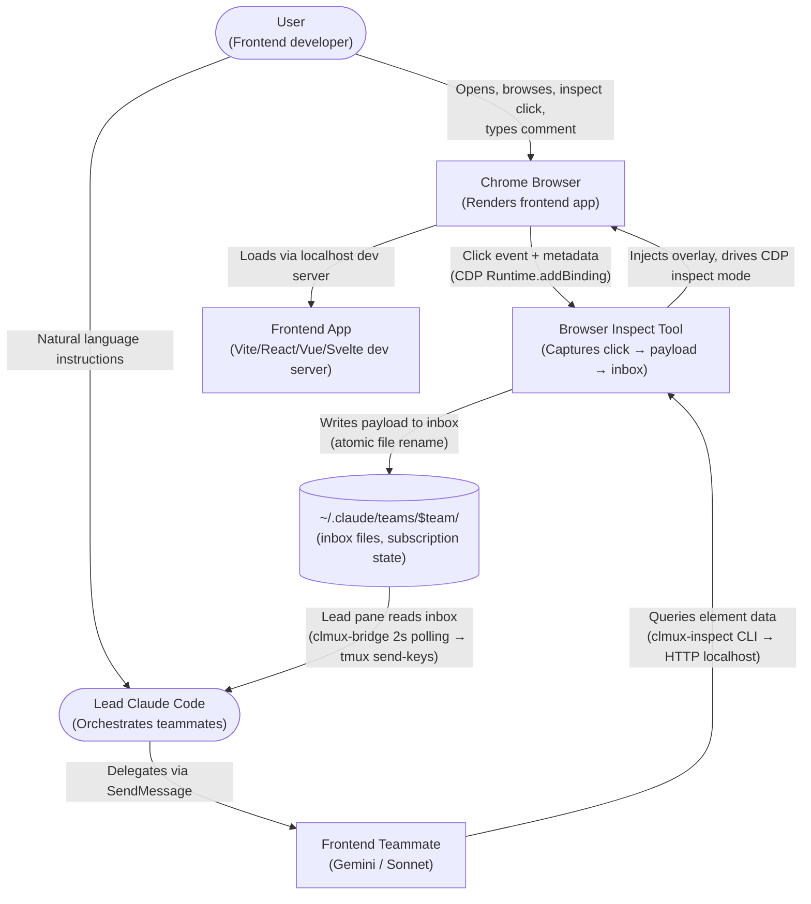
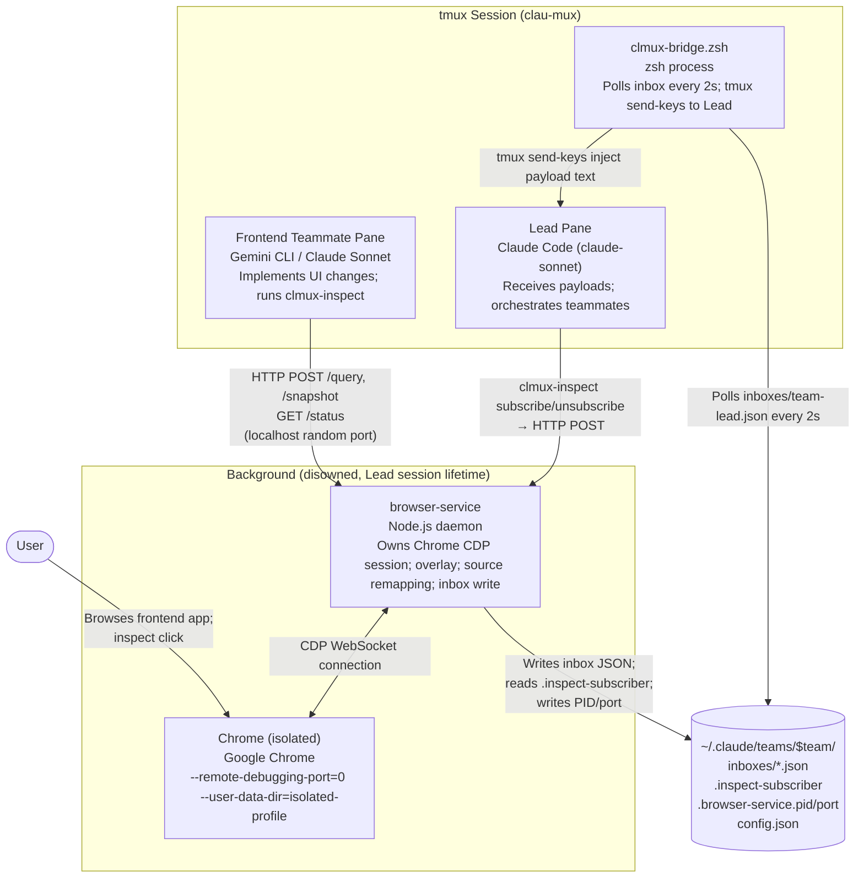
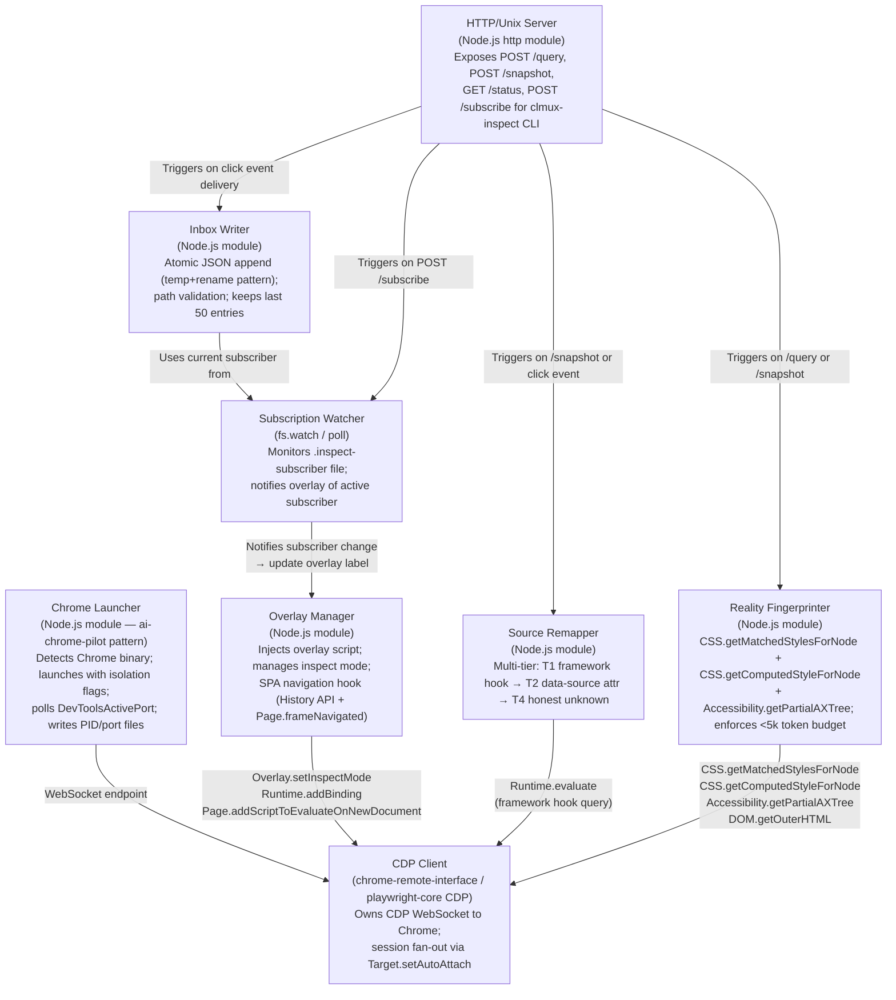
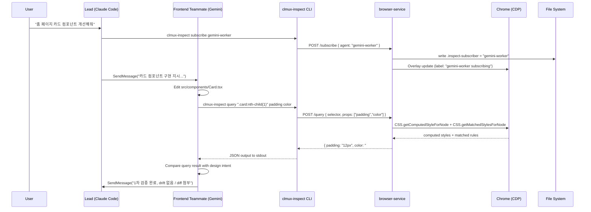
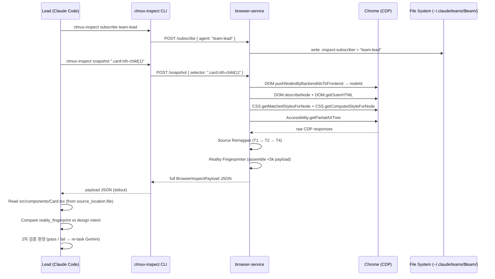
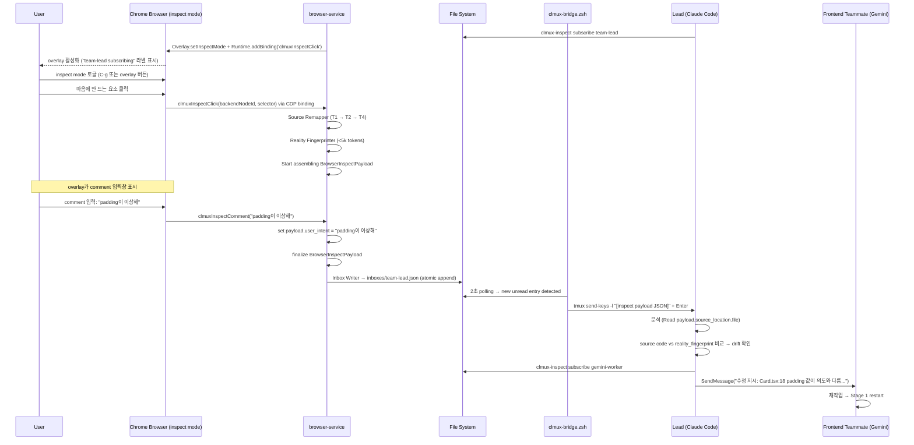

# Browser Inspect Tool — Architecture Document

**문서 번호**: ARCH-2026-04-08-001  
**상태**: Draft — research 완료, implementation-ready  
**작성일**: 2026-04-08  
**관련 문서**:
- `docs/superpowers/specs/2026-04-07-browser-inspect-tool-design.md` (design spec)
- `docs/superpowers/research/05-synthesis-and-design-updates.md` (R5 synthesis)
- `docs/superpowers/research/04-source-remapping-and-prompts.md` (source remapping + prompt templates)
- `docs/superpowers/research/02-cdp-technical-deep-dive.md` (CDP API reference)

---

## 1. 문서 정보 + 개요

### 목적

이 문서는 Browser Inspect Tool의 design spec을 구체적인 컴포넌트 아키텍처로 변환한다. 구현 엔지니어가 참조할 수 있도록 컴포넌트 내부 구조, 데이터 모델, CDP API 선택 근거, 시퀀스 다이어그램, 배포 토폴로지를 모두 다룬다.

설계 목표: 사용자가 브라우저에서 요소를 클릭하면 AI 에이전트의 입력에 inspect payload가 주입된다. 에이전트는 스크린샷 없이 소스 코드만 Read하여 intent(의도)와 rendered reality(렌더링 현실) 사이의 drift를 식별한다.

### 범위

**In scope**:
- browser-service 데몬 내부 컴포넌트 구조
- clmux-inspect CLI 명세
- Chrome 프로세스 수명 주기 관리
- BrowserInspectPayload 스키마 (4-section)
- 에이전트 prompt 통합 지점
- clmux.zsh `-b` 플래그 통합 포인트

**Out of scope**:
- React/Vue/Svelte 애플리케이션 측 코드 변경
- Playwright 테스트 스크립트 내용
- 업스트림 AI 모델 동작

### 독자

P1-P8 페이즈를 구현하는 엔지니어. clau-mux 파일 구조와 기존 브리지 패턴(clmux-bridge.zsh, bridge-mcp-server.js)에 익숙하다고 가정한다.

### 변경 이력

| 버전 | 날짜 | 내용 |
|---|---|---|
| 0.1 | 2026-04-08 | Initial draft from R5 synthesis |

---

## 2. 아키텍처 목표 (Architecture Goals)

1. **LLM 토큰 비용 최소화** — `reality_fingerprint` <5,000 토큰. Trade-off: CSS cascade 정보가 부족해질 수 있음 → 핵심 12개 CSS 속성 + `cascade_winner`만 포함으로 균형. Zendriver-MCP 실증(96% 감소) 기반.

2. **clau-mux 파일 브리지 컨벤션 유지** — WebSocket/MCP 없이 기존 inbox JSON 패턴 재사용. Trade-off: ~100ms polling latency. subscribe 빈도가 낮으므로(handoff 간격 수분) 허용 가능.

3. **source remapping 정확도** — multi-tier fallback으로 최대한 정확한 `file:line` 제공. Trade-off: Tier 1이 dev-only이므로 prod에서 정확도 저하 → honest `confidence` 필드로 에이전트에 전달. 에이전트는 `none` 시 grep fallback 수행.

4. **Chrome 격리 (보안)** — 별도 `user-data-dir` + random port. Trade-off: 기존 브라우저 세션 재사용 불가, 개발자 로그인 등 재입력 필요. Chrome 2025 보안팀 mandate(C6) 준수 필수.

5. **daemon 자체 복구** — exponential backoff + failure cap. Trade-off: 극단적 크래시 루프 시 자동 중단 → Lead에 알림 후 수동 재시작 안내.

---

## 3. C4 Level 1 — 시스템 컨텍스트 다이어그램



---

## 4. C4 Level 2 — 컨테이너 다이어그램



---

## 5. C4 Level 3 — 컴포넌트 다이어그램 (browser-service 내부)



---

## 6. 컴포넌트 상세

### 6.1 Chrome Launcher

**책임**: Chrome 바이너리 탐지 → 격리 프로파일로 launch → `DevToolsActivePort` 파일 poll로 port 확정 → PID/port 파일 기록.

**입력**: `team_name`, `chrome_profile_path`  
**출력**: WebSocket endpoint URL, Chrome PID

**핵심 알고리즘**:
```typescript
async function launchChrome(
  teamDir: string,
  profileDir: string
): Promise<{ endpoint: string; pid: number }> {
  const chromeBin = await detectChromeBinary();
  // macOS: /Applications/Google Chrome.app/Contents/MacOS/Google Chrome
  // Linux: /usr/bin/google-chrome or /usr/bin/chromium-browser

  const proc = spawn(chromeBin, [
    '--remote-debugging-port=0',       // OS assigns port (security: no fixed port)
    `--user-data-dir=${profileDir}`,   // isolated profile (C6 mandate)
    '--no-first-run',
    '--disable-default-apps',
    'about:blank',
  ], { detached: true, stdio: 'ignore' });

  proc.unref();

  // Poll for DevToolsActivePort file (Chrome writes this on startup)
  const port = await pollDevToolsActivePort(profileDir, { timeoutMs: 5000, retries: 3 });
  const endpoint = `ws://127.0.0.1:${port}`;

  fs.writeFileSync(path.join(teamDir, '.chrome.pid'), String(proc.pid));
  fs.writeFileSync(path.join(teamDir, '.browser-service.port'), String(port));

  return { endpoint, pid: proc.pid! };
}

async function pollDevToolsActivePort(profileDir: string, opts: PollOpts): Promise<number> {
  const portFile = path.join(profileDir, 'DevToolsActivePort');
  for (let attempt = 0; attempt < opts.retries; attempt++) {
    await sleep(500 * (attempt + 1));
    if (fs.existsSync(portFile)) {
      const line = fs.readFileSync(portFile, 'utf8').split('\n')[0];
      const port = parseInt(line, 10);
      if (!isNaN(port)) return port;
    }
  }
  throw new Error('DevToolsActivePort not created within timeout');
}
```

**실패 모드**:
- Chrome 바이너리 없음 → 오류 메시지 출력 + `exit 1`
- `DevToolsActivePort` 5초 내 미생성 → retry × 3 → `Error` throw → daemon exit

---

### 6.2 CDP Client

**책임**: Chrome WebSocket 연결 소유; CDP 도메인 활성화; `Target.setAutoAttach`으로 iframe 세션 관리.

**핵심 초기화**:
```typescript
async function initCDPClient(endpoint: string): Promise<CDPSession> {
  const client = await CDP({ target: endpoint });

  await Promise.all([
    client.DOM.enable(),
    client.CSS.enable(),
    client.Overlay.enable(),
    client.Accessibility.enable(),
    client.Page.enable(),
    client.Runtime.enable(),
    client.Target.setAutoAttach({
      autoAttach: true,
      waitForDebuggerOnStart: false,
      flatten: true,  // enables session fan-out per Target (iframe support)
    }),
  ]);

  return client;
}
```

**재연결 전략**:
```typescript
async function withReconnect(endpoint: string, work: (client: CDPSession) => Promise<void>): Promise<void> {
  const BACKOFFS_MS = [1000, 2000, 4000, 8000, 16000];
  let attempt = 0;
  while (attempt <= BACKOFFS_MS.length) {
    try {
      const client = await initCDPClient(endpoint);
      client.on('disconnect', () => { throw new Error('CDP_DISCONNECT'); });
      await work(client);
      return;
    } catch (err) {
      if (attempt >= BACKOFFS_MS.length) {
        await notifyLeadAlert('browser-service: CDP reconnect cap reached. Manual restart required.');
        process.exit(1);
      }
      await sleep(BACKOFFS_MS[attempt++]);
    }
  }
}
```

**실패 모드**: WebSocket disconnect → 즉시 재연결 → exponential backoff (1s, 2s, 4s, 8s, 16s) → failure cap 5회 → Lead alert 파일 생성 + daemon exit.

---

### 6.3 Overlay Manager

**책임**: inspect mode on/off; SPA navigation 시 overlay 재주입; `clmuxInspectClick` binding 등록; 현재 subscriber label을 overlay에 표시.

**입력**: CDP session  
**출력**: `inspectNodeRequested` events (backendNodeId)

**핵심 알고리즘**:
```typescript
async function enableInspectMode(session: CDPSession): Promise<void> {
  // 1. Register browser-side bindings (overlay → daemon messaging)
  await session.Runtime.addBinding({ name: 'clmuxInspectClick' });
  await session.Runtime.addBinding({ name: 'clmuxInspectComment' });

  // 2. Bootstrap script persists across SPA navigations
  await session.Page.addScriptToEvaluateOnNewDocument({
    source: OVERLAY_BOOTSTRAP_JS,  // injects overlay UI + wires bindings
  });

  // 3. Wrap History API to detect SPA route changes
  await session.Runtime.evaluate({ expression: HISTORY_API_HOOK_JS });
  // HISTORY_API_HOOK_JS wraps pushState/replaceState to emit custom 'clmux:navigate' event

  // 4. Dual detection: CDP-level + History API hook
  session.Page.on('frameNavigated', async ({ frame }) => {
    if (frame.parentId === undefined) {  // top-level frame only
      await reinjectOverlay(session);    // re-evaluate History API hook JS
      if (currentState.inspectModeActive) {
        await session.Overlay.setInspectMode({ mode: 'searchForNode', highlightConfig: HIGHLIGHT_CONFIG });
      }
    }
  });

  // 5. Enter inspect mode
  await session.Overlay.setInspectMode({
    mode: 'searchForNode',
    highlightConfig: {
      showInfo: true,
      contentColor: { r: 66, g: 133, b: 244, a: 0.2 },
      borderColor: { r: 66, g: 133, b: 244, a: 0.8 },
    },
  });

  // 6. Handle click events
  session.Overlay.on('inspectNodeRequested', async ({ backendNodeId }) => {
    await handleElementInspected(session, backendNodeId);
  });

  // 7. Handle comment submissions from overlay UI
  session.Runtime.on('bindingCalled', ({ name, payload }) => {
    if (name === 'clmuxInspectComment') {
      currentState.pendingComment = payload;
    }
  });
}
```

**SPA navigation 전략**: History API hook (pushState/replaceState 래핑) + `Page.frameNavigated` 이중 감지. MutationObserver 미사용 — route change와 DOM mutation 구분 불가 위험(R2 지적).

---

### 6.4 Source Remapper

**책임**: DOM element (backendNodeId) → source location (file, line, col, component) 역매핑. Multi-tier fallback.

**Tier 정의**:
| Tier | 방법 | 신뢰도 | 가용 조건 |
|---|---|---|---|
| T1 | Framework runtime hook | high | dev 빌드 (React 18, Vue 3, Svelte 4, Solid) |
| T2 | Build-time injected DOM attribute | medium | babel-plugin / vite plugin 설정 시 |
| T4 | Honest failure | none | 항상 (fallback) |

(Tier 3 = source-map lookup은 Post-MVP로 defer)

**알고리즘**:
```typescript
async function resolveSourceLocation(
  session: CDPSession,
  nodeId: number,
  framework: string
): Promise<SourceLocationSection> {
  // Tier 1: Framework-specific runtime hook
  const tier1 = await tryFrameworkHook(session, nodeId, framework);
  if (tier1.mapping_confidence === 'high') {
    return { ...tier1, mapping_tier_used: 1 };
  }

  // Tier 2: Build-time injected data-source attribute
  const tier2 = await tryDataSourceAttr(session, nodeId);
  if (tier2.mapping_confidence !== 'none') {
    return { ...tier2, mapping_tier_used: 2 };
  }

  // Tier 4: Honest failure — never block payload delivery
  return {
    framework,
    mapping_confidence: 'none',
    mapping_via: 'unknown',
    fallbackReason: 'No source metadata found. Agent should grep codebase by CSS selector or component name.',
    mapping_tier_used: 4,
  };
}

async function tryFrameworkHook(
  session: CDPSession,
  nodeId: number,
  framework: string
): Promise<Partial<SourceLocationSection>> {
  if (framework === 'react') {
    // React 18: __reactFiber$* → ._debugSource
    // React 19: _debugSource removed → auto-fallback to Tier 2
    const result = await session.Runtime.evaluate({
      expression: `(() => {
        const el = window.__clmux_inspected_node;
        if (!el) return null;
        const key = Object.keys(el).find(k => k.startsWith('__reactFiber$'));
        if (!key) return null;
        const fiber = el[key];
        const src = fiber._debugSource;  // null in React 19+
        if (!src) return null;
        return {
          file: src.fileName,
          line: src.lineNumber,
          col: src.columnNumber,
          component: fiber.type?.name || fiber._debugOwner?.type?.name || null,
          props: fiber.memoizedProps ? Object.keys(fiber.memoizedProps).reduce((acc, k) => {
            if (typeof fiber.memoizedProps[k] !== 'function') acc[k] = fiber.memoizedProps[k];
            return acc;
          }, {}) : null
        };
      })()`,
      returnByValue: true,
    });
    if (result.result.value) {
      return { ...result.result.value, framework: 'react', mapping_confidence: 'high', mapping_via: 'react-devtools-hook' };
    }
  }

  if (framework === 'vue') {
    const result = await session.Runtime.evaluate({
      expression: `(() => {
        const el = window.__clmux_inspected_node;
        if (!el?.__vue__) return null;
        const vm = el.__vue__;
        return { file: vm.$options.__file, component: vm.$options.name };
      })()`,
      returnByValue: true,
    });
    if (result.result.value?.file) {
      return { ...result.result.value, framework: 'vue', mapping_confidence: 'high', mapping_via: 'vue-vue' };
    }
  }

  if (framework === 'svelte') {
    const result = await session.Runtime.evaluate({
      expression: `(() => {
        const el = window.__clmux_inspected_node;
        return el?.__svelte_meta?.loc ?? null;
      })()`,
      returnByValue: true,
    });
    if (result.result.value) {
      return { ...result.result.value, framework: 'svelte', mapping_confidence: 'high', mapping_via: 'svelte-meta' };
    }
  }

  if (framework === 'solid') {
    const result = await session.Runtime.evaluate({
      expression: `(() => {
        const el = window.__clmux_inspected_node;
        const loc = el?.dataset?.sourceLoc;
        if (!loc) return null;
        const [file, line, col] = loc.split(':');
        return { file, line: parseInt(line), col: parseInt(col) };
      })()`,
      returnByValue: true,
    });
    if (result.result.value?.file) {
      return { ...result.result.value, framework: 'solid', mapping_confidence: 'high', mapping_via: 'solid-locator' };
    }
  }

  return { mapping_confidence: 'none', mapping_via: 'unknown' };
}

async function tryDataSourceAttr(session: CDPSession, nodeId: number): Promise<Partial<SourceLocationSection>> {
  // Check for babel-plugin-transform-react-jsx-location or vite plugin injected data-source attr
  const result = await session.Runtime.evaluate({
    expression: `(() => {
      const el = window.__clmux_inspected_node;
      const attr = el?.getAttribute('data-source') || el?.getAttribute('data-source-loc');
      if (!attr) return null;
      const [file, line, col] = attr.split(':');
      return { file, line: parseInt(line), col: parseInt(col) };
    })()`,
    returnByValue: true,
  });
  if (result.result.value?.file) {
    return { ...result.result.value, mapping_confidence: 'medium', mapping_via: 'data-source-attr' };
  }
  return { mapping_confidence: 'none', mapping_via: 'unknown' };
}
```

**React 19 handling**: `_debugSource`가 null → `tryFrameworkHook` returns `confidence: 'none'` → 자동으로 Tier 2로 fallback. 에이전트에 `mapping_confidence: 'low'`로 전달.

---

### 6.5 Reality Fingerprinter

**책임**: 선택된 element의 computed style, CSS cascade winner, 박스 모델, a11y 정보 수집. 토큰 budget <5,000 강제.

**핵심 호출 시퀀스**:
```typescript
async function buildRealityFingerprint(
  session: CDPSession,
  nodeId: number
): Promise<RealityFingerprintSection> {
  const TRACKED_PROPS = [
    'display', 'position', 'width', 'height', 'color',
    'background-color', 'font-size', 'font-weight', 'opacity',
    'z-index', 'visibility', 'pointer-events',
  ];

  // Parallel CDP calls to minimize latency
  const [computed, matched, axTree, boxModel] = await Promise.all([
    session.CSS.getComputedStyleForNode({ nodeId }),
    session.CSS.getMatchedStylesForNode({ nodeId }),
    session.Accessibility.getPartialAXTree({ nodeId, fetchRelatives: true }),
    session.DOM.getBoxModel({ nodeId }),
  ]);

  const computed_style_subset = Object.fromEntries(
    computed.computedStyle
      .filter(p => TRACKED_PROPS.includes(p.name))
      .map(p => [p.name, p.value])
  );

  // cascade_winner: highest-specificity rule per tracked property
  const cascade_winner = extractCascadeWinner(matched.matchedCSSRules, TRACKED_PROPS);
  // format: { 'padding': 'src/styles/card.css:23 (.card--highlighted)' }

  const axNode = axTree.nodes?.[0];
  const { x, y, width: w, height: h } = computeBoundingBox(boxModel);

  const scrollOffsets = await session.Runtime.evaluate({
    expression: '({ x: window.scrollX, y: window.scrollY })',
    returnByValue: true,
  });
  const viewport = await session.Runtime.evaluate({
    expression: '({ w: window.innerWidth, h: window.innerHeight })',
    returnByValue: true,
  });
  const dpr = await session.Runtime.evaluate({
    expression: 'window.devicePixelRatio',
    returnByValue: true,
  });

  return {
    computed_style_subset,
    cascade_winner,
    bounding_box: { x, y, w, h },
    scroll_offsets: scrollOffsets.result.value,
    viewport: viewport.result.value,
    device_pixel_ratio: dpr.result.value,
    ax_role_name: axNode?.role?.value ?? 'generic',
    ax_accessible_name: axNode?.name?.value,
    _token_budget: '<5000',
  };
}

function extractCascadeWinner(
  matchedRules: MatchedStyleRule[],
  trackedProps: string[]
): Record<string, string> {
  const winner: Record<string, string> = {};
  // matchedRules is ordered highest specificity last (CDP convention)
  for (const rule of matchedRules) {
    for (const decl of rule.rule.style.cssProperties) {
      if (trackedProps.includes(decl.name) && decl.value) {
        const sheet = rule.rule.styleSheetId ?? 'inline';
        const range = rule.rule.style.range;
        const loc = range ? `${sheet}:${range.startLine}` : sheet;
        winner[decl.name] = `${loc} (${rule.rule.selectorList.text})`;
      }
    }
  }
  return winner;
}
```

**토큰 예산 강제**: `_token_budget: '<5000'` 필드는 에이전트에 대한 주석적 제약으로, payload를 수신한 에이전트가 fingerprint를 추가 확장하지 않도록 명시. 실제 토큰 수는 a11y tree 포함 기준 약 1,500-3,000 수준.

---

### 6.6 Subscription Watcher

**책임**: `.inspect-subscriber` 파일 변화 감지 → 현재 subscriber 이름 갱신 → Overlay Manager에 통보.

**파일 형식**: plain text, 1줄, 에이전트 이름. 예: `gemini-worker`  
**빈 파일 또는 파일 없음** = 구독자 없음 (passive mode, overlay는 "no subscriber" 표시).

**구현**:
```typescript
function watchSubscriber(
  teamDir: string,
  onChange: (subscriber: string | null) => void
): void {
  const subFile = path.join(teamDir, '.inspect-subscriber');

  const read = () => {
    try {
      const content = fs.readFileSync(subFile, 'utf8').trim();
      onChange(content || null);
    } catch {
      onChange(null);  // file deleted = no subscriber
    }
  };

  // Initial read
  read();

  // fs.watch for change events
  try {
    fs.watch(subFile, { persistent: false }, (event) => {
      if (event === 'change' || event === 'rename') read();
    });
  } catch {
    // File doesn't exist yet — fall back to 2s polling
    const interval = setInterval(read, 2000);
    fs.watch(teamDir, { persistent: false }, (event, filename) => {
      if (filename === '.inspect-subscriber') {
        clearInterval(interval);
        watchSubscriber(teamDir, onChange);  // re-setup with fs.watch
      }
    });
  }
}
```

---

### 6.7 Inbox Writer

**책임**: inspect payload를 subscriber의 inbox JSON에 원자적으로 추가. `bridge-mcp-server.js` 패턴 그대로 적용.

**핵심 알고리즘**:
```typescript
function writeToInbox(
  teamDir: string,
  subscriber: string,
  payload: BrowserInspectPayload
): void {
  const inboxPath = path.join(teamDir, 'inboxes', `${subscriber}.json`);

  // Security: validate path (bridge-mcp-server.js 동일 패턴)
  const homeDir = os.homedir();
  const normalizedPath = path.normalize(inboxPath);
  if (
    !normalizedPath.startsWith(path.join(homeDir, '.claude')) ||
    !normalizedPath.endsWith('.json') ||
    normalizedPath.includes('..')
  ) {
    throw new Error(`Invalid inbox path: ${inboxPath}`);
  }

  let entries: InboxEntry[] = [];
  try {
    entries = JSON.parse(fs.readFileSync(inboxPath, 'utf8'));
  } catch {
    // Empty or non-existent file — start fresh
  }

  entries.push({
    from: 'browser-inspect',
    text: JSON.stringify(payload),  // clmux-bridge reads `text` field
    timestamp: new Date().toISOString(),
    read: false,
    summary: `browser-inspect: ${payload.user_intent.slice(0, 60)}`,
  });

  // Keep last 50 entries (bridge-mcp-server.js convention)
  if (entries.length > 50) entries = entries.slice(-50);

  // Atomic write: temp file + rename
  const tmp = inboxPath + '.' + crypto.randomBytes(4).toString('hex') + '.tmp';
  fs.writeFileSync(tmp, JSON.stringify(entries, null, 2), { mode: 0o600 });
  fs.renameSync(tmp, inboxPath);  // atomic on same filesystem
}
```

**실패 모드**: write 실패 시 ERROR 로그 + retry 3회 → 3회 모두 실패 시 payload discard + WARN. delivery 실패가 데몬을 종료시키지 않는다.

---

### 6.8 HTTP/Unix Server + clmux-inspect CLI

**책임**: clmux-inspect CLI 명령을 HTTP endpoint로 노출. 127.0.0.1 only.

**API surface**:

| Method | Path | Body | Response |
|---|---|---|---|
| POST | /query | `{ selector: string, props?: string[] }` | reality_fingerprint subset |
| POST | /snapshot | `{ selector: string }` | full BrowserInspectPayload |
| GET | /status | — | daemon state |
| POST | /subscribe | `{ agent: string }` | `{ ok: true }` |
| POST | /unsubscribe | — | `{ ok: true }` |

**서버 초기화**:
```typescript
function startHTTPServer(port: number, handlers: RequestHandlers): http.Server {
  const server = http.createServer((req, res) => {
    // Bind only to localhost
    if (req.socket.remoteAddress !== '127.0.0.1' && req.socket.remoteAddress !== '::1') {
      res.writeHead(403);
      res.end(JSON.stringify({ error: 'forbidden', code: 403 }));
      return;
    }
    router(req, res, handlers);
  });
  server.listen(port, '127.0.0.1');
  return server;
}
```

**Port discovery**: CLI reads `~/.claude/teams/$CLMUX_TEAM/.browser-service.port`.

**clmux-inspect CLI commands**:
```
clmux-inspect subscribe <agent>
  # POST /subscribe { agent } → writes .inspect-subscriber
  # Exit: 0=ok, 1=daemon not running

clmux-inspect unsubscribe
  # POST /unsubscribe → clears .inspect-subscriber
  # Exit: 0=ok, 1=daemon not running

clmux-inspect query <selector> [prop1 prop2 ...]
  # POST /query { selector, props } → prints JSON to stdout
  # --json flag: machine-readable (default)
  # Exit: 0=ok, 1=daemon not running, 2=selector not found

clmux-inspect snapshot <selector>
  # POST /snapshot { selector } → prints full BrowserInspectPayload JSON
  # Exit: 0=ok, 1=daemon not running, 2=selector not found, 3=remap failed

clmux-inspect status
  # GET /status → prints daemon state JSON
  # Exit: 0=running, 1=not running
```

**Error shape**: `{ "error": string, "reason"?: string, "code": number }`

---

## 7. 데이터 모델 (Data Model)

### 7.1 Payload Schema (TypeScript)

```typescript
interface BrowserInspectPayload {
  user_intent: string;  // comment entered by user in overlay, or "" if none

  pointing: {
    selector: string;                    // CSS selector (unique, daemon-generated)
    outerHTML: string;                   // truncated to ~500 chars; <script> stripped
    tag: string;
    attrs: Record<string, string>;
    shadowPath?: string[];               // NEW R5: Shadow DOM chain (host selectors)
    iframeChain?: string[];              // NEW R5: iframe frame URLs (outermost → innermost)
  };

  source_location: {
    framework: 'react' | 'vue' | 'svelte' | 'solid' | 'unknown';
    file?: string;
    line?: number;
    col?: number;
    component?: string;
    props?: Record<string, unknown>;     // non-function props only
    mapping_confidence: 'high' | 'medium' | 'low' | 'none';
    mapping_via:
      | 'react-devtools-hook'
      | 'vue-vue'
      | 'svelte-meta'
      | 'solid-locator'
      | 'data-source-attr'
      | 'source-map'
      | 'unknown';
    fallbackReason?: string;             // present when mapping_confidence is 'none'
    caller_chain?: Array<{              // NEW R5: Post-MVP (common-component drift)
      component: string;
      file: string;
      line: number;
    }>;
  };

  reality_fingerprint: {
    computed_style_subset: Record<string, string>;  // 12 CSS props
    cascade_winner: Record<string, string>;          // prop → "file:line (selector)"
    bounding_box: { x: number; y: number; w: number; h: number };
    scroll_offsets: { x: number; y: number };
    viewport: { w: number; h: number };
    device_pixel_ratio: number;
    ax_role_name: string;
    ax_accessible_name?: string;
    _token_budget: '<5000';             // annotation constraint for agent
  };

  meta: {
    timestamp: string;                  // ISO 8601
    url: string;
    mapping_tier_used: 1 | 2 | 4;
  };
}
```

### 7.2 파일 레이아웃

```
~/.claude/teams/$team/
├── config.json                         ← team member metadata (update_pane.py schema)
├── inboxes/
│   ├── team-lead.json                  ← Lead pane inbox (clmux-bridge polled every 2s)
│   ├── gemini-worker.json              ← Gemini inbox
│   └── ...
├── .browser-service.pid                ← browser-service Node.js PID
├── .browser-service.port               ← HTTP port (random, OS-assigned), chmod 0600
├── .browser-service.env                ← environment vars for reconnect (optional)
├── .browser-service-alert              ← created on ERROR; Lead pane monitors (TBD)
├── .inspect-subscriber                 ← plain text: current subscriber agent name
└── .chrome.pid                         ← Chrome process PID

/tmp/clmux-browser-service-$team.log   ← daemon log (INFO/WARN/ERROR)

# Chrome isolated profile:
# macOS:
~/Library/Application Support/clau-mux/browser-inspect/chrome-profile-$team/
# Linux:
~/.local/share/clau-mux/browser-inspect/chrome-profile-$team/
```

### 7.3 config.json Browser-service 확장 (NEW)

기존 schema 유지, `browserService` 키 추가:
```json
{
  "name": "team_name",
  "members": [
    {
      "agentId": "gemini-worker@team_name",
      "name": "gemini-worker",
      "model": "gemini-2.0-flash",
      "joinedAt": 1712500000000,
      "tmuxPaneId": "%72",
      "cwd": ".",
      "backendType": "tmux",
      "agentType": "bridge",
      "taskCapable": true,
      "isActive": true
    }
  ],
  "browserService": {
    "enabled": true,
    "pid": 12345,
    "port": 54321,
    "chromeProfileDir": "~/Library/Application Support/clau-mux/browser-inspect/chrome-profile-team_name"
  }
}
```

`browserService` 키는 `clmux -gb` 플래그로 시작 시에만 삽입된다. 없으면 browser-service 비활성화 상태.

---

## 8. 데이터 흐름 (Data Flow Diagrams)

### 8.1 Stage 1-2: 구현 + 1차 검증 (Teammate active)



### 8.2 Stage 3: Lead 2차 검증



### 8.3 Stage 4-5: User 3차 검증 + 재작업 루프



---

## 9. 인터페이스 정의

### 9.1 clmux-inspect CLI 전체 명세

```
USAGE
  clmux-inspect <command> [args] [flags]

COMMANDS

  subscribe <agent-name>
    Writes <agent-name> to ~/.claude/teams/$CLMUX_TEAM/.inspect-subscriber
    Daemon updates Chrome overlay label to show active subscriber.
    Exit codes: 0=success, 1=daemon not running

  unsubscribe
    Clears .inspect-subscriber (writes empty string).
    Disables auto-delivery of click payloads.
    Exit codes: 0=success, 1=daemon not running

  query <css-selector> [prop1 prop2 ...]
    Returns reality_fingerprint subset for element matching selector.
    If no props specified, returns all 12 tracked CSS props + cascade_winner.
    Flags:
      --json   Machine-readable JSON output (default: true)
      --pretty Pretty-printed JSON output
    Exit codes: 0=success, 1=daemon not running, 2=selector not found

  snapshot <css-selector>
    Returns full BrowserInspectPayload (all 4 sections: user_intent,
    pointing, source_location, reality_fingerprint + meta).
    Triggers full source remapping + fingerprint pipeline.
    Exit codes: 0=success, 1=daemon not running, 2=selector not found, 3=remap pipeline error

  status
    Returns current daemon state as JSON:
      { state, subscriber, chrome_pid, port, uptime_s, inspect_mode, url }
    Exit codes: 0=running, 1=not running

ENVIRONMENT
  CLMUX_TEAM    Team name (required; set by clmux.zsh on spawn)
  CLMUX_DIR     clau-mux installation directory
```

### 9.2 Daemon HTTP API 전체 명세

포트 탐색: `~/.claude/teams/$CLMUX_TEAM/.browser-service.port`

```
POST /query
  Content-Type: application/json
  Body: {
    "selector": string,   // CSS selector
    "props"?: string[]    // optional subset of 12 tracked props
  }
  Response 200: {
    "computed_style_subset": { [prop: string]: string },
    "cascade_winner": { [prop: string]: string },
    "bounding_box": { "x": number, "y": number, "w": number, "h": number }
  }
  Response 404: { "error": "selector_not_found", "code": 404 }

POST /snapshot
  Content-Type: application/json
  Body: { "selector": string }
  Response 200: BrowserInspectPayload (full 4-section payload)
  Response 404: { "error": "selector_not_found", "code": 404 }
  Response 500: { "error": "remap_failed", "reason": string, "code": 500 }

GET /status
  Response 200: {
    "state": "running" | "idle",
    "subscriber": string | null,
    "chrome_pid": number,
    "port": number,
    "uptime_s": number,
    "inspect_mode": boolean,
    "url": string | null
  }

POST /subscribe
  Content-Type: application/json
  Body: { "agent": string }
  Response 200: { "ok": true }

POST /unsubscribe
  Response 200: { "ok": true }
```

모든 오류 응답 형태: `{ "error": string, "reason"?: string, "code": number }`

### 9.3 CDP 호출 시퀀스

**Inspect mode 진입 (daemon startup)**:
```
1. Runtime.addBinding({ name: 'clmuxInspectClick' })
2. Runtime.addBinding({ name: 'clmuxInspectComment' })
3. Page.addScriptToEvaluateOnNewDocument({ source: OVERLAY_BOOTSTRAP_JS })
4. Runtime.evaluate({ expression: HISTORY_API_HOOK_JS })
5. Overlay.setInspectMode({ mode: 'searchForNode', highlightConfig: { ... } })
6. Listen: Overlay.on('inspectNodeRequested', handler)
7. Listen: Runtime.on('bindingCalled', commentHandler)
8. Listen: Page.on('frameNavigated', spaNavHandler)
```

**Element capture (inspectNodeRequested event)**:
```
1. DOM.pushNodesByBackendIdsToFrontend({ backendNodeIds: [backendNodeId] }) → nodeId
2. DOM.describeNode({ nodeId, depth: 1, pierce: true }) → element metadata (tag, attrs)
3. DOM.getOuterHTML({ nodeId }) → outerHTML (truncate to 500 chars, strip <script>)
4. CSS.getMatchedStylesForNode({ nodeId }) → matchedCSSRules (cascade_winner source)
5. CSS.getComputedStyleForNode({ nodeId }) → computedStyle (filter to 12 props)
6. Accessibility.getPartialAXTree({ nodeId, fetchRelatives: true }) → axNode
7. DOM.getBoxModel({ nodeId }) → bounding_box
8. Runtime.evaluate({ expression: getFrameworkHookJS(nodeId) }) → source_location Tier 1
   [parallel with 4-7 where possible]
```

**SPA navigation reset (Page.frameNavigated, top-level frame)**:
```
1. Runtime.evaluate({ expression: HISTORY_API_HOOK_JS })   // re-hook pushState/replaceState
2. if (inspectModeActive) → Overlay.setInspectMode({ mode: 'searchForNode', ... })
3. currentState.url = frame.url
4. log INFO: "SPA navigation detected: ${frame.url}"
```

### 9.4 Browser-side Bindings

```javascript
// Called by overlay JS when user clicks element in inspect mode:
window.clmuxInspectClick = (payload) => {
  // payload: { backendNodeId: number, selector: string, timestamp: string }
};
// Daemon catches via: Runtime.on('bindingCalled', ({ name, payload }) => { ... })

// Called by overlay JS when user submits comment:
window.clmuxInspectComment = (text) => {
  // text: string (user's comment from overlay input)
};
```

---

## 10. 배포 (Deployment View)

### 10.1 프로세스 트리

```
zsh launcher: clmux -n proj -gb -T proj-team
└── tmux session: proj-team
    ├── pane %0: Lead Claude Code (claude-sonnet)
    │   └── → spawns clmux-bridge.zsh for own inbox (backgrounded, disowned)
    ├── pane %1: Gemini CLI
    │   └── → clmux-bridge.zsh polling inboxes/gemini-worker.json
    ├── pane %2: Codex CLI (optional)
    │   └── → clmux-bridge.zsh polling inboxes/codex-worker.json
    └── [disowned background processes]
        ├── browser-service.js (Node.js)
        │     PID → ~/.claude/teams/proj-team/.browser-service.pid
        │     port → ~/.claude/teams/proj-team/.browser-service.port
        │     log → /tmp/clmux-browser-service-proj-team.log
        └── Google Chrome (isolated)
              PID → ~/.claude/teams/proj-team/.chrome.pid
              --user-data-dir=~/Library/Application Support/clau-mux/.../chrome-profile-proj-team
              --remote-debugging-port=0
```

### 10.2 시작 시퀀스 (`clmux -gb` 플래그)

```
clmux.zsh 실행 흐름 (parse -b flag):

1. parse_flags: detect -b → ENABLE_BROWSER=true
2. _clmux_ensure_team_dir:
   mkdir -p ~/.claude/teams/$team/inboxes/
3. _clmux_launch_browser_service():
   a. detect_chrome_binary()
      → macOS: /Applications/Google Chrome.app/Contents/MacOS/Google Chrome
      → Linux: /usr/bin/google-chrome | /usr/bin/chromium-browser
      → fail if not found → print error + exit 1
   b. PROFILE_DIR = platform_profile_dir()/chrome-profile-$team
      mkdir -p "$PROFILE_DIR"
   c. launch Chrome (disowned):
      "$CHROME_BIN" \
        --remote-debugging-port=0 \
        --user-data-dir="$PROFILE_DIR" \
        --no-first-run \
        --disable-default-apps \
        about:blank \
        >> /tmp/clmux-chrome-$team.log 2>&1 &
      echo $! > ~/.claude/teams/$team/.chrome.pid
      disown
   d. poll DevToolsActivePort (5s timeout, retry × 3)
      → read port from "$PROFILE_DIR/DevToolsActivePort"
   e. WS_ENDPOINT = "ws://127.0.0.1:$port"
   f. launch browser-service.js (disowned):
      node "$CLMUX_DIR/browser-service/browser-service.js" \
        --team="$team" \
        --endpoint="$WS_ENDPOINT" \
        >> /tmp/clmux-browser-service-$team.log 2>&1 &
      echo $! > ~/.claude/teams/$team/.browser-service.pid
      disown
   g. wait for /status = running (poll 500ms × 6 = 3s timeout)
      → curl -sf http://127.0.0.1:$(cat .browser-service.port)/status
   h. update config.json: set browserService.{enabled,pid,port,chromeProfileDir}
4. continue with normal teammate spawn (spawn Lead pane, Gemini pane, etc.)
5. Lead pane startup message: "Browser Inspect Tool ready on port $port"
```

### 10.3 종료 시퀀스 (tmux session exit or manual teardown)

```
tmux session-closed hook (or clmux teardown script):

1. TEAM_DIR="$HOME/.claude/teams/$team"
2. if [ -f "$TEAM_DIR/.browser-service.pid" ]; then
     kill $(cat "$TEAM_DIR/.browser-service.pid") 2>/dev/null
     rm -f "$TEAM_DIR/.browser-service.pid"
   fi
3. if [ -f "$TEAM_DIR/.chrome.pid" ]; then
     kill $(cat "$TEAM_DIR/.chrome.pid") 2>/dev/null
     rm -f "$TEAM_DIR/.chrome.pid"
   fi
4. rm -f "$TEAM_DIR/.browser-service.port"
5. rm -f "$TEAM_DIR/.browser-service.env"
6. rm -f "$TEAM_DIR/.browser-service-alert"
7. rm -f "$TEAM_DIR/.inspect-subscriber"
8. update config.json: set browserService.enabled = false, pid = null, port = null

# Log files are intentionally retained for post-mortem:
# /tmp/clmux-browser-service-$team.log
# /tmp/clmux-chrome-$team.log
```

**Chrome / browser-service**: SIGTERM 수신 시 graceful shutdown. 10초 내 미종료 시 SIGKILL.

---

## 11. 횡단 관심사 (Cross-cutting Concerns)

### Logging

- **파일**: `/tmp/clmux-browser-service-$team.log`
- **레벨**: `INFO` (lifecycle events), `WARN` (recoverable errors), `ERROR` (fatal/unrecoverable)
- **포맷**: `[ISO-timestamp] [LEVEL] [component] message`
  - 예: `[2026-04-08T10:23:41.123Z] [INFO] [overlay-manager] inspect mode enabled`
- **Lead alert**: `ERROR` 레벨은 `.browser-service-alert` 파일 생성 → Lead pane 자동 알림 메커니즘 (구현 TBD; 파일 존재 여부를 clmux-bridge가 체크하는 방식 검토)
- **clmux-inspect status**: `WARN` 이상 마지막 오류 메시지를 status 응답에 `last_warning` 필드로 포함

### Error Handling

| 오류 | 처리 전략 |
|---|---|
| Chrome 바이너리 없음 | daemon exit 1 + 사용자 안내 메시지 |
| Chrome crash (PID watcher) | exponential backoff restart (1s → 2s → 4s → 8s → 16s) → cap 5회 → Lead alert + exit |
| CDP WebSocket disconnect | 즉시 재연결 시도 → 동일 backoff → cap 5회 → Lead alert + exit |
| `DevToolsActivePort` timeout | retry × 3 → Chrome 재시작 시도 × 1 → fail |
| Inbox write failure | log ERROR + retry 3회 → payload discard + WARN (daemon 계속 동작) |
| Source remap all tiers fail | Tier 4 honest unknown 반환 — payload delivery는 절대 블로킹하지 않음 |
| selector not found (/query, /snapshot) | HTTP 404 + exit code 2 |
| SPA navigation | Overlay 재주입 + inspect mode 재활성화 (§6.3) |

### Security (C6 + 기존 패턴)

| 항목 | 조치 |
|---|---|
| Chrome remote debugging | `--remote-debugging-port=0` (OS 랜덤 포트) + `--user-data-dir=<isolated>` (C6 mandate) |
| HTTP server bind | `127.0.0.1` only — `0.0.0.0` 절대 사용 금지 |
| Port file permissions | `chmod 0600` — daemon-only read |
| Inbox path validation | `startsWith ~/.claude/`, `endsWith .json`, no `..` (bridge-mcp-server.js 동일) |
| outerHTML sanitization | 500자 truncation + `<script>` 태그 strip |
| Sensitive attr redaction | passwords, tokens 등 allowlist 기반 redaction (Post-MVP TBD) |

### Concurrency

- **Write actor rule**: CDP `Page.navigate`, `Runtime.evaluate` 등 page-mutating 호출은 browser-service daemon 단독 소유 (R2 규칙). Playwright 등 외부 도구는 `connectOverCDP`로 attach-only — page navigation 금지.
- **Inbox atomic write**: temp file + `fs.renameSync` — partial read 방지.
- **Subscription watcher**: single callback chain — concurrent onChange 호출 없음 (Node.js single-thread 보장).
- **CDP event ordering**: `inspectNodeRequested` → source remap → fingerprint → inbox write 는 sequential async chain (no parallel element capture).

---

## 12. ADR 요약 + Risk Register

### Architecture Decision Records

| ADR# | 결정 | 근거 | 출처 | 대안 (rejected) |
|---|---|---|---|---|
| ADR-1 | Lead-hosted background daemon | Chrome CDP 독점 소유, clau-mux 수명 동조, Copilot MCP 패턴 검증됨 | spec #8, R2 D5 | Separate tmux pane (fragile), subprocess Claude (비용 폭등) |
| ADR-2 | NOT MCP — CLI + file bridge | 기존 clau-mux 컨벤션 일관성, R3 조사 60% non-MCP 검증 | spec #3, R3 | MCP (user constraint 위반) |
| ADR-3 | CDP Overlay inspect mode | Chrome 네이티브 inspect experience, overlayConfig 제어 가능 | R2 D1 | Custom JS overlay (복잡도 증가) |
| ADR-4 | Source remap multi-tier T1→T2→T4 | dev-only hook limitation 인정 + honest failure 선택 | R4 Part A | Screenshot OCR (rejected: visual 의존성, 정확도 낮음) |
| ADR-5 | Subscription = `.inspect-subscriber` 파일 | clau-mux 파일 브리지 컨벤션, subscribe 빈도 낮음(수분 간격), localhost CDP 포트 충돌 위험 없음 | R5 §7 | WebSocket (R3 제안, rejected: 복잡도) |
| ADR-6 | Chrome `--user-data-dir` isolated, `port=0` | 2025 Chrome 보안팀 mandate, infostealer 위협 대응 | R2 D6, NEW-4 | Default profile (보안 위험) |
| ADR-7 | `reality_fingerprint` <5k tokens (a11y tree + 12 props) | Zendriver-MCP 96% 감소 실증, token budget 강제 | R3, R5 NEW-3 | Full DOM dump (400k tokens, 비용 불가) |
| ADR-8 | NEW-1 완화: MVP=agent prompt rule, Post-MVP=`caller_chain` | 복잡도 trade-off; MVP는 프롬프트 규칙 B로 충분 ("import count grep 규칙") | R5 NEW-1, R4 Part B | `caller_chain` MVP 즉시 구현 (payload 복잡도 증가, defer) |

### Risk Register

| Risk ID | 내용 | Severity | 관련 컴포넌트 | 완화 전략 | Status |
|---|---|---|---|---|---|
| NEW-1 | Common-component 잘못된 파일 수정 (예: `Button.tsx` 공용 컴포넌트를 직접 수정) | High | Source Remapper + Prompt Template | MVP: agent prompt rule B (import count grep). Post-MVP: `caller_chain` 필드 추가 | flag-for-user; Post-MVP planned |
| NEW-2 | SPA navigation 시 overlay 손실 | Medium | Overlay Manager | History API hook (pushState/replaceState) + `Page.frameNavigated` 이중 감지 (§6.3) | accepted |
| NEW-3 | 토큰 budget 초과 | Medium | Reality Fingerprinter | a11y tree + 12-prop subset + `_token_budget` annotation. Zendriver-MCP 기법 적용 | accepted (§6.5) |
| NEW-4 | Chrome 2025 보안 mandate 미준수 | High | Chrome Launcher | `--remote-debugging-port=0 --user-data-dir=<isolated>` mandatory (§6.1, ADR-6) | accepted |
| NEW-5 | React 19에서 `_debugSource` 제거 | Medium | Source Remapper | `_debugSource === null` 시 Tier 2로 자동 fallback; `mapping_confidence: 'low'` 반환 (§6.4) | accepted |

---

## Bibliography

- [Chrome DevTools Protocol — Overlay](https://chromedevtools.github.io/devtools-protocol/tot/Overlay/)
- [Chrome DevTools Protocol — CSS](https://chromedevtools.github.io/devtools-protocol/tot/CSS/)
- [Chrome DevTools Protocol — Target](https://chromedevtools.github.io/devtools-protocol/tot/Target/)
- [Chrome DevTools Protocol — Accessibility](https://chromedevtools.github.io/devtools-protocol/tot/Accessibility/)
- [Chrome DevTools Protocol — Runtime](https://chromedevtools.github.io/devtools-protocol/tot/Runtime/)
- [React Fiber DevTools Hook Overview](https://github.com/facebook/react/blob/main/packages/react-devtools/OVERVIEW.md)
- [React 19 _debugSource removal issue](https://github.com/facebook/react/issues/32574)
- [Bippy: Hacking React Internals](https://github.com/aidenybai/bippy)
- [vite-plugin-vue-inspector](https://github.com/webfansplz/vite-plugin-vue-inspector)
- [react-dev-inspector (Vite integration)](https://react-dev-inspector.zthxxx.me/docs/integration/vite)
- [Zendriver-MCP (96% token reduction technique)](https://github.com/ShubhamChoulkar/Zendriver-MCP)
- [ai-chrome-pilot (Chrome launcher pattern)](https://github.com/shinshin86/ai-chrome-pilot)
- [svelte-grab (overlay + SPA navigation patterns)](https://github.com/HeiCg/svelte-grab)
- [Playwright MCP (a11y tree concept)](https://github.com/microsoft/playwright-mcp)
- [BrowserTools MCP (CDP session manager pattern)](https://github.com/AgentDeskAI/browser-tools-mcp)
- [MDN Source Maps](https://developer.mozilla.org/en-US/docs/Glossary/Source_map)
- [Chrome 2025 remote debugging security](https://developer.chrome.com/blog/remote-debugging-port)
